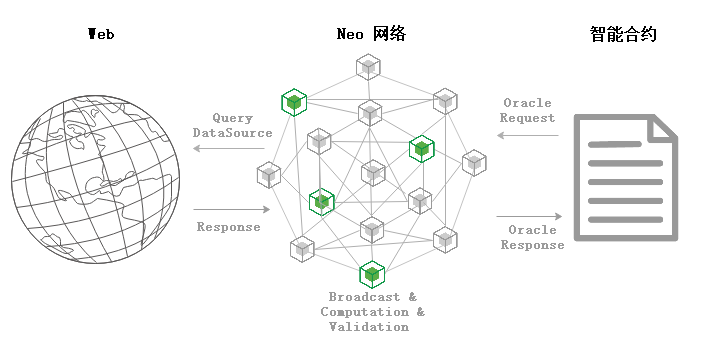

# 预言机

预言机（Oracle）的出现解决了区块链无法向外部网络获取链外信息的问题，作为智能合约与外部世界通信的网关，Oracle 为区块链打开了一扇通往外部世界的窗户。对于链外请求到的数据，Oracle会通过多方验证来保证结果的准确性，并将结果以区块的形式在链上存储供合约访问。

## Neo Oracle

Neo 提供了内置的 Oracle 服务，以原生合约的形式供其他合约调用。为了获取链外的网络数据，合约首先需构造Oracle请求交易，部署上链后则可调用 Neo Oracle 服务。

Oracle节点由委员会选举，除了 Oracle 节点外，网络中的所有节点也会协助交易的运行。当Oracle交易广播到网络中后，每个节点会将当前未验证的交易作为已知的哈希存储在其内存池中，并将其传递给其他节点。通过此过程，Oracle交易的Oracle节点将使用URL并应用过滤器来完成所有包含的请求。然后，通过将结果附加到Oracle交易的TransactionAttribute 部分，这些节点将就返回响应的数据达成共识。

一旦收集到足够的签名，就可以将Oracle交易视为已验证，并由共识节点将其存储在一个区块中，待区块上链后即可供合约访问。

Oracle 节点会收取一定交易费用。在 Neo 网络中，可用GAS支付Oracle交易。



## Oracle 请求

| 字段             | 字节数    | 描述                                           |
| ---------------- | --------- | ---------------------------------------------- |
| Url              | string    | 请求的Url                                      |
| Filter           | string    | 过滤器，可用于过滤无用数据                     |
| CallbackContract | 20 bytes  | 回调合约                                       |
| CallbackMethod   | string    | 回调方法名                                     |
| UserData         | var bytes | 用户提供的额外数据                             |
| GasForResponse   | long      | 获取响应所需的费用，由调用Oracle服务的合约设置 |

### GasForResponse

用于支付获取响应交易的费用，GasForResponse应不小于0.1GAS，否则无法发起Oracle请求。

### Filter

过滤器用于在从数据源返回的结果中过滤出有用信息，其中Filter字段为JSONPath表达式，更多关于JSONPath的信息，可点击[此处](https://github.com/json-path/JsonPath)查看。

## Oracle 响应

在构建Response交易时会调用Oracle合约的`finish`方法，从而执行回调函数`CallbackMethod`，回调函数需要在请求交易合约内定义。回调函数通常需要以下几个字段：

| 字段     | 字节数    | 描述               |
| -------- | --------- | ------------------ |
| Url      | string    | 请求的Url          |
| UserData | var bytes | 用户提供的额外数据 |
| Code     | byte      | Oracle 响应编码    |
| Result   | var bytes | 响应内容           |

### Code
Code字段定义了响应交易的执行结果，包括以下五种类型：

| 值     | 名称        | 说明             | 类型   |
| ------ | ----------- | ---------------- | ------ |
| `0x00` | `Success`   | 执行成功         | `byte` |
| `0x01` | `NotFound`  | 请求的信息不存在 | `byte` |
| `0x12` | `Timeout`   | 执行超时         | `byte` |
| `0x14` | `Forbidden` | 无执行权限       | `byte` |
| `0xff` | `Error`     | 执行错误         | `byte` |

## 示例合约

```C#
    public class OracleDemo : SmartContract
    {
        public static void DoRequest()
        {
            string url = "http://127.0.0.1:8080/test";
            string filter = "$.value";  // JSONPath, { "value": "hello world" }
            string callback = "callback";
            object userdata = "userdata"; // arbitrary type
            long gasForResponse = 10000000; // minimum fee 

            Oracle.Request(url, filter, callback, userdata, gasForResponse);
        }

        public static void Callback(string url, string userdata, int code, string result)
        {
            object ret = Json.Deserialize(result); // [ "hello world" ]
            object[] arr = (object[])ret;
            string value = (string)arr[0];

            Runtime.Log("userdata: " + userdata);
            Runtime.Log("response value: " + value);
        }
    }
```