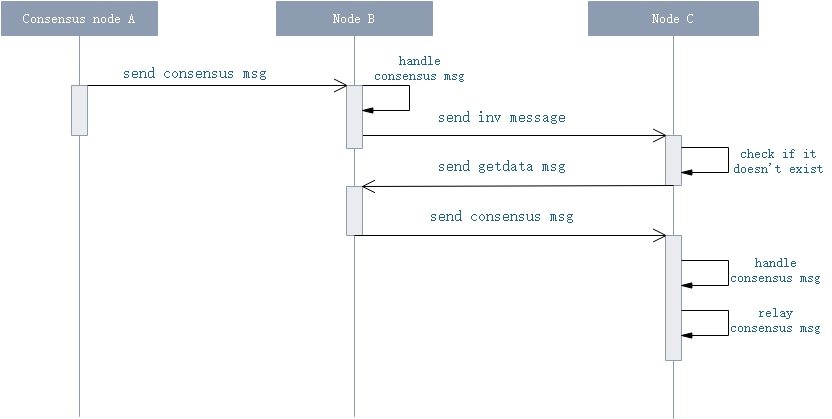

# 共识协议

## 共识消息格式

### ExtensiblePayload

所有链上传输的共识信息均用 ExtensiblePayload 类型包装，其Data域包含了具体的消息内容。

| 尺寸 | 字段 | 类型  | 说明 |
|----|------|-------|------|
| ? | Category | String | 消息类别，目前为`dBFT` |
| 4 | ValidBlockStart | uint | 起始有效高度 |
| 4 | ValidBlockEnd | uint | 终止有效高度 |
| 20 | Sender | UInt160 | 发送共识消息的议员的地址哈希 |
| ? |  Data | byte[] | 具体消息内容包括`ChangeView`, `PrepareRequest`, `PrepareResponse`, `Commit`, `RecoveryMessage`, `RecoveryRequest` |
| ? | Witness | Witness | 见证人 |

### ConsensusMessage 消息格式

ConsensusMessage 为共识消息的基础抽象类型，其余共识消息均继承自该类型。

| 尺寸| 字段 | 类型 | 说明  |
|----|------|-----|-------|
| 1 | Type | ConsensusMessageType | 共识信息种类，包含`ChangeView`, `PrepareRequest`, `PrepareResponse`, `Commit`, `RecoveryMessage`, `RecoveryRequest` |
| 4 | BlockIndex | uint | 创建消息时的区块高度 |
| 1 | ValidatorIndex | byte | 发送共识消息的议员的编号 |
| 1 | ViewNumber | byte | 当前视图编号 |

### ChangeView 消息格式

| 尺寸| 字段 | 类型 | 说明  |
|----|------|-----|-------|
| 8 | Timestamp | ulong | 创建ChangeView消息时的时间戳 |
| 1 | Reason | ChangeViewReason |  视图更改原因 |

### Commit 消息格式

| 尺寸| 字段 | 类型 | 说明  |
|----|------|-----|-------|
| ? | Signature | byte[] | 消息签名 |

### PrepareRequest 消息格式

| 尺寸| 字段 | 类型 | 说明  |
|----|------|-----|-------|
| 4 | Version | uint | 版本信息，默认为0 |
| 32 | PrevHash | UInt256 | 上个区块的hash |
| 8 | Timestamp | ulong | 创建PrepareRequest消息时的时间戳 |
| ?  | TransactionHashes | UInt256[] |  区块中交易的哈希列表 |

### PrepareResponse 消息格式

| 尺寸| 字段 | 类型 | 说明  |
|----|------|-----|-------|
| 32 | PreparationHash | UInt256 | 相应 PrepareRequest 信息的 hash |

### RecoveryMessage 消息格式

| 尺寸| 字段 | 类型 | 说明  |
|----|------|-----|-------|
|  ?  | ChangeViewMessages | Dictionary<int, ChangeViewPayloadCompact> | ChangeView信息 |
|  ?  | PrepareRequestMessage | PrepareRequest | 当前PrepareRequest信息 |
|  32  | PreparationHash | UInt256 | PrepareRequest 的 hash |
|  ?  | PreparationMessages | Dictionary<int, PreparationPayloadCompact> | 当前收集到的Preparation信息 |
|  ?  | CommitMessages | Dictionary<int, CommitPayloadCompact> | 当前收集到的Commit信息 |

### RecoveryRequest 消息格式

| 尺寸| 字段 | 类型 | 说明  |
|----|------|-----|-------|
|  8  | Timestamp | ulong | 创建信息的时间 |

## 传输协议

共识消息进入P2P网络后，和其他数据包一样，进行广播传输，（因为共识节点之间并不知道对方的IP地址), 即普通节点都可能收到共识数据包。共识消息的广播流程如下图。

  1. 共识节点A， 直接将共识消息`consensus` 广播连接上的节点B

  2. 节点B在收到`consensus`消息后，先进行共识消息处理，再进行共识消息的转发。转发共识消息前，先发送`inv`消息，并携带上`consensus`消息的`payload`的hash数据。

  3. 若节点C已经收到过该hash对应的数据，或在短时间内，已经重复获取该`inv`消息时，则不处理；否则，进入步骤四。

  4. C向B发送`getdata`消息，附带上`inv`消息中的hash数据。

  5. 节点B收到`getdata`消息后，则发送`consenus`消息给对方。

  6. C节点收到`consensus`消息后，则触发共识模块对消息处理，以及转发该共识消息，回到步骤二。

Inv 和 getdata 消息都使用 InvPayload 作为信息载体，其定义如下：

### InvPayload

| 尺寸 | 字段 | 类型  | 说明 |
|------|------|-------|------|
| 1 | Type | InventoryType | 信息种类 |
| ? | Hashes | UInt256[] | 广播 / 请求的hash |

其中，`InventoryType` 包含三种类型：

- `0x2b`: 交易， `Hashes`存放为交易hash列表
- `0x2c`: 区块， `Hashes`存放区块的hash列表
- `0x2e`: 共识， `Hashes`存放共识消息`ExtensiblePayload`的hash列表

## 共识消息处理

###  校验

1. 检查 `ValidBlockStart` 是否小于 `ValidBlockEnd`，否则断开与消息发送者的连接。

2. 检查当前高度是否在 `[ValidBlockStart, ValidBlockEnd)` 中，否则忽略该消息。

3. 检查消息发送者是否在共识白名单中，否则忽略该消息。

4. 检查验证脚本是否通过，以及`Category`是否为 "dBFT"，若不通过则忽略消息。

5. 若本节点已经在该轮发出新区快，则忽略该消息。

6. 若包含的共识信息格式有误，则忽略该消息。

7. 检查 `message.BlockIndex`。若小于或等于当前高度，则忽略该消息。

8. 检查 `message.ValidatorIndex` 是否超过当前议员总数，以及 `payload.Sender` 是否和对应的议员 hash 一致，若不合法则忽略该消息。

### 处理

1. **PrepareRequest** 由一轮共识的议长发出，其中附带了`block`相关的数据：

    1. 检查节点自身，若`PrepareRequest`已接收过，或该节点正在尝试改变视图，则忽略该消息。

    2. 根据 `message.ValidatorIndex` 确定对方是不是本轮的议长，若不是，或信息的视图 `message.ViewNumber` 编号与当前视图不一致，则忽略。 

    3. 检查 `message.Version` 和 `message.PrevHash` 是否和本节点一致，否则忽略该消息。

    4. 检查消息中的交易列表是否在 `MaxTransactionsPerBlock` 以内，否则忽略该消息。

    5. 检查 `message.Timestamp`， 若小于等于上一个区块的时间戳，或者超过了当前时间8个区块时间以上，则认为消息过期，忽略。

    6. 若提议包含的任何交易已经在区块链中，忽略消息。

    7. 更新共识上下文，并过滤在此之前收到的不合法签名（Prepare-Reponse 消息可能先到达）。

    8. 收下议长附带的签名。

    9. 若提案中交易数为0，则直接检查本地 `PrepareResponse` 的收集情况，若有足够 `PrepareResponse` 则发送 `Commit` 信息。

    10. 从内存池收集和验证提案block所需的交易。
    
        1. 若交易验证失败，或交易不满足策略要求，则认为交易数据不对，忽略该消息。

        2. 否则收下该交易，存放到共识上下文中。

    11. 检查未确认交易池中包含的block所需的交易，首先进行交易验证，再将交易存放到共识上下文中，以便构建完整的区块。

    12. 若缺少`block`中的交易时，则广播`getdata`消息，附带缺少交易的hash列表。

2. **PrepareResponse** 是议员对议长发的`PrepareRequest`消息回应，并附带了对block的签名：

    1. 若消息的视图和当前视图不匹配，则忽略。

    2. 若对方签名已经收到过，或当前节点正在尝试改变视图，则忽略。
    
    3. 若在此之前尚未收到 `PrepareRequest` 消息时，则先收下该签名（后续收到PrepareRequest时，进行过滤）。否则进入步骤 4）。
    
    4. 校验对方的签名，若通过，则收下签名，否则忽略。

    5. 若本节点已发送过`Commit`信息，则忽略。
    
    6. 若本节点发送或接收过`PrepareRequest`，则检查签名数，若已经满足`N-f`个签名，则广播`Commit`信息，并检查本地已收到的Commit信息数量，若已收到`N-f`个，则出块并广播。

3. **Changeview** 议员或者议长，在遇到超时（议长第一次超时例外，发送`PrepareRequest`消息），或者校验失败时，则发送`ChangeView`消息。议员，议长收到`ChangeView`消息做如下处理：

    1. 若新视图编号，小于等于该议员目前的视图编号，则发送`RecoveryMessage`信息。

    2. 若该节点已发送过`Commit`信息，则忽略。
    
    3. 若有不少于`N-f`个议员的视图编号等于新视图编号时，则切换视图成功，当前议员重置共识流程，视图编号为新的视图编号。

4. **Commit** 议员或议长在接收到`N-f`个`PrepareResponse`后发出的信息，通知其他节点准备出块。

    1. 若之前已接收过同一节点发出的`Commit`信息，则忽略。

    2. 校验信息签名，若校验通过，将信息存放到共识上下文中，并检查本地已收到的Commit信息数量，若已收到`N-f`个，则出块并广播。

5. **RecoveryRequest** 议员或议长在开启共识，或已Commit节点与失效节点之和大于`f`个，则会广播该信息以获取最新共识状态。

    1. 若已接受过该信息，则忽略。

    2. 检查该节点是否有义务答复该信息（已发送过`Commit`信息，或编号在信息发出节点的编号后`f`内）

    3. 若该节点有义务答复，则发送`RecoveryMessage`信息

6. **RecoveryMessage** 议员或议长在接收到自己有回复权限的`RecoveryRequest`信息，或在已发送过`Commit`信息后超时，将广播该信息帮助其他节点获取最新共识状态。

    1. 若消息的视图编号大于本节点视图编号，则接收并处理消息中的`ChangeView`信息。

    2. 接下来，若消息的视图编号等于本节点视图编号，且本节点并未正在尝试改变视图或已发送过`Commit`信息，则接收并处理消息中的`PrepareRequest`和`PrepareResponse`信息。

    3. 再接下来，若消息的视图编号小于等于本节点视图编号，则接收并处理消息中的`Commit`信息。

4. **onTimer** 消息处理

    1. 若 timer 的高度或视图编号和本节点不一致，忽略该消息。
  
    2. 若是议长超时，第一次超时发送`PrepareRequest`消息；后续若已经发送过`Commit`消息，则发送`RecoveryMessage`消息。否则发送`ChangeView`消息
    
    3. 若是议员超时，若已经发送过`Commit`消息，则发送`RecoveryMessage`消息。否则发送`ChangeView`消息

5. **PersistCompleted** 事件处理

    重置共识过程。

6. **New Tx** 事件处理

    1. 若当前节点已经发送过`PrepareRequset`或者`PrepareResponse`消息，或正在切换视图中，或已经在本轮发出新块，则忽略该交易。

    2. 若已经收到过该交易，则忽略。

    3. 若交易不在待打包block里面，则忽略。

    4. 检查交易，若交易验证失败，则发起`ChangeView`请求。

    5. 将交易收下，放到待打包的block里。

    6. 若交易为 Oracle 交易，处理相关逻辑。

    7. 若该节点为议员节点，检查提案区块是否符合 `MaxBlockSize` 和 `MaxBlockSystemFee`，否则发起`ChangeView`请求；以及检查本地 `PrepareResponse` 的收集情况，若有足够 `PrepareResponse` 则发送 `Commit` 信息。