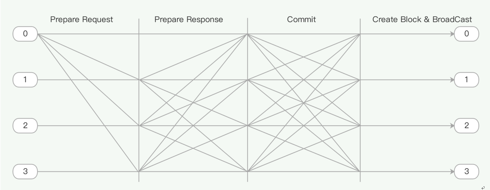

# 共识机制

## 概述 

区块链是一种去中心化的分布式账本系统，它可以用于登记和发行数字化资产、产权凭证、积分等，并以点对点的方式进行转账、支付和交易。区块链技术最早是由中本聪在一个密码学的邮件列表中提出的 [1]，也就是比特币。此后，基于区块链技术的各种应用纷纷出现，比如基于区块链的电子现金系统、基于区块链的股权交易系统、基于区块链的智能合约系统等。区块链系统与传统的中心化账本系统相比，具有完全公开、不可篡改、防止多重支付等优点，并且不依赖于任何的可信第三方。 

然而，和任何分布式系统一样，区块链系统会面临网络延迟、传输错误、软件错误、安全漏洞、黑客入侵等问题。此外，去中心化的特点决定了此系统的任何一个参与者都不能被信任，可能会出现恶意节点，以及因各方利益不一致导致的数据分歧等问题。 

为了防范这些潜在的错误，区块链系统需要一个高效的共识机制来确保每一个节点都有一个唯一公认的全局账本。传统的针对某些特定问题的容错方法，并不能完全解决分布式系统以及区块链系统的容错问题，人们需要一种能够容忍任何种类错误的容错方案。 

比特币采用工作量证明机制，非常巧妙地解决了这个问题。但是代价也很明显，那就是巨额的电力成本和资源浪费。此外，新的区块链必须寻找到一种与之不同的散列算法，用于避免来自比特币的算力攻击，如莱特币采用了与比特币的 SHA256 不同的 SCRYPT 算法。 

拜占庭容错技术是一种解决分布式系统容错问题的通用方案。NEO 在PBFT（Practical Byzantine Fault Tolerance， 实用拜占庭容错）算法的基础上，提出了dBFT（delegated Byzantine Fault Tolerance， 委托拜占庭容错）共识算法。算法根据区块链实时投票情况，决定下一轮参与共识的节点，有效降低了算法耗时，从而提高了出块速度，同时降低了交易确认周期。2019 年 3 月 又在原dBFT算法的基础上提出了升级版算法 dBFT 2.0，引入了三阶段共识机制和恢复机制，进一步提升了算法的鲁棒性和安全性。

## 系统模型 

区块链是一个分布式账本系统，参与者通过点对点网络连接，所有消息都通过广播的形式来发送。系统中存在两种节点：普通节点和共识节点。普通节点使用系统来进行转账、交易等操作，并接受账本中的数据；共识节点负责向全网提供记账服务，并维护全局账本。 

我们假设在此网络中，消息可能会丢失、损坏、延迟、重复发送，并且接受的顺序与发送的顺序不一致。此外，节点的行为可以是任意的：可以随时加入、退出网络，可以丢弃消息、伪造消息、停止工作等，还可能发生各种人为或非人为的故障。 

我们采用密码学技术来保证消息传递的完整性和真实性，消息的发送者要对消息的散列值进行签名。

## 算法 

我们的算法同时提供了安全性和可用性，只要参与共识的错误节点不超过 ⌊ (N−1) / 3 ⌋，就能保证整个系统正常运作，其中 N = |𝑅|表示参与共识的节点总数，𝑅 是共识节点的集合。令 F = ⌊ (N−1) / 3 ⌋，则 F 就表示系统所容许的错误节点的最大数量。由于实际上全局账本仅由共识节点来维护，因此系统中的普通节点不参与共识算法，但可以看到完整的共识过程。 
参与共识的节点，需要维护一个状态表，用于记录当前的共识状态。一次共识从开始到结束所使用的数据集合，称为视图。如果在当前视图内无法达成共识，则需要更换视图。我们为每一个视图分配一个编号 𝑣，编号从 0 开始，并逐渐递增，直到达成共识为止。 
我们为每一个参与共识的节点分配一个编号，从 0 开始，最后一个节点的编号为 N − 1。每一轮共识都需要有一个节点来充当议长，其它节点则为议员。议长的编号 𝑝 由如下的算法来决定：假设当前共识的区块高度为ℎ，则 𝑝 = (ℎ − 𝑣) 𝑚𝑜𝑑 N，其中 𝑝 的取值范围为 0 ≤ 𝑝 < N。每一次共识产生一个区块，并附有至少 N − F 个共识节点的签名。一旦有新的区块产生，则立即开始新一轮的共识，同时重置 𝑣 = 0。

### 一般流程

一轮共识具有以下4个阶段：

1. 议长发起共识，广播Prepare Request ；
2. 接收到Prepare Request后，议员广播Prepare Response；
3. 接收到足够多的Prepare Response 消息后，共识节点广播Commit；
4. 接收到足够多的Commit后，共识节点产生新块并广播。

### 视图更换

当共识过程中出现以下情况时，会发起Change View Request尝试更换议长：

- 议员在验证交易时出现问题
- 议员等待议长的Prepare Request超时，或等待Prepare Response超时

### 恢复机制

当发起Change View Request的时候，若缺少足够的活跃共识节点连接（已经发出Commit信息的节点和故障节点数目之和大于*F*）的时候，共识节点会向网络广播Recovery Request消息，以将数据同步至最新共识状态。共识节点收到Recovery Request时，如果满足一定条件，就会生成并广播Recovery Message。

## dBFT 2.0 的容错性

共识节点个数为 *N* 的dBFT2.0共识系统可以最多容忍 F =  ⌊ (N−1) / 3 ⌋ 个异常节点。系统的每个共识操作（Commit，Change View，出块等）需要至少 M = N − F 个节点达成共识，只要系统中的正常共识节点不少于*M*，共识进程就可以不断进行下去。比如，在一个*N* = 4 的共识系统中，只需  4 − ⌊ (4−1) / 3 ⌋ =3  个正常共识节点，就可以保证系统的正常工作。

## dBFT 2.0 的终局性

dBFT 2.0针对旧版本可能产生分叉的问题进行修正，从根本上杜绝了分叉的可能性。这是由于：

- 出块的必需条件包括，对于该新块提案，收到至少*M*个共识节点的Commit信息；
- 已经发出Commit的共识节点将不会改变视图；

因此产生一个新块意味着：

- 已经有至少*M*个共识节点对该块的提案做过签名并发出Commit信息，且这些共识节点的视图不会变化；
- 其他共识节点的数量不足产生另一个不同的区块。

因此可以保证新块的唯一性。

## 延伸阅读

[共识算法](../../tooldev/consensus/consensus_algorithm.md)

[共识协议](../../tooldev/consensus/consensus_protocol.md)

[投票](../../tooldev/consensus/vote_validator.md)

