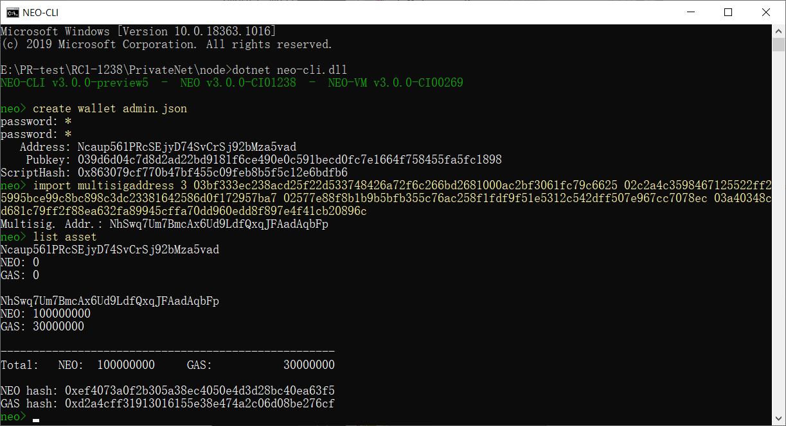
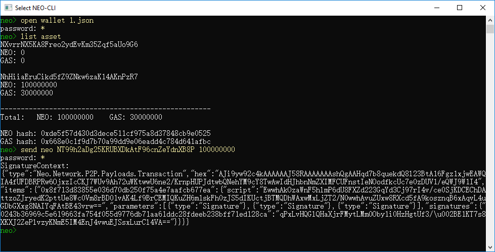
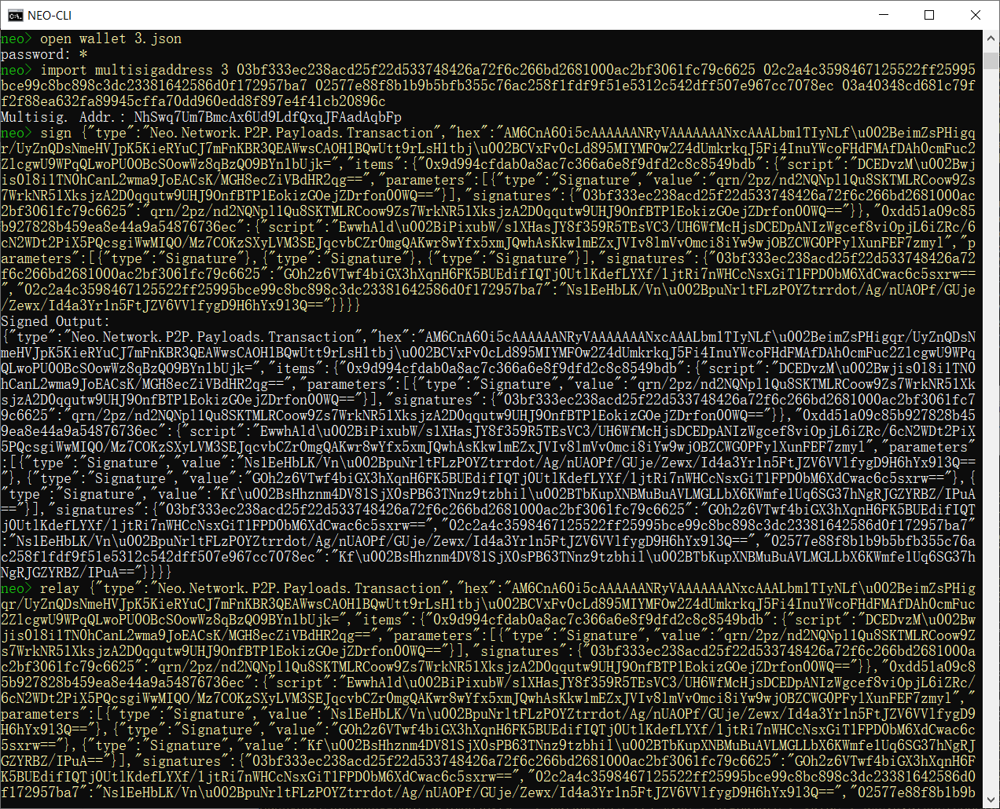
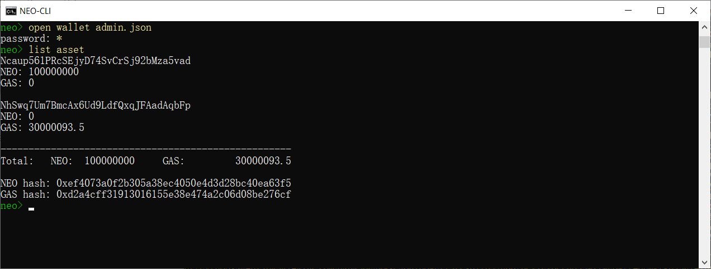

# 在本地主机搭建私有链

这篇文章我们将介绍如何在一台 Windows 系统的电脑上搭建私有链。

## 安装节点

首先安装 Neo-CLI，并将节点文件复制为 4 份，文件夹名分别命名为 c1、c2、c3、c4。

安装过程请参考 [Neo 节点的安装部署](../../../node/cli/setup.md)。 

## 创建钱包文件

使用 Neo-CLI 或 Neo-GUI 创建四个不同的钱包文件，命名为 1.json、2.json、3.json、4.json，分别放置于四个节点的文件夹中。

## 修改 config.json

在每个节点下的 config.json 文件中进行如下修改：

- 设置每个端口不重复且不被其它程序占用。
- 设置 UnlockWallet 下的参数 `Path` 为钱包文件名，`Password` 为钱包密码。
- 设置 `StartConsensus` 和 `IsActive` 为 `true`。
- `Network` 为私有链 ID，可设置为 [0 - 4294967295] 区间内的任意整数。
- `StandbyCommittee` 是委员会成员节点的公钥，票数前4的即为共识节点，这里可以输入 4 个钱包的公钥。

- `SeedList` 为种子节点的 IP 地址和端口号，IP 地址设置为 localhost，端口为 4 个节点的 `P2P` Port。


可参照下面的配置：

**c1/config.json**

```json
{
  "ApplicationConfiguration": {
    "Logger": {
      "Path": "Logs",
      "ConsoleOutput": true,
      "Active": true
    },
    "Storage": {
      "Engine": "LevelDBStore",
      "Path": "Data_LevelDB_{0}"
    },
    "P2P": {
      "Port": 21333,
      "WsPort": 21334
    },
    "UnlockWallet": {
      "Path": "1.json",
      "Password": "1",
      "IsActive": true
    },
    "PluginURL": "https://github.com/neo-project/neo-modules/releases/download/v{1}/{0}.zip"
  },
  "ProtocolConfiguration": {
    "Network": 5943216,
    "MillisecondsPerBlock": 15000,
    "MaxTraceableBlocks": 2102400,
    "ValidatorsCount": 7,
    "StandbyCommittee": [
      "03bf333ec238acd25f22d533748426a72f6c266bd2681000ac2bf3061fc79c6625",
      "02c2a4c3598467125522ff25995bce99c8bc898c3dc23381642586d0f172957ba7",
      "02577e88f8b1b9b5bfb355c76ac258f1fdf9f51e5312c542dff507e967cc7078ec",
      "03a40348cd681c79ff2f88ea632fa89945cffa70dd960edd8f897e4f41cb20896c"
    ],
    "SeedList": [
      "localhost:21333",
      "localhost:22333",
      "localhost:23333",
      "localhost:24333"
    ]
  }
}
```

**c2/config.json**

```json
{
  "ApplicationConfiguration": {
    "Logger": {
      "Path": "Logs",
      "ConsoleOutput": true,
      "Active": true
    },
    "Storage": {
      "Engine": "LevelDBStore",
      "Path": "Data_LevelDB_{0}"
    },
    "P2P": {
      "Port": 22333,
      "WsPort": 22334
    },
    "UnlockWallet": {
      "Path": "2.json",
      "Password": "1",
      "IsActive": true
    },
    "PluginURL": "https://github.com/neo-project/neo-modules/releases/download/v{1}/{0}.zip"
  },
  "ProtocolConfiguration": {
    "Network": 5943216,
    "MillisecondsPerBlock": 15000,
    "MaxTraceableBlocks": 2102400,
    "ValidatorsCount": 7,
    "StandbyCommittee": [
      "03bf333ec238acd25f22d533748426a72f6c266bd2681000ac2bf3061fc79c6625",
      "02c2a4c3598467125522ff25995bce99c8bc898c3dc23381642586d0f172957ba7",
      "02577e88f8b1b9b5bfb355c76ac258f1fdf9f51e5312c542dff507e967cc7078ec",
      "03a40348cd681c79ff2f88ea632fa89945cffa70dd960edd8f897e4f41cb20896c"
    ],
    "SeedList": [
      "localhost:21333",
      "localhost:22333",
      "localhost:23333",
      "localhost:24333"
    ]
  }
}
```

**c3/config.json**

```json
{
  "ApplicationConfiguration": {
    "Logger": {
      "Path": "Logs",
      "ConsoleOutput": true,
      "Active": true
    },
    "Storage": {
      "Engine": "LevelDBStore",
      "Path": "Data_LevelDB_{0}"
    },
    "P2P": {
      "Port": 23333,
      "WsPort": 23334
    },
    "UnlockWallet": {
      "Path": "3.json",
      "Password": "1",
      "IsActive": true
    },
    "PluginURL": "https://github.com/neo-project/neo-modules/releases/download/v{1}/{0}.zip"
  },
  "ProtocolConfiguration": {
    "Network": 5943216,
    "MillisecondsPerBlock": 15000,
    "MaxTraceableBlocks": 2102400,
    "ValidatorsCount": 7,
    "StandbyCommittee": [
      "03bf333ec238acd25f22d533748426a72f6c266bd2681000ac2bf3061fc79c6625",
      "02c2a4c3598467125522ff25995bce99c8bc898c3dc23381642586d0f172957ba7",
      "02577e88f8b1b9b5bfb355c76ac258f1fdf9f51e5312c542dff507e967cc7078ec",
      "03a40348cd681c79ff2f88ea632fa89945cffa70dd960edd8f897e4f41cb20896c"
    ],
    "SeedList": [
      "localhost:21333",
      "localhost:22333",
      "localhost:23333",
      "localhost:24333"
    ]
  }
}
```

**c4/config.json**

```json
{
  "ApplicationConfiguration": {
    "Logger": {
      "Path": "Logs",
      "ConsoleOutput": true,
      "Active": true
    },
    "Storage": {
      "Engine": "LevelDBStore",
      "Path": "Data_LevelDB_{0}"
    },
    "P2P": {
      "Port": 24333,
      "WsPort": 24334
    },
    "UnlockWallet": {
      "Path": "4.json",
      "Password": "1",
      "IsActive": true
    },
    "PluginURL": "https://github.com/neo-project/neo-modules/releases/download/v{1}/{0}.zip"
  },
  "ProtocolConfiguration": {
    "Network": 5943216,
    "MillisecondsPerBlock": 15000,
    "MaxTraceableBlocks": 2102400,
    "ValidatorsCount": 7,
    "StandbyCommittee": [
      "03bf333ec238acd25f22d533748426a72f6c266bd2681000ac2bf3061fc79c6625",
      "02c2a4c3598467125522ff25995bce99c8bc898c3dc23381642586d0f172957ba7",
      "02577e88f8b1b9b5bfb355c76ac258f1fdf9f51e5312c542dff507e967cc7078ec",
      "03a40348cd681c79ff2f88ea632fa89945cffa70dd960edd8f897e4f41cb20896c"
    ],
    "SeedList": [
      "localhost:21333",
      "localhost:22333",
      "localhost:23333",
      "localhost:24333"
    ]
  }
}
```

> [!Note]
>
> 如果安装了 RpcServer 插件，需要修改插件的 config.json 中的端口号，使其互不相同，且与节点的 config.json 中端口号也互不相同。


## 安装共识插件

下载 [共识插件]("https://github.com/neo-project/neo-modules/releases/download/v3.1.0/DBFTPlugin.zip"), 并放入四个节点 `CLI` 根目录的`Plugins`目录下。修改其配置文件`config.json`：

- 将`Network` 与私有链`config.json`中的`Network`设为相同数值。
- `AutoStart`：设为`true`以方便在启动 CLI 时自动开启共识。

可参照下面的配置：

**Plugins/DBFTPlugin/config.json**

```json
{
  "PluginConfiguration": {
    "RecoveryLogs": "ConsensusState",
    "IgnoreRecoveryLogs": false,
    "AutoStart": true,
    "Network": 5943216,
    "MaxBlockSize": 262144,
    "MaxBlockSystemFee": 900000000000
  }
}
```


## 创建快捷启动

为了方便启动私链，创建一个记事本文件，输入以下命令：

```
start cmd /k "cd c1 &&ping localhost -n 3 > nul&& dotnet neo-cli.dll"
start cmd /k "cd c2 &&ping localhost -n 3 > nul&& dotnet neo-cli.dll"
start cmd /k "cd c3 &&ping localhost -n 3 > nul&& dotnet neo-cli.dll"
start cmd /k "cd c4 &&ping localhost -n 3 > nul&& dotnet neo-cli.dll"
```

然后重命名为 Run.cmd。将其复制到 4 个节点目录外的同级目录下。

到此，私有链已经搭建完成了，所有修改过的文件结构如下

```
├─Run.cmd
|
├─c1
│      1.json
│      config.json
│
├─c2
│      2.json
│      config.json
│
├─c3
│      3.json
│      config.json
│
└─c4
|      4.json
|      config.json
```

## 启动私有链

进入每个节点目录，双击 `Run.cmd`，如果控制台打印出共识信息并且区块高度增长表示私链成功搭建：


如果关闭所有窗口，将停止私有链。

## 提取 NEO 和 GAS

在 NEO 网络的创世块中存放着 1 亿份 NEO 和 3 千万 GAS，当私链搭建起来后，GAS 也将伴着新区块的生成而生成。你可以使用 Neo-CLI 从多方签名合约中提取出这部分 NEO 和 GAS 以便内部开发测试使用。

### 从 Neo-CLI 提取

#### 创建多方签名地址

1. 启动私链。

2. 复制一个共识节点作为外部节点来进行操作，同时复制4个共识节点钱包到该节点根目录并关闭或删除共识插件。

3. 创建admin钱包，在节点中使用命令 `import multisigaddress m pubkeys`，创建一个多方签名地址。

   这里设置最小签名数 m 为 3，pubkeys 为四个共识节点的公钥（见 config.json）。例如：

    ``` 
   import multisigaddress 3 03bf333ec238acd25f22d533748426a72f6c266bd2681000ac2bf3061fc79c6625 02c2a4c3598467125522ff25995bce99c8bc898c3dc23381642586d0f172957ba7 02577e88f8b1b9b5bfb355c76ac258f1fdf9f51e5312c542dff507e967cc7078ec 03a40348cd681c79ff2f88ea632fa89945cffa70dd960edd8f897e4f41cb20896c
    ```

4. 分别打开钱包`1.json`, `2.json`, `3.json`重复第三步导入多签地址。

5. 输入命令 `list asset`，可以看到合约地址中出现了 100,000,000 NEO 和 30,000,000 GAS。

   

> [!Note]
>
> 至少3个共识钱包创建多方签名地址才能成功完成转账交易的签名。


#### 提取 NEO/GAS 到普通地址

接下来我们将 NEO 从合约地址转入普通地址：

1. 打开第一个钱包（1.json）使用命令 `send <id|alias> <address> <value>` 将 NEO 转入admin 钱包地址。

2. 复制 SignatureContext 内容并关闭钱包。

   

3. 打开第二个钱包（2.json）。

4. 使用步骤 2 中复制的内容输入命令 `sign <jsonObjectToSign>` 

5. 复制 Signed Output 内容。

   

6. 打开第三个钱包（3.json）重复前面的签名步骤，然后就可以使用 `relay <jsonObjectToSign>` 广播交易完成签名。

   

7. 输入 `list asset` 查看钱包资产，可以看到 NEO 已经转入。

   

参考前面提取 NEO 进行的多方签名操作，同样可以提取 GAS 到目标地址。