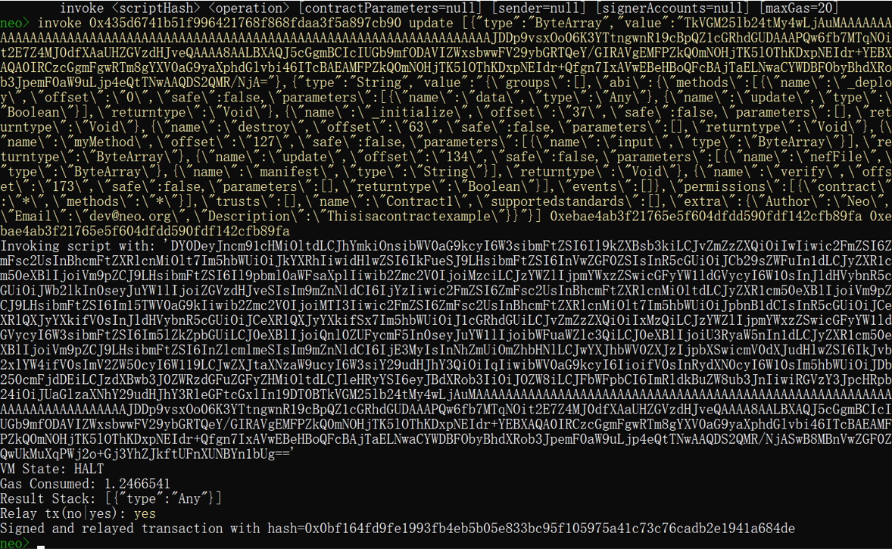

# 合约升级与销毁

合约支持在发布之后进行升级和销毁，但需要在合约里实现升级和销毁方法。

## 合约升级

当需要将原来已经部署使用的合约进行升级或者想将旧合约的存储区迁移到新合约的时候，需要用到合约升级的功能。合约升级时合约哈希和存储区都不会改变。

### 实现 Update 方法
要使用合约升级的功能，需要在原有合约中实现升级方法，合约模板中已默认实现了 `Update` 方法，如下所示：

```c#
public static bool Verify() => IsOwner();

public static void Update(ByteString nefFile, string manifest)
{
    if (!IsOwner()) throw new Exception("No authorization.");
    ContractManagement.Update(nefFile, manifest, null);
}
```

如果希望未来对合约进行升级，那么此合约在部署之前必须实现 `update` 方法。关于部署合约，请参考 [部署和调用合约](../deploy/deploy.md)。

### 进行合约升级

1. 准备好新合约编译后的 NEF 文件和 Manifest 文件

2. 获得 Base64 格式的 NEF，可使用 [文件在线转 Base64](https://www.hitoy.org/tool/file_base64.php)

3. 获得压缩转义的 Manifest，可使用 [JSON在线压缩转义](http://www.bejson.com/zhuanyi/)

4. 使用 invoke 命令调用合约的 update 方法




关于调用合约，请参考 [调用合约](../deploy/invoke.md)。

执行 update 方法后，合约即升级完成，合约哈希和存储区都不会改变。

## 合约销毁

智能合约支持在发布之后进行销毁操作，但需要在旧合约内预留销毁方法。

要使用合约销毁的功能，需要在原有合约中实现销毁方法。合约模板中已默认实现了 `destroy` 方法，如下所示：

```c#
public static bool Verify() => IsOwner();

public static void Destroy()
{
    if (!IsOwner()) throw new Exception("No authorization.");
    ContractManagement.Destroy();
}
```

Destroy 方法不需要参数，调用该方法后，合约将会被删除，如果合约有存储区，则存储区也将被删除。之后合约将不可用。

