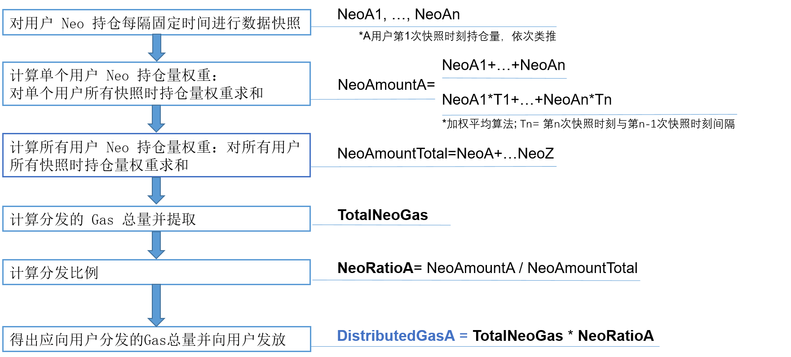

# 给用户分发 GAS

交易所可以选择是否给用户分发 GAS。GAS 用来支付 NEO 区块链的记账费和附加服务费。

## 什么是 GAS ?

NEOGAS（缩写符号 GAS）共 1 亿份，代表了 NEO 区块链的使用权。GAS 会随着每个新区块的生成而产生，依照既定的缓慢衰减的发行速度，经历总量从 0 到 1 亿的过程，约 22 年达到 1 亿总量。只要获得 NEO，GAS 便会在系统中按照算法自动生成。

GAS 有两种状态，可提取和不可提取，对应于 NEO 的两种状态：已花费和未花费。一个 NEO 的生命周期以转入地址开始，转出地址截止，转入时状态变为未花费，转出时状态变为已花费。当 NEO 处于未花费状态时，所产生的 Gas 为不可提取。当 NEO 处于已花费状态时，期间所产生的 GAS 变为可以提取。如何将钱包中的所有不可提取GAS 转为可提取呢？很简单，将钱包中的所有 NEO 转到钱包中的任意一个地址即可。

## 计算可提取的 GAS 总量

- 可提取的*GAS = f(neo_amount, Δt_const)*

  -  Δt_const = t_end - t_start
    -  t_end =NEO 变为 spent 状态时刻
    -  t_start =NEO 变为 unspent 状态时刻

  由于 Δt 是定量，所以可提取的 GAS 也是一个定量。可提取 GAS 的大小取决于所持有的 NEO 数量以及两个状态的时间差。

- 不可提取的*GAS = f(neo_amount, Δt_var)*

  - Δt_var = t - t_start
    - t 为当前时刻
    - t_start =NEO 变为 unspent 状态时刻

  由于 t 是变量，所以不可提取的 GAS 也随时间增长而不停增长，是一个变量。

## 给用户分发 GAS

假设交易所的所有地址都在一个钱包里，下图显示了交易所向某用户 A 分发 GAS 的流程和计算公式：

快照间隔越短，计算越精确。如果快照时间间隔不均匀，可以采用加权平均算法。

## RPC 方法

以下 RPC 方法可以帮助交易所查询用户 GAS 信息。要查看调用的 JSON 文件示例，点击表格中的链接。

| 方法                                                         | 描述                                                         | 参数           |
| ------------------------------------------------------------ | ------------------------------------------------------------ | -------------- |
| [getunclaimedgas](../../reference/rpc/latest-version/api/getunclaimedgas.md) | 显示当前钱包内所有地址生成的 GAS 数量。                      |                |
| [getunclaimed](../../reference/rpc/latest-version/api/getunclaimed.md) | 显示指定地址中未提取的 GAS 数量。                            | \<address>     |
| [claimgas](../../reference/rpc/latest-version/api/claimgas.md) | 提取钱包中的 GAS。默认将 GAS 提取到钱包第一个标准地址，也可以将 GAS 提取到指定地址。 | [address] 可选 |
| [getclaimable](../../reference/rpc/latest-version/api/getclaimable.md) | 显示指定地址内可以 claim 的 GAS 信息。                       | \<address>     |
| [getunspents](../../reference/rpc/latest-version/api/getunspents.md) | 返回指定账户中未花费的 UTXO 资产（如 NEO、GAS）信息。        | \<address>     |

## 用户提取 GAS

用户将地址中的 NEO 完成一次转账即可提取 GAS，例如：地址 A 中有 NEO，GAS 为不可提取状态， 那么只需要将 NEO 转给自己，GAS 即可变为可提取状态。

具体提取步骤和命令请参见下表。

| #    | 步骤                                       | 输入命令                                     |
| ---- | :--------------------------------------- | ---------------------------------------- |
| 1    | 运行客户端                                    | `dotnet neo-cli.dll --rpc`                     |
| 2    | 查看客户端版本                                  | `version`                                |
| 3    | 查看客户端同步高度（Height: 区块高度 / 区块头高度，Nodes: 连接节点数量）。 | `show state`                             |
| 4    | 创建钱包                                     | `create wallet /home/NeoNode/test.db3`   |
| 5    | 打开钱包                                     | `open wallet /home/NeoNode/test.db3`     |
| 6    | 查看钱包里的地址列表                               | `list address`                           |
| 7    | 查看钱包资产                                   | `list asset`                             |
| 8    | 获取钱包 GAS 余额详情                              | `show gas`                               |
| 9    | 给自己的钱包地址 （如 AaAHt6Xi51iMCaDaYoDFTFLnGbBN1m75SM 1）转账，通过给自己转账将 GAS 状态变为可提取状态 | `send NEO AaAHt6Xi51iMCaDaYoDFTFLnGbBN1m75SM 1` |
| 10   | 再次获取钱包 GAS 余额详情，此时所有 GAS 都为可提取状态           | `show GAS`                               |
| 11   | 提取 GAS                                   | `claim gas [all]`                              |
| 12   | 再次查看钱包余额，确认提取成功                          | `list asset`                             |

