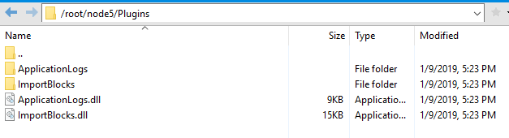

# 在服务器中部署 Neo 节点

## 安装节点

1. 安装 Neo 节点的运行环境 [.NET Core Runtime](https://www.microsoft.com/net/download/core#/runtime)，2.0 或以上版本。
2. 在 GitHub 上下载 [neo-cli](https://github.com/neo-project/neo-node/releases) 程序包并启动 Neo 节点。

## 安装插件

一些附加功能被独立封装在插件中用以调用，提升了节点的安全性，稳定性和灵活性。关于插件的详细信息，请参见 [安装插件](../node/cli/config.md/#安装插件)。

交易所需要在[这里](https://github.com/neo-project/neo-plugins/releases/)下载安装以下插件，以保证 API 的正常使用和自动读取离线包的完整性：

- ApplicationLogs（必选）
- LevelDBStore（必选）
- RpcServer（必选）
- RpcNep5Tracker（推荐）
- StatesDumper（推荐）
- SystemLog（推荐）

 将下载的插件包解压到 neo-cli 根目录下，解压完成后的目录结构如下图:



也可以使用以下命令自动进行安装：

```
install ApplicationLogs
install LevelDBStore
install RpcServer
install RpcNep5Tracker
install StatesDumper
install SystemLog
```

> [!Note]
>
> RpcNep5Tracker 插件需要 RpcServer 插件已安装的前提下使用；
> ApplicationLogs 和 RpcNep5Tracker 插件需在初始同步之前就必须安装，否则会遗漏安装前已同步区块中交易日志的内容。

## 修改配置文件

在启动 Neo-CLI 前需先配置 config.json 文件中的参数，请参阅 [配置与启动](../node/cli/config.md)。

> [!Caution]
>
> 当设置自动打开钱包时，请确保防火墙打开并处于安全环境， 谨慎使用。

