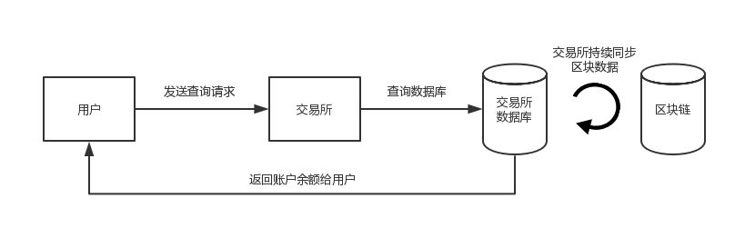
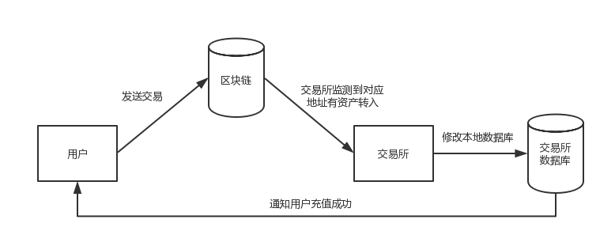
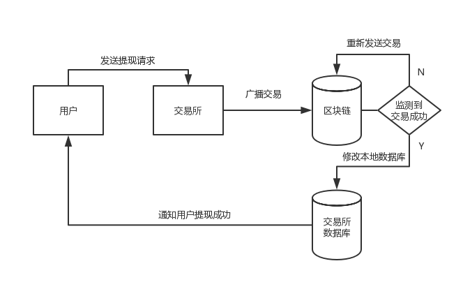
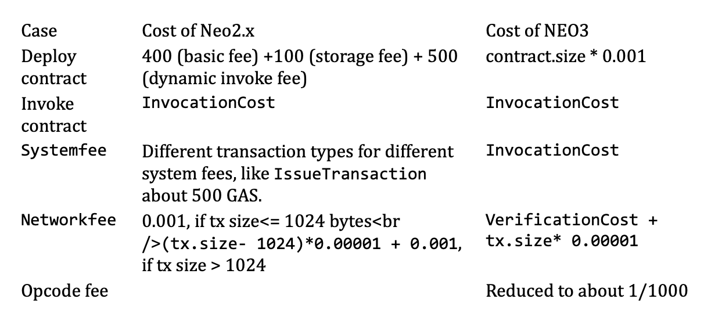

# 处理资产交易

## 简介

Neo3 中只有一种资产，即 NEP-5 类型的资产，使用 BALANCE 模型来管理资产。交易所对接时，主要处理这类资产的查询、充值、提现等操作。这三种操作的流程分别如下图所示：

   

   

   

## 网络费

网络费是用户向 Neo 网络提交交易时支付的费用，作为共识节点的出块奖励。每笔交易的网络费存在一个基础值，计算公式如图所示。只有当用户支付的网络费大于或等于此基础费用时，才会执行交易。否则将被认为无效交易。

   

- VerficationCost：NeoVM 验证交易签名执行的指令相对应的费用
- tx.size：交易数据的字节长度
- FeePerByte：交易每字节的费用，目前在 PolicyContract 定义为 0.00001 GAS。

## 系统费

系统费是根据 NeoVM 要执行的指令计算得出的费用，有关每个操作指令的费用，请参考[系统费用](../sc/fees.md)。Neo3 中取消了每笔交易 10 GAS 的免费额度，系统费用总额受合约脚本的指令数量和指令类型影响，计算公式如下：

   

### 操作码费用

NeoVM 操作码费用降低为原来的 1/1000 左右，可以显著降低智能合约开发成本。

与 NEO2.x 的比较：



## 处理查询交易

交易所由于自身管理钱包产生的查询地址余额需求和用户的查询账户余额请求是不同的。

### 交易所查询用户地址余额

交易所查询用户地址余额的操作如下：

1. 编写 JSON 文件，调用以下任意一个 RPC 方法：
   - getnep5balances（需提前安装 RpcNep5Tracker 插件）
   - invokefunction
2. 向 Neo RPC 服务器发送文件请求。
3. 根据返回值计算出用户余额。

#### 调用 getnep5balances

在 JSON 文件中，getnep5balances 的请求正文通常为以下格式：
```json
{
  "jsonrpc": "2.0",
  "method": "getnep5balances",
  "params": ["NVfJmhP28Q9qva9Tdtpt3af4H1a3cp7Lih", 0],
  "id": 1
}
```
发送请求后，将收到如下响应：
```json
{
    "jsonrpc": "2.0",
    "id": 1,
    "result": {
        "balance": [
            {
                "asset_hash": "0x9bde8f209c88dd0e7ca3bf0af0f476cdd8207789",
                "amount": "2",
                "last_updated_block": 52675
            },
            {
                "asset_hash": "0x8c23f196d8a1bfd103a9dcb1f9ccf0c611377d3b",
                "amount": "700000000",
                "last_updated_block": 52675
            }
        ],
        "address": "NVfJmhP28Q9qva9Tdtpt3af4H1a3cp7Lih"
    }
}
```
根据所有返回值，可以计算出用户余额为：
用户余额 = 700000000/10⁸ NEO = 7 GAS, 2 NEO

#### 调用 invokefunction

在 JSON 文件中，invokefunction 的请求正文通常为以下格式：

```json
{
  "jsonrpc": "2.0",
  "method": "invokefunction",
  "params": [
    "script hash",
    "method name",
    [
      {
        "optional arguments"
      }
    ]
  ],
  "id": 1
}
```

查询用户余额时，你需要替换上例中的这些字符：

**script hash**

要查询的 NEP-5 资产的脚本哈希，例如：

NEO脚本哈希是：*0x9bde8f209c88dd0e7ca3bf0af0f476cdd8207789*       

GAS脚本哈希是：*0x8c23f196d8a1bfd103a9dcb1f9ccf0c611377d3b*

**method name**

要调用的方法。要查询用户余额，需要调用以下三个方法：

balanceOf

- 语法：`public static BigInteger balanceOf(byte[] account)`
- 说明："balanceOf" 返回 "account" 的余额。

decimals

- 语法：`public static byte decimals()`
- 说明： "decimals" 返回代币使用的小数位数。

symbol

- 语法：`public static string symbol()`
- 说明："symbol" 返回币种符号。


- optional arguments

  可选。如果调用的方法需要参数，可以将这些参数构造成一个数组传入。例如，NEP-5 的 "balanceOf" 返回 "account" 的余额：

  `public static BigInteger balanceOf(byte[] account)`

  因此，你需要把 account 作为 "balanceOf" 方法的一个参数。

##### 调用示例

##### **调用 balanceOf**

假设用户账户地址是 NeHNBbeLNtiCEeaFQ6tLLpXkr5Xw6esKnV，你需要将其转换为 Hash160 类型并将此参数构造成 JSON 对象，如下所示:

```json
{
    "type": "Hash160",
    "value": "0x09ad8f0b21a7294b3e429f58eaa415ac4b327ec9"
}
```

然后构造如下 JSON 参数：

请求正文：

```json
{
  "jsonrpc": "2.0",
  "method": "invokefunction",
  "params": [
    "0xe9fa06842455ecf020b15d0e9b9c42de24ea3c6d",
    "balanceOf",
    [
      {
        "type": "Hash160",
        "value": "0x09ad8f0b21a7294b3e429f58eaa415ac4b327ec9"
      }
    ]
  ],
  "id": 3
}
```

发送请求后，将收到如下响应：

```json
{
    "jsonrpc": "2.0",
    "id": 3,
    "result": {
        "script": "14c97e324bac15a4ea589f423e4b29a7210b8fad0951c10962616c616e63654f66146d3cea24de429c9b0e5db120f0ec55248406fae968627d5b52",
        "state": "HALT",
        "gas_consumed": "8295750",
        "stack": [
            {
                "type": "ByteArray",
                "value": "AADBb/KGIw=="
            }
        ]
    }
}
```

返回值 "AADBb/KGIw==" 为 base64 编码后的 ByteArray，由 base64 解码返回值再转化成 BigInteger 可以得到 **1x10<sup>16</sup>**, 最后除以 8 位 decimals 得到此 Nep-5 资产的余额为 **1x10<sup>8</sup>**。

##### **调用 decimals**

请求正文：

```json
{
  "jsonrpc": "2.0",
  "method": "invokefunction",
  "params": [
    "0xe9fa06842455ecf020b15d0e9b9c42de24ea3c6d",
    "decimals",
    []
    ],
  "id": 2
}
```

发送请求后，将收到如下响应：

```json
{
    "jsonrpc": "2.0",
    "id": 3,
    "result": {
        "script": "00c108646563696d616c73146d3cea24de429c9b0e5db120f0ec55248406fae968627d5b52",
        "state": "HALT",
        "gas_consumed": "5673200",
        "stack": [
            {
                "type": "Integer",
                "value": "8"
            }
        ]
    }
}
```

返回值为整数 **8**。

##### **调用 symbol**

请求正文:

```json
{
  "jsonrpc": "2.0",
  "method": "invokefunction",
  "params": [
    "0xe9fa06842455ecf020b15d0e9b9c42de24ea3c6d",
    "symbol",
    [ ]
  ],
  "id": 3
}
```

发送请求后，将收到如下响应：

```json
{
    "jsonrpc": "2.0",
    "id": 3,
    "result": {
        "script": "00c10673796d626f6c146d3cea24de429c9b0e5db120f0ec55248406fae968627d5b52",
        "state": "HALT",
        "gas_consumed": "8106560",
        "stack": [
            {
                "type": "ByteArray",
                "value": "dDE="
            }
        ]
    }
}
```

返回值 "dDE=" 可以被 base64 解码为 "t1"。

##### **计算用户余额**

根据所有返回值，可以计算出用户余额为：
用户余额 = balanceOf 返回值 / 10<sup>decimals</sup>。

### 处理用户查询账户余额请求

用户实际在交易所里的余额，应当记录在交易所的数据库里。 交易所需要编写程序监控每个区块的每个交易，在数据库中记录下所有充值提现交易，对应修改数据库中的用户余额，以供用户查询使用。

## 处理充值交易

交易所处理充值交易的操作如下：
1. 通过 getblock API 获取每个区块的详情，其中便包括该区块中所有交易的详情；
2. 分析每笔交易的交易类型，过滤出所有类型为 "InvocationTransaction" 的交易，任何非 "InvocationTransaction" 类型的交易都不可能成为 NEP-5 类型资产的转账交易；
3. 调用 getapplicationlog API 获取每笔 "InvocationTransaction" 交易的详情，分析交易内容，完成用户充值。

### 调用 getapplicationlog

使用 [getapplicationlog](../reference/rpc/latest-version/api/getapplicationlog.md) 这个 API 来获取交易信息。

正确安装 ApplicationLogs 插件并启动 Neo-CLI 节点后，可以看到在neo-cli 根目录下生成了一个 ApplicationLogs 文件夹，完整的合约日志会记录到该目录下，每笔 NEP-5 交易会记录在 leveldb 文件中，通过 API 来读取。

以下是一个 API 调用结果：

```json
{
    "jsonrpc": "2.0",
    "id": 1,
    "result": {
        "txid": "0xe7b3782ea15c74889ee914de6acb7c311603ea7b5c3209d0e8b8e7a805848750",
        "trigger": "Application",
        "vmstate": "HALT",
        "gas_consumed": "13805550",
        "stack": [
            {
                "type": "Integer",
                "value": "1"
            }
        ],
        "notifications": [
            {
                "contract": "0x293b54c743f7a6433b2619da037beb9ed22aa73b",
                "state": {
                    "type": "Array",
                    "value": [
                        {
                            "type": "ByteArray",
                            "value": "VHJhbnNmZXI="
                        },
                        {
                            "type": "ByteArray",
                            "value": "0wzwBoLXDacAgxEkGaxxo1Ezxh4="
                        },
                        {
                            "type": "ByteArray",
                            "value": "yX4yS6wVpOpYn0I+SymnIQuPrQk="
                        },
                        {
                            "type": "ByteArray",
                            "value": "AADBb/KGIw=="
                        }
                    ]
                }
            }
        ]
    }
}
```

> [!Note]
>
> -  失败的 NEP-5 交易也会上链，因此需要判断虚拟机的状态项 "vmstate" 是否正确（HALT）。
> -  "vmstate" 是虚拟机执行合约后的状态，如果包含"FAULT"的话，说明执行失败，那么该交易便是无效的。

- **contract**: 该字符串为智能合约的脚本哈希，对于交易所来说，这里是相应 NEP5 类型资产的脚本哈希，交易所可以以此来确定资产的唯一性。例如，"0xb9d7ea3062e6aeeb3e8ad9548220c4ba1361d263" 就是 QLC 资产的脚本哈希，是该资产在全网的唯一标识。

- 对于转账交易，"state" 中 "value" 对应的数组包含以下四个对象：

  [事件，转出账户，转入账户，金额]

  - 数组中的第一个对象，类型为 bytearray，值为 "VHJhbnNmZXI="，经过 base64 解码后转换，为字符串 "transfer"。transfer 是 NEP-5 中的一个方法，代表资产转账。
    
    ```json
    {
      "type": "ByteArray",
      "value": "VHJhbnNmZXI="
    }
    ```
    
  - 数组中的的第二个对象，为转出账户地址，类型为 bytearray，值为 "0wzwBoLXDacAgxEkGaxxo1Ezxh4="，经过 base64 解码为 ByteArray 后再转换为字符串 "Nf9uG9nhF8PEvbSHc8xmNGsG7toNnu4a8T"。
  
    > 提示
    >
    > - Neo 中 16 进制值如果前面加 0x，按大端序处理，如果没加 0x，按小端序处理。
    ```json
    {
      "type": "ByteArray",
      "value": "0wzwBoLXDacAgxEkGaxxo1Ezxh4="
    }
    ```
  
   - 数组中的第三个对象，为转入账户地址，类型为 bytearray，值为 "yX4yS6wVpOpYn0I+SymnIQuPrQk="，经过 base64 解码为 ByteArray 后再转换为字符串 "NeHNBbeLNtiCEeaFQ6tLLpXkr5Xw6esKnV"。对于交易所来说，如果该地址为交易所地址，那么该交易是一笔充值交易。
    ```json
    {
      "type": "ByteArray",
      "value": "yX4yS6wVpOpYn0I+SymnIQuPrQk="
    }
    ```
  - 数组中的的第四个对象，为转账金额，类型为 bytearray，值为 "AADBb/KGIw=="，经 base64 解码后为 "0000c16ff28623"。因前面没加 0x，按小端序处理, 翻转后为 "2386f26fc10000", 值为 1x10<sup>16</sup>, 因为 decimal 为 8 位，所以实际值就是 100000000.00000000。这里根据金额不同，会有两种类型，一种是 integer 类型，另一种是 bytearray 类型。交易所处理该数值时，应当特别注意，如果类型为 integer，其数值转换方式与 bytearray 不同，如对于当前返回值，Integer 类型应为 10000000000000000。
    ```json
    {
      "type": "ByteArray",
      "value": "AADBb/KGIw=="
    }
    ```

> [!Note]
>
> 关于文件中 transfer 通知格式的转换，可以参考工具 [Neo3-Tool](https://github.com/neo-ngd/Neo3-Tool)。

## 处理提现交易

交易所可以通过以下一种方式发送资产给用户，客户端则必须打开钱包才能使用以下 API：

- Neo-CLI 命令： `send`
- RPC 方法： `sendfrom`
- RPC 方法： `sendtoaddress`
- RPC 方法： `sendmany`

### Neo-CLI 命令：send

##### 语法

`send <txid|script hash> <address> <value> `

##### 参数

- `txid|script hash`：资产 ID。
- `address`：付款地址。
- `value`：转账金额。

该命令会检查钱包密码。

##### 示例

要将 100 个某 NEP5 转账到地址 NeHNBbeLNtiCEeaFQ6tLLpXkr5Xw6esKnV，输入以下命令：

```
send 0x293b54c743f7a6433b2619da037beb9ed22aa73b NeHNBbeLNtiCEeaFQ6tLLpXkr5Xw6esKnV 100
```

如果要转账 neo/gas，只需要将第一个参数改为 NEO/GAS 对应的 scriptHash。例如:
* NEO: 0x9bde8f209c88dd0e7ca3bf0af0f476cdd8207789
* GAS: 0x8c23f196d8a1bfd103a9dcb1f9ccf0c611377d3b

### RPC 方法：openwallet

> [!Note]
>
> 在任何调用钱包相关操作的 RPC 方法之前，需要先调用 `openwallet` 这个 RPC 方法打开钱包。

"params"  是一个包含 2 个参数的数组。

`"params":[path， password]`

例如，要打开密码为 `111111` 的名为 `a.json` 的钱包，可以编写如下 JSON 请求发送给 RPC 服务器。

请求正文：

```json
{
  "jsonrpc": "2.0",
  "method": "openwallet",
  "params": ["a.json", "111111"],
  "id": 1
}
```

发送请求后，将收到如下响应：

```json
{
    "jsonrpc": "2.0",
    "id": 1,
    "result": true
}

```

### RPC 方法：sendfrom

 "params"  包含一个 4 个参数的数组。

`"params":[script hash, address from, address to, amount ]`

例如，要从地址 NeHNBbeLNtiCEeaFQ6tLLpXkr5Xw6esKnV 发送 10 NEO 到地址 NQbqLCGg3iZRVp89HefRzCtiuvw11se3SK，编写如下 JSON 文件并发送给 RPC 服务器。

请求正文：

```json
{
  "jsonrpc": "2.0",
  "method": "sendfrom",
  "params": ["0x9bde8f209c88dd0e7ca3bf0af0f476cdd8207789","NeHNBbeLNtiCEeaFQ6tLLpXkr5Xw6esKnV","NQbqLCGg3iZRVp89HefRzCtiuvw11se3SK",10],
  "id": 1
}
```

发送请求后，将收到如下响应：

```json
{
    "jsonrpc": "2.0",
    "id": 1,
    "result": {
        "hash": "0xfc69052f7875ab934098c22086e6025b6e99c2d5383ede6b5e7ffc5cada0f526",
        "size": 258,
        "version": 0,
        "nonce": 1499649081,
        "sender": "NeHNBbeLNtiCEeaFQ6tLLpXkr5Xw6esKnV",
        "sys_fee": "100000000",
        "net_fee": "1258270",
        "valid_until_block": 2408902,
        "attributes": [],
        "cosigners": [
            {
                "account": "0x09ad8f0b21a7294b3e429f58eaa415ac4b327ec9",
                "scopes": "CalledByEntry"
            }
        ],
        "script": "WhQzapXCv4GGc3VXYkpfCfc5hNkgIBTJfjJLrBWk6lifQj5LKachC4+tCVPBCHRyYW5zZmVyFBXKoEIUMQZw1eWjmOFH4NvtmM9DaGJ9W1Lx",
        "witnesses": [
            {
                "invocation": "QKw6QhHNOTcvifIw6Jxyomb7Rto2SZZYR/H48tS5f0UYlYKQdRsgxVycB/f/HXEqYZVaL7G9WYGp6WsexKoOb4I=",
                "verification": "IQLqNWb+zTA/d3UpLyQr4Ux3jVnJ6jJDniao8UG2IcxkBlBoCpBq1A=="
            }
        ]
    }

```

### RPC 方法：sendtoaddress

 "params"  包含一个 3 个参数的数组。

`"params":[script hash, address, amount]`

例如，要发送 1000 GAS 到地址 NQbqLCGg3iZRVp89HefRzCtiuvw11se3SK，编写如下 JSON 文件并发送给 RPC 服务器。

请求正文：

```json
{
    "jsonrpc":"2.0",
    "method":"sendtoaddress",
    "params":[
        "0x8c23f196d8a1bfd103a9dcb1f9ccf0c611377d3b",
        "NQbqLCGg3iZRVp89HefRzCtiuvw11se3SK",
        "1000"
    ],
    "id":1
}
```

发送请求后，将收到如下响应：

```json
{
    "jsonrpc": "2.0",
    "id": 1,
    "result": {
        "hash": "0x5e810bf58c9c14f49c821e7d12adb435a4fac413b817390bae850e578202c214",
        "size": 370,
        "version": 0,
        "nonce": 370378736,
        "sender": "Nc2TgT3BTnDZGh21uU14Fudaq9C8GqUKJA",
        "sys_fee": "100000000",
        "net_fee": "2370540",
        "valid_until_block": 2409087,
        "attributes": [],
        "cosigners": [
            {
                "account": "0x09ad8f0b21a7294b3e429f58eaa415ac4b327ec9",
                "scopes": "CalledByEntry"
            }
        ],
        "script": "BQDodkgXFDNqlcK/gYZzdVdiSl8J9zmE2SAgFMl+MkusFaTqWJ9CPksppyELj60JU8EIdHJhbnNmZXIUJYLRsnXobI8Ok6my+s1f23YJdqFoYn1bUvE=",
        "witnesses": [
            {
                "invocation": "QPKQ71AqXJ83CdatB7+jb7oQdFV94g6Qr00y7i59w/bp4WH6OcvZxr2PNkpBCNIO/wkGiiySOB0N4a14ptKQ6b0=",
                "verification": "IQL8lC/gCB0zH17Y7ioOmrUAqlGeGpUXpON83NH7CDJfY1BoCpBq1A=="
            },
            {
                "invocation": "QOmJGUTaynsVo7a4doEnBsDj3qjrBgu6f5jG7IQ9tHWzxHlZg9OknmIWhLYatCLX1qbPb2KartjAYezE5uWra2U=",
                "verification": "IQLqNWb+zTA/d3UpLyQr4Ux3jVnJ6jJDniao8UG2IcxkBlBoCpBq1A=="
            }
        ]
    }
}
```

### RPC 方法：sendmany

"params"  包含至少两个参数的数组。

`"params":[address from(optional), []]`

例如，要从 NeHNBbeLNtiCEeaFQ6tLLpXkr5Xw6esKnV 发送 100 NEO 和 1000 GAS 到 NQbqLCGg3iZRVp89HefRzCtiuvw11se3SK，编写如下 JSON 文件并发送给 RPC 服务器。

请求正文：

```json
{
    "jsonrpc": "2.0",
    "method": "sendmany",
    "params": [
    "NeHNBbeLNtiCEeaFQ6tLLpXkr5Xw6esKnV",
        [
            {
                "asset": "0x9bde8f209c88dd0e7ca3bf0af0f476cdd8207789",
                "value": 100,
                "address": "NQbqLCGg3iZRVp89HefRzCtiuvw11se3SK"
            },
            {
                "asset": "0x8c23f196d8a1bfd103a9dcb1f9ccf0c611377d3b",
                "value": 2,
                "address": "NQbqLCGg3iZRVp89HefRzCtiuvw11se3SK"
            }
        ]
    ],
    "id": 1
}
```

发送请求后，将收到如下响应：

```json
{
    "jsonrpc": "2.0",
    "id": 1,
    "result": {
        "hash": "0x01bdee95fe77ebca78bd17a8bbfd4f538671941381560e9f842e07d5bd86ec5e",
        "size": 344,
        "version": 0,
        "nonce": 1882341262,
        "sender": "NeHNBbeLNtiCEeaFQ6tLLpXkr5Xw6esKnV",
        "sys_fee": "100000000",
        "net_fee": "1344270",
        "valid_until_block": 2409235,
        "attributes": [],
        "cosigners": [
            {
                "account": "0x09ad8f0b21a7294b3e429f58eaa415ac4b327ec9",
                "scopes": "CalledByEntry"
            }
        ],
        "script": "AWQUM2qVwr+BhnN1V2JKXwn3OYTZICAUyX4yS6wVpOpYn0I+SymnIQuPrQlTwQh0cmFuc2ZlchQVyqBCFDEGcNXlo5jhR+Db7ZjPQ2hifVtS8QQAwusLFDNqlcK/gYZzdVdiSl8J9zmE2SAgFMl+MkusFaTqWJ9CPksppyELj60JU8EIdHJhbnNmZXIUJYLRsnXobI8Ok6my+s1f23YJdqFoYn1bUvE=",
        "witnesses": [
            {
                "invocation": "QA9OZduN6MyEczPEV12TW7EFise5+riC9wagEv/M2SV7rrcRPiDAjbDbZxY0bcIz4JSafTJtF9FEo9laJwuhSMs=",
                "verification": "IQLqNWb+zTA/d3UpLyQr4Ux3jVnJ6jJDniao8UG2IcxkBlBoCpBq1A=="
            }
        ]
    }
}
```

## 相关参考

[NEP-5 Token Standard](https://github.com/neo-project/proposals/blob/master/nep-5.mediawiki "NEP5") 

[数据转换示例](https://github.com/neo-ngd/Neo3-Tool)
