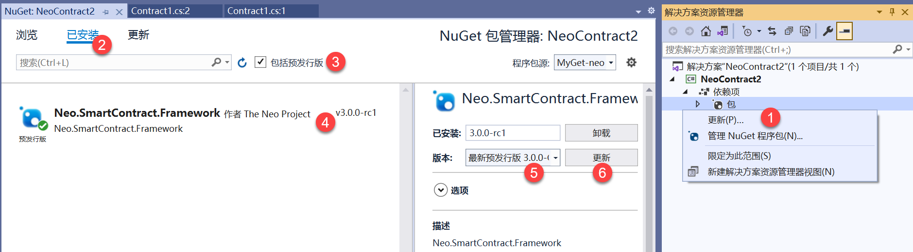
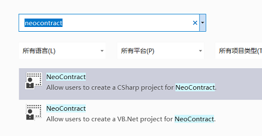

# 开发示例合约

我们已经搭建私链并启动节点连接私链，下文将以使用 Windows 10 和 C# 为例，带领开发者配置环境、编写、编译以及在私链上部署和调用 Neo 智能合约。

在本节我们将完成以下任务：

1. 安装合约开发环境
2. 创建一个 NEP17 合约项目
3. 编译合约

## 配置开发环境

### 下载开发工具

1. 下载 [Visual Studio 2019](https://www.visualstudio.com/products/visual-studio-community-vs) 并安装。

   安装时需要勾选 `.NET Core 跨平台开发` 和 `Visual Studio 扩展开发`。

2. 安装 [.NET Core 5.0 Developer Pack](https://dotnet.microsoft.com/download/dotnet/thank-you/sdk-5.0.202-windows-x64-installer)。

3. 安装 [.NET Framework 4.6.2 Developer Pack](https://dotnet.microsoft.com/download/dotnet-framework/thank-you/net462-developer-pack-offline-installer) 以便接下来正确加载项目。

4. 在 GitHub 上下载 [neo-devpack-dotnet](https://github.com/neo-project/neo-devpack-dotnet) 库。

### 配置环境

1. 在 Visual Studio 中打开解决方案文件 neo-devpack-dotnet.sln
2. 编译 `Installer` 项目，生成 Neo.SmartContract.Installer
3. 安装 Neo.SmartContract.Installer
4. 编译 `Neo.Compiler.CSharp` 项目，生成 nccs.dll
5. 将 nccs.dll 所在目录添加到环境变量 Path 中

### 升级依赖项

方法一：

1. 在解决方案所在目录添加 NuGet.Config 文件

   ```xml
   <?xml version="1.0" encoding="utf-8"?>
   <configuration>
       <packageSources>
       <clear />
       <add key="MyGet-neo" value="https://www.myget.org/F/neo/api/v3/index.json" />
       <add key="NuGet.org" value="https://api.nuget.org/v3/index.json" />
       </packageSources>
   </configuration>
   ```

2. 升级 Neo.SmartContract.Framework 到最新

   

方法二：

1. 删除 NuGet 中的 Neo.SmartContract.Framework 引用
2. 引用 neo-devpack-dotnet 解决文案中的 Neo.SmartContract.Framework 项目或编译后的 dll

## 创建 NEP17 合约项目

### 创建项目

1. 在 Visual Studio 中点击 `文件` -> `新建` -> `项目`。

2. 在项目模板对话框中，搜索 neocontract，选择 C#对应的NeoContact，并根据向导完成项目创建。

   

### 编辑 NEP17 代码

创建项目后，会自动生成一个智能合约的代码模板，功能是向存储区存入 "Hello" "World" 的键值对。

很多开发者比较关心的是如何在 Neo 公链上发布自己的合约资产，下面我们就在私链上一步步实现。

从 GitHub 上下载 Neo N3 的 [NEP17 示例](https://github.com/neo-project/examples/pull/44)。

> [!Note]
>
> 相对于 Neo Legacy 来说， Neo N3 的 NEP17 合约模板有以下改动：
>
> - 在智能合约类上方添加了自定义特性：
>
>   ```c#
>   [DisplayName("Token Name")]
>   [ManifestExtra("Author", "Neo")]
>   [ManifestExtra("Email", "dev@neo.org")]
>   [ManifestExtra("Description", "This is a NEP17 example")]
>   [SupportedStandards("NEP-17")]
>   [ContractPermission("*", "onNEP17Payment")]
>   public class NEP17 : SmartContract
>   ……
>   ```
>
> - 将 Transfer 事件改为首字母大写
>
> - 移除了 Name 方法
>
> - 添加了 _deploy 方法，合约部署后会立即执行
>
> - 添加了 Update、Destroy 方法
>
> - 所有 Crowdsale 方法都在 NEP17.Crowdsale.cs 文件中，开发者可以根据需要选择是否使用该文件
>
> - 在 Transfer 方法中调用接收方的 onNEP17Payment 方法
>
> - 实现 onNEP17Payment 以便在收到 NEP17 资产时自动执行智能合约
>
> - 智能合约开发框架有了较大的改动
>

参考 [NEP-17](../develop/write/nep17.md)

## 编译合约文件

方法一：

完成合约代码编写后，点击菜单栏上的 `生成` -> `生成解决方案`（Ctrl + Shift + B）或 `生成项目`（Ctrl+B）。

方法二：

在解决方案或项目目录，启动命令行程序，运行 nccs。

编译成功后会在该项目的 `bin/sc` 目录生成以下文件：

- `NEP17.nef` ：与 Neo Legacy 中的 .avm 文件类似，.nef 是 Neo N3 的智能合约执行文件。
- `NEP17.manifest.json` ：智能合约的描述文档，文档中对合约的功能、ScriptHash、入口、方法、参数、返回值等进行了描述。
