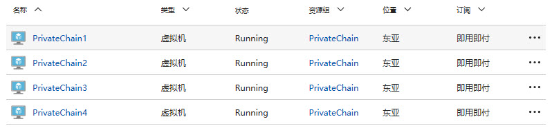
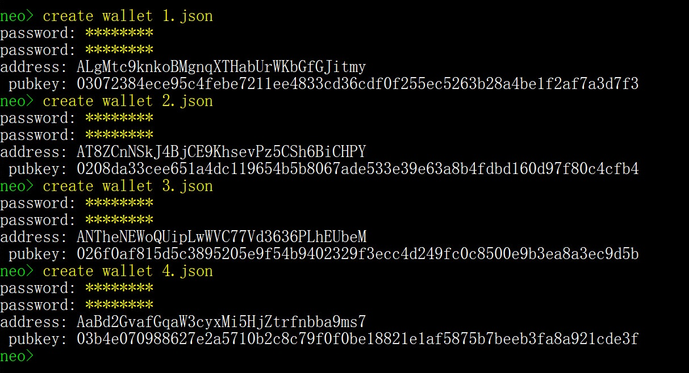
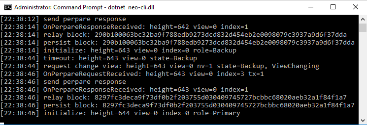
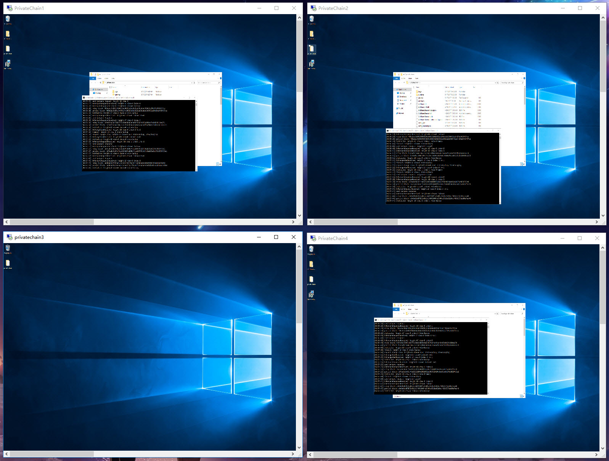

# 用虚拟机搭建私有链

本文将介绍如何使用四台虚拟机来搭建私有链，以及如何从自己的私有链中提取 NEO 和 GAS。                        

## 配置虚拟机

NEO 私有链的部署至少需要 4 台服务器才能取得共识，每台服务器对应一个共识节点。为了演示，我们在 Azure 上创建了 4 台 Windows 虚拟机，大小为 Standard DS1 v2 (1 核心，3.5 GB 内存)，你也可以在局域网中或虚拟机中部署私有链。



创建好后，要开通 10331-10334 端口，具体方法为在系统的 `防火墙`-> `高级设置`-> `入站规则` 中新建规则，然后添加端口 10331-10334。

> [!Note]
>
> 如果你在云服务器上创建的虚拟机，还要登录虚拟机的管理后台，设置网络安全组
>
> Azure 上的设置方法为：`网络`-> `入站端口规则` -> 添加端口 10331-10334。

创建好虚拟机后，将四台虚拟机的 IP 地址保存下来以备后用。

## 安装 NEO-CLI

分别在四台虚拟机上进行如下操作：

1. 参考 [安装 NEO-CLI](../../node/cli/setup.md) ，安装 NEO 客户端。
2. 下载 [SimplePolicy](https://github.com/neo-project/neo-plugins/releases/download/v2.9.2/SimplePolicy.zip) 插件并将解压后的 Plugins 文件夹拷贝到 neo-cli 目录下。

## 创建钱包

1. 在任意一台虚拟机上使用 NEO-CLI 或 NEO-GUI 创建四个钱包文件，下图以在 NEO-CLI 上创建为例。

   

2. 将四个钱包的公钥保存下来以备后用。可以直接复制上面的公钥或者用 [CLI 命令](../../node/cli/cli.md) 中的 `                                                                           list key` 命令查看公钥再复制。

3. 将四个钱包文件分别复制到四个虚拟机的 neo-cli 节点目录下。

## 修改节点配置文件

1. 配置每个节点的 `protocol.json `文件 ，修改以下参数：

   - `Magic` ：Magic 用于识别消息的来源网络，指定不同的 Magic 确保 NEO 区块链中的不同网络信息在传输过程中不会发送到其它网络。Magic 的类型为 uint，注意填写的数值要在 [0 - 4294967295] 区间内。
   - `StandbyValidators`：将创建好的四个钱包的公钥填写在这里。
   - `SeedList`：将四台虚拟机的 IP 地址填写在这里，端口号保持不变。

   ```json
   {
     "ProtocolConfiguration": {
       "Magic": 123456,
       "AddressVersion": 23,
       "SecondsPerBlock": 15,
       "LowPriorityThreshold": 0.001,     
       "StandbyValidators": [      "03072384ece95c4febe7211ee4833cd36cdf0f255ec5263b28a4be1f2af7a3d7f3",      "0208da33cee651a4dc119654b5b8067ade533e39e63a8b4fdbd160d97f80c4cfb4",      "026f0af815d5c3895205e9f54b9402329f3ecc4d249fc0c8500e9b3ea8a3ec9d5b",
    "03b4e070988627e2a5710b2c8c79f0f0be18821e1af5875b7beeb3fa8a921cde3f"
       ],
       "SeedList": [
         "13.75.112.62:10333",
         "137.116.173.200:10333",
         "168.63.206.73:10333",
         "137.116.171.134:10333"
       ],
       "SystemFee": {
         "EnrollmentTransaction": 10,
         "IssueTransaction": 5,
         "PublishTransaction": 5,
         "RegisterTransaction": 100
       }
     }
   }
   ```

2. 配置每个节点的 config.json 文件，以便打开钱包，开启共识：

   - `Path`：设置对应的钱包名称。
   - `Password`：钱包密码。
   - `StartConsensus`：设置为 true 开启共识。

   ```
   "UnlockWallet": {
     "Path": "1.json",
     "Password": "11111111",
     "StartConsensus": true,
     "IsActive": true
   }
   ```

## 启动私有链

在四台虚拟机上依次运行命令行，进入 neo-cli 目录并输入命令 `dotnet neo-cli.dll /rpc` 启动节点，这时程序会自动打开钱包并开启共识。

如果上述操作成功，可以运行 `show state` 来查看节点状态。若高度发生变化，则说明共识过程正常。4个节点的共识过程如图所示：



4 个节点即使关掉一台依然可以达成共识，如图所示



## 提取 NEO 和 GAS

在 NEO 网络的创世块中存放着 1 亿份 NEO，当私链搭建起来后，Gas 也将伴着新区块的生成而生成。你可以使用 NEO-GUI 从多方签名合约中提取出这部分 NEO 和 GAS 以便内部开发测试使用。

### 安装并配置 NEO-GUI

1. 从 Github 上下载 [NEO-GUI](https://github.com/neo-project/neo-gui/releases) 并解压。
2. 修改 NEO-GUI 配置文件 protocol.json 使其连接到私有链中：
   - StandbyValidators`：将前面创建的四个钱包的公钥填写在这里。
   - `SeedList`：将四台虚拟机的 IP 地址填写在这里，端口号保持不变。
3. 配置 config.json 文件，设置端口与其它四个节点端口不冲突。如果端口冲突，NEO-GUI 将无法与 NEO-CLI 同时运行。

运行 NEO-GUI，打开任意钱包，如果左下角有连接数不为零，而且一直在同步区块，表示该客户端已经成功地连接到了私有链中。

### 创建多方签名地址

在 NEO-GUI 中依次打开四个钱包，进行以下操作：

1. 右键单击账户页面空白处，选择`创建合约地址` -> `多方签名`在每个钱包里添加多方签名地址。

2. 输入四个钱包的公钥，设置最小签名数量为 3（共识节点数量 / 2 + 1），点击 `确定`。

   

3. 点击 `钱包` -> `重建钱包索引`。

> [!Note]
>
> 四个钱包都要添加多方签名地址，否则签名会失败。

你将看到合约地址中出现了 1 亿 NEO，如图所示。


### 提取 NEO 到标准地址

进行如下操作，将 NEO 从合约地址转到标准地址中：

1. 打开四个钱包中的任意一个，点击 `交易`-> `转账`。

2. 输入要转入的标准地址，将 1 亿 NEO 转到这个地址中。

3. 系统会提示“交易构造完成，但没有足够的签名”，将代码复制下来。

4. 打开第二个钱包，点击 `交易` ->`签名` 。

5. 粘贴刚才复制的代码，点击 `签名`， 然后将生成的代码复制下来。

6. 打开第三个钱包，点击 `交易`-> `签名`，粘贴刚才复制的代码，点击 `签名`。

   这时窗口中显示 `广播` 按钮，代表交易已经签名完成，达到多方签名合约要求的最少签名数量，可以广播。

7. 点击 `广播` 完成转账交易。

   等待片刻后将看到 1 亿 NEO 成功转入了标准地址。


### 提取 GAS 到标准地址

打开要转入 GAS 的钱包账户，点击 `高级` -> `提取 NeoGas` -> `全部提取`。

> [!Note]
>
> GAS 有两种状态，可提取和不可提取。当账户中的 NEO 花费后（即转出），其产生的 GAS 会转变成可提取状态。你可以通过给自己转账将 GAS 变为可提取状态，即使钱包里只有一个地址也可以。

接下来的操作与转账 NEO 类似，将没有足够签名的代码复制下来，依次打开第二个和第三个钱包，完成交易签名和广播。提取成功后如下图所示。


