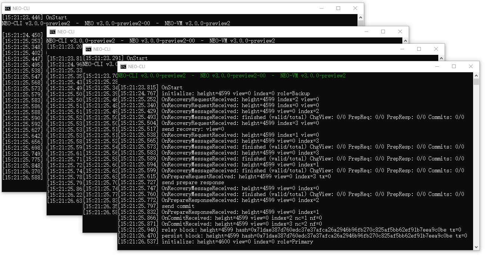
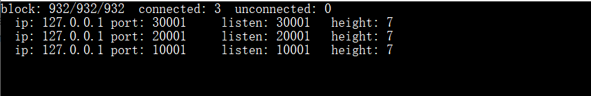
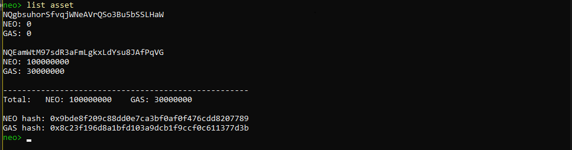
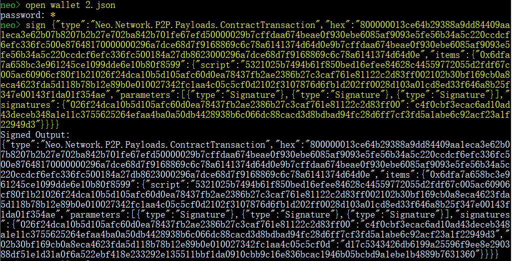
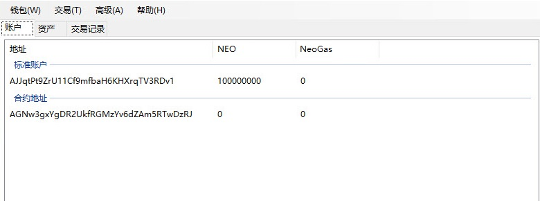

# 在本地主机搭建私有链

这篇文章我们将介绍如何在一台 Windows 系统的电脑上搭建私有链。

## 安装节点

首先安装 Neo-CLI，并将节点文件复制为 4 份，文件夹名分别命名为 node1、node2、node3、node4。

安装过程请参考 [Neo 节点的安装部署](../../node/cli/setup.md)。 

## 安装插件

要使节点达成共识，需要安装 SimplePolicy 插件启用共识策略。

1. 下载 [SimplePolicy](https://github.com/neo-project/neo-plugins/releases/) 插件并解压。
2. 将文件夹 Plugins 拷贝四份，分别放置到四个节点文件夹中。

## 创建钱包文件

使用 Neo-CLI 或 Neo-GUI 创建四个不同的钱包文件，命名为 1.json、2.json、3.json、4.json，分别放置于四个节点的文件夹中。

## 修改 config.json

在每个节点下的 config.json 文件中进行如下修改：

- 设置每个端口不重复且不被其它程序占用。
- 设置 UnlockWallet 下的参数 `Path` 为钱包文件名，`Password` 为钱包密码。
- 设置 `StartConsensus` 和 `IsActive` 为 `true`。


可参照下面的配置：

**node1/config.json**

```json
{
  "ApplicationConfiguration": {
    "Paths": {
      "Chain": "Chain_{0}",
      "ApplicationLogs": "ApplicationLogs_{0}"
    },
    "P2P": {
      "Port": 10001,
      "WsPort": 10002
    },
    "RPC": {
      "Port": 10003,
      "SslCert": "",
      "SslCertPassword": ""
    },
    "UnlockWallet": {
      "Path": "1.json",
      "Password": "11111111",
      "StartConsensus": true,
      "IsActive": true
    }
  }
}
```

**node2/config.json**

```json
{
  "ApplicationConfiguration": {
    "Paths": {
      "Chain": "Chain_{0}",
      "ApplicationLogs": "ApplicationLogs_{0}"
    },
    "P2P": {
      "Port": 20001,
      "WsPort": 20002
    },
    "RPC": {
      "Port": 20003,
      "SslCert": "",
      "SslCertPassword": ""
    },
    "UnlockWallet": {
      "Path": "2.json",
      "Password": "11111111",
      "StartConsensus": true,
      "IsActive": true
    }
  }
}
```

**node3/config.json**

```json
{
  "ApplicationConfiguration": {
    "Paths": {
      "Chain": "Chain_{0}",
      "ApplicationLogs": "ApplicationLogs_{0}"
    },
    "P2P": {
      "Port": 30001,
      "WsPort": 30002
    },
    "RPC": {
      "Port": 30003,
      "SslCert": "",
      "SslCertPassword": ""
    },
    "UnlockWallet": {
      "Path": "3.json",
      "Password": "11111111",
      "StartConsensus": true,
      "IsActive": true
    }
  }
}
```

**node4/config.json**

```json
{
  "ApplicationConfiguration": {
    "Paths": {
      "Chain": "Chain_{0}",
      "ApplicationLogs": "ApplicationLogs_{0}"
    },
    "P2P": {
      "Port": 40001,
      "WsPort": 40002
    },
    "RPC": {
      "Port": 40003,
      "SslCert": "",
      "SslCertPassword": ""
    },
    "UnlockWallet": {
      "Path": "4.json",
      "Password": "11111111",
      "StartConsensus": true,
      "IsActive": true
    }
  }
}
```

## 修改 protocol.json

在每个节点下的 protocol.json 文件中，对以下参数进行修改，并保证所有节点的配置一致。

- Magic ：私有链 ID，可设置为 [0 - 4294967295] 区间内的任意整数。

- StandbyValidators ：备用共识节点的公钥，这里输入 4 个钱包的公钥。

- SeedList ：种子节点的 IP 地址和端口号，IP 地址设置为 localhost，端口为 config.json 中配置的 4 个 P2P Port。


可参照下面的配置：

```json
{
  "ProtocolConfiguration": {
    "Magic": 123456,
    "AddressVersion": 23,
    "SecondsPerBlock": 15,
    "StandbyValidators": [
      "026f24dca10b5d105afc60d0ea78437fb2ae2386b27c3caf761e81122c2d83ff00",
      "02b30bf169cb0a8eca4623fda5d118b78b12e89b0e010027342fc1aa4c05c5cf0d",
      "02f3107876d6fb1d202ff0028d103a01cd8ed33f646a8b25f347e00143f1da01f3",
      "025b7494b61f850bed16efee84628c44559772055d2fdf67c005ac60906cf80f1b"
    ],
    "SeedList": [
      "localhost:10001",
      "localhost:20001",
      "localhost:30001",
      "localhost:40001"
    ],
    "SystemFee": {
      "EnrollmentTransaction": 10,
      "IssueTransaction": 5,
      "PublishTransaction": 5,
      "RegisterTransaction": 100
    }
  }
}
```

## 创建快捷启动

为了方便启动私链，创建一个记事本文件，输入 `dotnet neo-cli.dll /rpc` 然后重命名为 1Run.cmd。将其复制到 4 个节点目录下。

到此，私有链已经搭建完成了，所有修改过的文件结构如下

```
├─node1
│      1.json
│      1Run.cmd
│      config.json
│      protocol.json
│
├─node2
│      1Run.cmd
│      2.json
│      config.json
│      protocol.json
│
├─node3
│      1Run.cmd
│      3.json
│      config.json
│      protocol.json
│
└─node4
        1Run.cmd
        4.json
        config.json
        protocol.json
```

## 启动私有链

进入每个节点目录，双击 `1Run.cmd`，当共识过程如图所示，表示私链成功建立：



如果关闭所有窗口，将停止私有链。

## 提取 Neo 和 GAS

在 Neo 网络的创世块中存放着 1 亿份 NEO 和 3 千万份 GAS，你可以使用 Neo-CLI 或 Neo-GUI 从多方签名合约中提取出这部分 NEO 和 GAS 以便内部开发测试使用。

### 从 Neo-CLI 提取

为方便操作，我们需要再准备一个普通节点接入私链，然后从该节点提取 NEO/GAS。 

#### 安装和配置普通节点

1. 复制前面步骤中配置好的任意一个共识节点文件，命名为 node0

2. 配置 config.json 文件：

   - 设置每个端口不重复且不被其它程序占用。
   - 设置 UnlockWallet 下的参数 `Path` 和`Password` 为空。
   - 设置 `StartConsensus` 和 `IsActive` 为 `false`。

3. 将之前创建的四个钱包文件复制到 node0 根目录下。

4. 运行普通节点，打开一个钱包并输入命令 `show state` 查看节点状态。

   如果高度发生变化且连接数不为0，则表示节点已接入私链。

   

   > [!Note]
   >
   > 4 个共识节点需要关掉一个，普通节点才能接入。

#### 创建多方签名地址

1. 在普通节点上打开任意钱包

2. 使用命令 `import multisigaddress m pubkeys` 创建一个多方签名地址：

   - `m`: 设置最小签名数 3
   - `pubkeys`: 四个共识节点的钱包公钥（配置在 `StandbyValidator` 里 ）

   > [!Note]
   >
   > 四个钱包中都必须创建多方签名地址才能成功完成转账交易的签名。

3. 输入 `list asset`, 可以看到账户里出现了 1 亿 NEO 和 3 千万 GAS。

   


#### 提取 NEO 到普通地址

接下来我们将 NEO 从合约地址转入普通地址：

1. 输入命令 `send <id|alias> <address> <value>` 将 NEO 转入目标地址。

2. 复制 SignatureContext 内容并关闭钱包。

   

3. 打开多方签名中的第二个钱包。

4. 使用步骤 2 中复制的内容输入命令 `sign <jsonObjectToSign>` 

5. 复制 Signed Output 内容并关闭钱包。

   

6. 打开第三个钱包重复前面的签名步骤，然后就可以使用 `relay <jsonObjectToSign>` 广播交易完成签名。

   

7. 输入 `list asset` 查看钱包资产，可以看到 NEO 已经转入。

   

参考前面提取 NEO 进行的多方签名操作，提取 GAS 到目标地址即可。

### 从 Neo-GUI 提取

#### 安装并配置 Neo-GUI

1. 从 Github 上下载 [Neo-GUI](https://github.com/neo-project/neo-gui/releases) 并解压。
2. 修改 Neo-GUI 配置文件 protocol.json 使其连接到私有链中：
   - `StandbyValidators`：将前面创建的四个钱包的公钥填写在这里。
   - `SeedList`：将四台虚拟机的 IP 地址填写在这里，端口号保持不变。
3. 配置 config.json 文件，设置端口与其它四个节点端口不冲突。如果端口冲突，Neo-GUI 将无法与 Neo-CLI 同时运行。

运行 Neo-GUI，打开任意钱包，如果左下角有连接数不为零，而且一直在同步区块，表示该客户端已经成功地连接到了私有链中。

#### 创建多方签名地址

在 Neo-GUI 中依次打开四个钱包，进行以下操作：

1. 右键单击账户页面空白处，选择`创建合约地址` -> `多方签名`在每个钱包里添加多方签名地址。

2. 输入四个钱包的公钥，设置最小签名数量为 3（共识节点数量 / 2 + 1），点击 `确定`。

   

3. 点击 `钱包` -> `重建钱包索引`。

> [!Note]
>
> 四个钱包都要添加多方签名地址，否则签名会失败。

你将看到合约地址中出现了 1 亿 Neo，如图所示。


#### 提取 Neo 到标准地址

进行如下操作，将 Neo 从合约地址转到标准地址中：

1. 打开四个钱包中的任意一个，点击 `交易`-> `转账`。

2. 输入要转入的标准地址，将 1 亿 Neo 转到这个地址中。

3. 系统会提示“交易构造完成，但没有足够的签名”，将代码复制下来。

4. 打开第二个钱包，点击 `交易` ->`签名` 。

5. 粘贴刚才复制的代码，点击 `签名`， 然后将生成的代码复制下来。

6. 打开第三个钱包，点击 `交易`-> `签名`，粘贴刚才复制的代码，点击 `签名`。

   这时窗口中显示 `广播` 按钮，代表交易已经签名完成，达到多方签名合约要求的最少签名数量，可以广播。

7. 点击 `广播` 完成转账交易。

   等待片刻后将看到 1 亿 Neo 成功转入了标准地址。



参考前面提取 NEO 进行的多方签名操作，提取 GAS 到目标地址即可。
