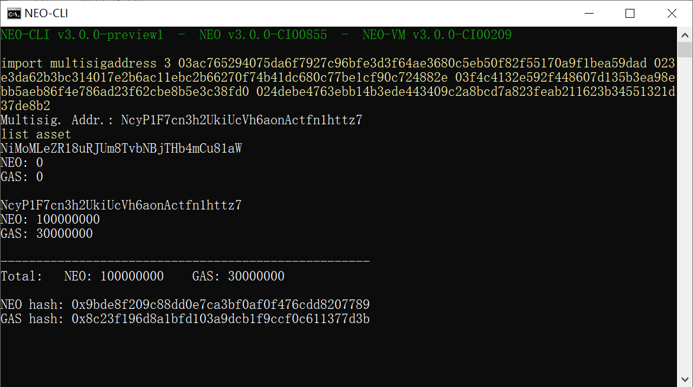

# 在本地主机搭建私有链

这篇文章我们将介绍如何在一台 Windows 系统的电脑上搭建私有链。

## 安装节点

首先安装 Neo-CLI，并将节点文件复制为 4 份，文件夹名分别命名为 node1、node2、node3、node4。

安装过程请参考 [Neo 节点的安装部署](../../node/cli/setup.md)。 

## 创建钱包文件

使用 Neo-CLI 或 Neo-GUI 创建四个不同的钱包文件，命名为 1.json、2.json、3.json、4.json，分别放置于四个节点的文件夹中。

## 修改 config.json

在每个节点下的 config.json 文件中进行如下修改：

- 设置每个端口不重复且不被其它程序占用。
- 设置 UnlockWallet 下的参数 `Path` 为钱包文件名，`Password` 为钱包密码。
- 设置 `StartConsensus` 和 `IsActive` 为 `true`。


可参照下面的配置：

**node1/config.json**

```json
{
  "ApplicationConfiguration": {
    "Storage": {
      "Engine": "LevelDBStore"
    },
    "P2P": {
      "Port": 10333,
      "WsPort": 10334
    },
    "UnlockWallet": {
      "Path": "1.json",
      "Password": "1",
      "StartConsensus": true,
      "IsActive": true
    },
    "PluginURL": "https://github.com/neo-project/neo-modules/releases/download/v{1}/{0}.zip"
  }
}
```

**node2/config.json**

```json
{
  "ApplicationConfiguration": {
    "Storage": {
      "Engine": "LevelDBStore"
    },
    "P2P": {
      "Port": 20333,
      "WsPort": 20334
    },
    "UnlockWallet": {
      "Path": "2.json",
      "Password": "1",
      "StartConsensus": true,
      "IsActive": true
    },
    "PluginURL": "https://github.com/neo-project/neo-modules/releases/download/v{1}/{0}.zip"
  }
}
```

**node3/config.json**

```json
{
  "ApplicationConfiguration": {
    "Storage": {
      "Engine": "LevelDBStore"
    },
    "P2P": {
      "Port": 30333,
      "WsPort": 30334
    },
    "UnlockWallet": {
      "Path": "3.json",
      "Password": "1",
      "StartConsensus": true,
      "IsActive": true
    },
    "PluginURL": "https://github.com/neo-project/neo-modules/releases/download/v{1}/{0}.zip"
  }
}
```

**node4/config.json**

```json
{
  "ApplicationConfiguration": {
    "Storage": {
      "Engine": "LevelDBStore"
    },
    "P2P": {
      "Port": 40333,
      "WsPort": 40334
    },
    "UnlockWallet": {
      "Path": "4.json",
      "Password": "1",
      "StartConsensus": true,
      "IsActive": true
    },
    "PluginURL": "https://github.com/neo-project/neo-modules/releases/download/v{1}/{0}.zip"
  }
}
```

> [!Note]
>
> 如果安装了 RpcServer 插件，需要修改插件的 config.json 中的端口号，使其互不相同，且与节点的 config.json 中端口号也互不相同。

## 修改 protocol.json

在每个节点下的 protocol.json 文件中，对以下参数进行修改，并保证所有节点的配置一致。

- Magic ：私有链 ID，可设置为 [0 - 4294967295] 区间内的任意整数。

- StandbyValidators ：备用共识节点的公钥，这里输入 4 个钱包的公钥。

- SeedList ：种子节点的 IP 地址和端口号，IP 地址设置为 localhost，端口为 config.json 中配置的 4 个 P2P Port。


可参照下面的配置：

```json
{
  "ProtocolConfiguration": {
    "Magic": 5195086,
    "MillisecondsPerBlock": 15000,
    "StandbyValidators": [
      "03ac765294075da6f7927c96bfe3d3f64ae3680c5eb50f82f55170a9f1bea59dad",
      "023e3da62b3bc314017e2b6ac11ebc2b66270f74b41dc680c77be1cf90c724882e",
      "03f4c4132e592f448607d135b3ea98ebb5aeb86f4e786ad23f62cbe8b5e3c38fd0",
      "024debe4763ebb14b3ede443409c2a8bcd7a823feab211623b34551321d37de8b2"
    ],
    "SeedList": [
      "localhost:10333",
      "localhost:20333",
      "localhost:30333",
      "localhost:40333"
    ]
  }
}
```

## 创建快捷启动

为了方便启动私链，创建一个记事本文件，输入 `dotnet neo-cli.dll /rpc` 然后重命名为 1Run.cmd。将其复制到 4 个节点目录下。

到此，私有链已经搭建完成了，所有修改过的文件结构如下

```
├─node1
│      1.json
│      1Run.cmd
│      config.json
│      protocol.json
│
├─node2
│      1Run.cmd
│      2.json
│      config.json
│      protocol.json
│
├─node3
│      1Run.cmd
│      3.json
│      config.json
│      protocol.json
│
└─node4
        1Run.cmd
        4.json
        config.json
        protocol.json
```

## 启动私有链

进入每个节点目录，双击 `1Run.cmd`，在其中一个节点输入 `show state`，如果连接 3 个节点并且区块高度增长表示私链成功搭建：


如果关闭所有窗口，将停止私有链。

## 提取 NEO 和 GAS

在 NEO 网络的创世块中存放着 1 亿份 NEO 和 3 千万 GAS，当私链搭建起来后，GAS 也将伴着新区块的生成而生成。你可以使用 Neo-CLI 从多方签名合约中提取出这部分 NEO 和 GAS 以便内部开发测试使用。

### 创建多方签名地址

1. 启动私链

2. 在一个节点中使用命令 `import multisigaddress m pubkeys`，创建一个多方签名地址。

   这里设置最小签名数 m 为 3，pubkeys 为四个共识节点的公钥（见 protocal.json）。例如：

    ``` 
   import multisigaddress 3 03ac765294075da6f7927c96bfe3d3f64ae3680c5eb50f82f55170a9f1bea59dad 023e3da62b3bc314017e2b6ac11ebc2b66270f74b41dc680c77be1cf90c724882e 03f4c4132e592f448607d135b3ea98ebb5aeb86f4e786ad23f62cbe8b5e3c38fd0 024debe4763ebb14b3ede443409c2a8bcd7a823feab211623b34551321d37de8b2
    ```

3. 在其它三个节点中重复步骤 2

4. 输入命令 `list asset`，可以看到合约地址中出现了 100,000,000 NEO 和 30,000,000 GAS。



> [!Note]
>
> 四个钱包中都必须创建多方签名地址才能成功完成转账交易的签名。


### 提取 NEO/GAS 到普通地址

接下来我们将 NEO 从合约地址转入普通地址：

1. 打开第一个钱包（1.json）使用命令 `send <id|alias> <address> <value>` 将 NEO 转入目标地址。

2. 复制 SignatureContext 内容并关闭钱包。

   

3. 打开第二个钱包（2.json）。

4. 使用步骤 2 中复制的内容输入命令 `sign <jsonObjectToSign>` 

5. 复制 Signed Output 内容并关闭钱包。

   

6. 打开第三个钱包（3.json）重复前面的签名步骤，然后就可以使用 `relay <jsonObjectToSign>` 广播交易完成签名。

   

7. 输入 `list asset` 查看钱包资产，可以看到 NEO 已经转入。

   

参考前面提取 NEO 进行的多方签名操作，提取 GAS 到目标地址即可。
