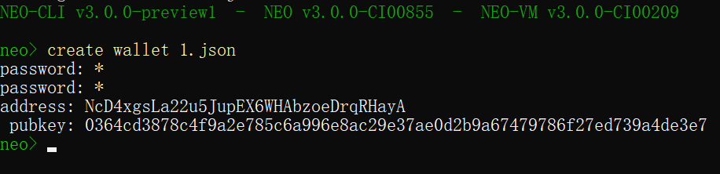
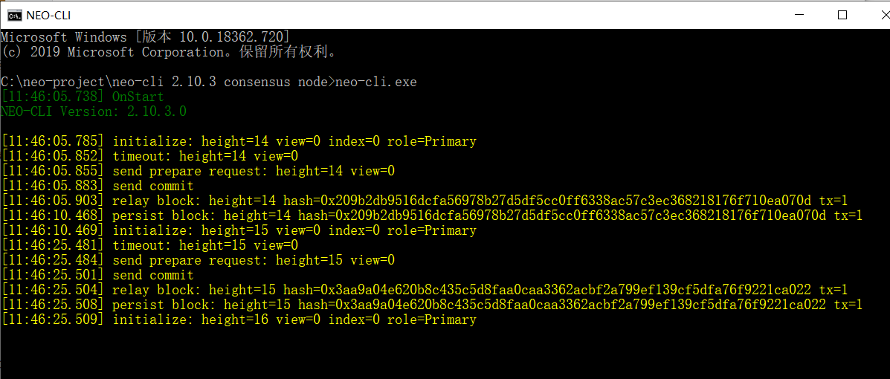

# 使用单节点搭建私有链

Neo-CLI 支持单节点模式下正常生成区块，只需一个节点即可正常运行私有链。[NEO-Private-Net](https://github.com/chenzhitong/NEO-Private-Net) 项目是一个已配置好的私有链，下载后可以直接运行。

你也可以自己配置私有链，下文将介绍具体方法。

## 准备工作

1. 首先安装 Neo-CLI，安装过程请参考 [Neo 节点的安装部署](../../node/cli/setup.md)。

2. 运行 Neo-CLI，输入 `create wallet <path>` 命令创建一个钱包，如 `create wallet 1.json`。

   

3. 记录钱包公钥（ pubkey），后面会用到。

## 修改节点配置文件

### 修改config.json

在Neo-CLI的 config.json 文件中进行如下修改：

- 设置 UnlockWallet 下的参数 `Path` 为钱包文件名，`Password` 为钱包密码。
- 设置 `StartConsensus` 和 `IsActive` 为 `true`。

可参照下面的配置：

```json
{
  "ApplicationConfiguration": {
    "Storage": {
      "Engine": "LevelDBStore"
    },
    "P2P": {
      "Port": 10333,
      "WsPort": 10334
    },
    "UnlockWallet": {
      "Path": "1.json",
      "Password": "1",
      "StartConsensus": true,
      "IsActive": true
    },
    "PluginURL": "https://github.com/neo-project/neo-modules/releases/download/v{1}/{0}.zip"
  }
}
```

### 修改 protocol.json

1. 打开 Neo-CLI 下面的 protocol.json 文件。
2. 在参数 StandbyValidators 中输入前面创建的1.json钱包的公钥（StandbyValidators  中只有一个公钥的时候为单节点模式）。

可参照下面的配置：

```json
{
  "ProtocolConfiguration": {
    "Magic": 5195086,
    "MillisecondsPerBlock": 15000,
    "StandbyValidators": [
      "03ac765294075da6f7927c96bfe3d3f64ae3680c5eb50f82f55170a9f1bea59dad"
    ],
    "SeedList": [
    ]
  }
}
```

## 启动私有链

运行命令行，进入 neo-cli 目录，双击 `neo-cli.exe` 即可启动私链。成功建立的私链如下图所示。



> [!Note]
>
> 安装 SystemLog 插件后，会输出共识日志。这里为了方便在 Neo-CLI 中输入命令没有安装。
>
> 输入 `show state` 命令可以查看区块高度。

如果关闭窗口，将停止私有链。

## 提取私有链中的 NEO/GAS

在 NEO 网络的创世块中存放着 1 亿份 NEO 和 3 千万 GAS，当私链搭建起来后，GAS 也将伴着新区块的生成而生成。你可以使用 Neo-CLI 或 Neo-GUI 从多方签名合约中提取出这部分 NEO 和 GAS 以便内部开发测试使用。

1. 启动私链

2. 使用命令 `import multisigaddress m pubkeys`，创建一个多方签名地址。

   这里设置最小签名数 m 为 1，pubkeys 为钱包 a.json 的公钥。例如：

    ``` 
   import multisigaddress 1 03ac765294075da6f7927c96bfe3d3f64ae3680c5eb50f82f55170a9f1bea59dad
    ```

3. 输入命令 `list asset`，可以看到合约地址中出现了 100,000,000 NEO 和 30,000,000 GAS。
