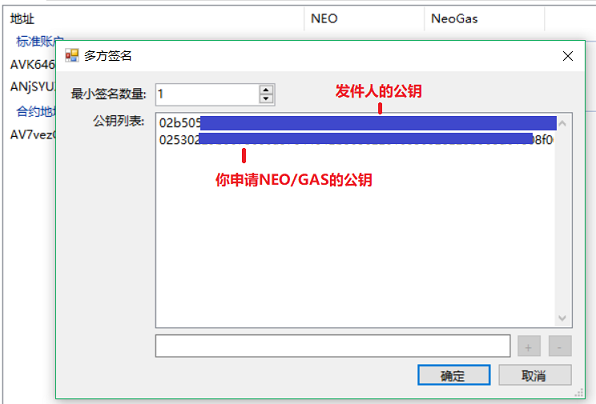

# 主网与测试网

NEO 的节点默认运行在主网，主网是正式上线，独立运行的区块链网络。

NEO 的测试网（Test Net）是官方提供的，专供用户来开发、调试和测试的。测试网上面的系统费用是测试网中的 NeoGas，并非真实的 NeoGas，测试网的 NEO 和 NeoGas 可以在官网上免费申请。

测试网的所有区块数据都是独立于主网的。如果开发简单的智能合约或者尝试注册资产的话，用测试网就足够了，待开发完成后可以迁移到 NEO 的主网上运行。

## 测试网的特点

- 资产注册、资产分发、合约执行等不会消耗真实货币。
- 全球化的，部署在 Internet 环境上的。
- 测试网中的区块、交易等信息可以在区块链浏览器中方便地查看到。
- 部署在测试环境上的智能合约，全世界任何人都可以调用。
- 测试网不能作为商业应用的实际落地环境。

## 切换到测试网

下载NEO客户端后，可以通过修改客户端的配置文件来让客户端在主网和测试网中切换。以下步骤以 NEO-GUI为例，NEO-CLI操作相同。

1. 将客户端目录下的 `protocol.testnet.json` 里的内容复制到 `protocol.json`（替换原有配置文件），如图。

2. 将客户端（GUI）目录下的 `config.testnet.json` 里的内容复制到 `config.json`（替换原有配置文件），如图

> [!NOTE]
>
> - 旧版客户端此步是将 `neo-gui.testnet.config` 里的内容复制到 `neo-gui.exe.config`（替换原有配置文件）。
>
> - NEO3客户端目前只能接入测试网，主网尚未上线。

## 申请测试网 GAS 和 NEO

如果你是开发人员，可以申请用于测试网的 NEO 和 GAS。 在测试网部署一条合约需要花费500个测试 GAS。  

你可以在 [NGD faucet](https://neowish.ngd.network/) 上每天自动领取最多1000 个 GAS 和 1000 个 NEO。如果需要更多测试币，可以通过以下方式申请：

1. 填写申请表 (https://neo.org/testcoin/apply) ，指定你的公钥和Email。

   大约三天后，你将收到一封电子邮件。其中包含合约地址和另一个公钥。 

2. 在钱包中创建一个多方签名地址。

3. 将多方签名地址中的资产转账到你自己的地址。

### 第 1 步 - 查看您的公钥

在NEO中，地址和公钥不同。要查看公钥，在NEO-GUI客户端中右键单击您的钱包地址，选择 `查看私钥`，出现的对话框中会显示公钥。

### 第 2 步 - 填写申请

填写申请表：https://www.neo.org/Testnet/Create ，需要指定你的邮箱和公钥。
一般一天后将收到邮件回复，包含一个多方签名地址和发件人的公钥。关于多方签名地址，请参见 [多方签名地址](../node/gui/sc.md)。

### 第 3 步 - 创建多方签名地址

要获取资产，你需要在 NEO-GUI 中创建一个多方签名地址，将用到以下信息： 

- 邮件中的多方签名地址
- 邮件中的发件人公钥
- 第一步中获取的你自己的公钥 

1. 在 NEO-GUI 中，右键单击地址账户并选择 `创建合约地址` -> `多方签名地址`。

2. 在公钥列表中输入用于签名的公钥，即发件人的公钥和你自己的公钥。 

3. 设置最小签名数为  `1`.

4. 点击 `确定`.

邮件中指定的合约地址已创建并显示在账户页面中。

可以在合约地址处看到获取的 NEO/GAS 数量。

### 第 4 步 - 将资产转账到另一个账户

1. 在NEO-GUI中选中合约地址，点击 `交易` -> `转账`

2. 选择要转账的资产并设置转账金额和转入账户。 

## 其它测试方法

在发布智能合约到主网前，使用测试网进行试验无疑是个好办法，但是在开发初期，您还可以考虑其他测试方式，例如运行您自己的私人测试网。

