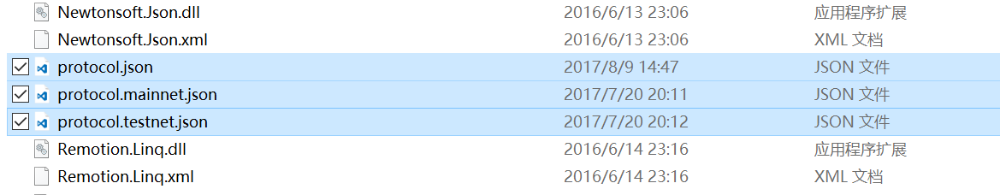
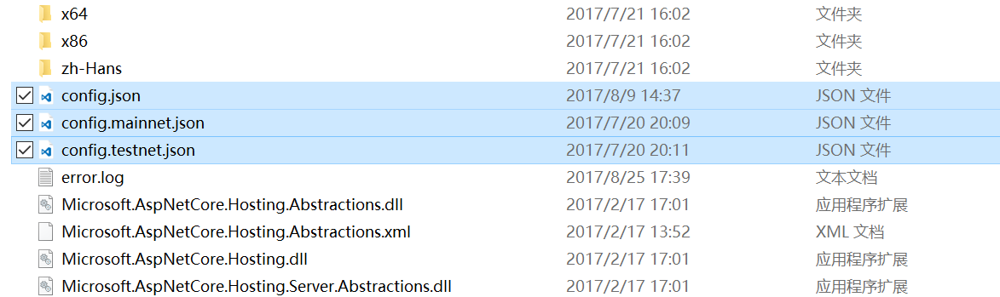

# 主网与测试网

Neo 的节点默认运行在主网，主网是正式上线，独立运行的区块链网络。

Neo 也提供了测试网（Test Net）供开发者进行开发、调试和测试。测试网上花费的手续费是测试网中的 GAS，并非真实的 GAS，测试网的 NEO 和 GAS 可以在官网上免费申请。

测试网的所有区块数据都是独立于主网的。如果开发简单的智能合约或者尝试注册资产的话，用测试网就足够了，待开发完成后可以迁移到 Neo 的主网上运行。

> [!Note]
>
> Neo3 客户端目前只能接入测试网，主网尚未上线。

## 测试网的特点

- 资产注册、资产分发、合约执行等不会消耗真实货币。
- 全球化的，部署在 Internet 环境上的。
- 测试网中的区块、交易等信息可以在区块链浏览器中方便地查看到。
- 部署在测试环境上的智能合约，全世界任何人都可以调用。
- 测试网不能作为商业应用的实际落地环境。

## 连接到测试网

对于Neo-GUI，运行后将默认连接到测试网。

对于Neo-CLI，由于默认接入主网，下载 客户端后，需要通过修改客户端的配置文件来将节点接入测试网。

1. 将客户端目录下的 `protocol.testnet.json` 里的内容复制到 `protocol.json`（替换原有配置文件），如图所示：

   

2. 将客户端目录下的 `config.testnet.json` 里的内容复制到 `config.json`（替换原有配置文件），如图所示：

   

## 申请测试网 GAS 和 NEO

如果你是开发人员，可以申请用于测试网的 Neo 和 GAS。 在测试网部署一条合约需要花费500个测试 GAS。  

### 自动领取测试币

你可以在 [NGD faucet](https://neowish.ngd.network/neo3/) 上每天自动领取最多500 个 GAS。

### 通过 Neo 官网申请

如果需要更多测试币，可以通过 Neo 官网申请。

#### 第 1 步 - 获取你的 Neo 公钥

在 Neo 中，地址和公钥不同。要查看公钥，在 Neo-GUI 客户端中右键单击您的钱包地址，选择 `查看私钥`，出现的对话框中会显示公钥。

#### 第 2 步 - 填写申请

填写申请表：https://neo.org/testcoin/apply ，注意选择Neo版本为Neo3。
一般一天后将收到邮件回复，包含一个多方签名地址和发件人的公钥。关于多方签名地址，请参见 [多方签名地址](../node/gui/sc.md)。

#### 第 3 步 - 创建多方签名地址并转账

要获取资产，你需要在 Neo-CLI 中创建一个多方签名地址，将用到以下信息： 

- 邮件中的多方签名地址
- 邮件中的发件人公钥
- 第一步中获取的你自己的公钥 

1. 在 Neo-CLI 中，使用命令 `import multisigaddress m pubkeys`，创建一个多方签名地址。

   这里设置最小签名数 m 为 1，pubkeys 为用于签名的公钥，即发件人的公钥和你自己的公钥。 

2. 输入命令 `list asset`，可以看到合约地址中出现了 获取的 Neo/GAS 数量。

3. 使用命令`send gas <address> <amount>`，输入要转账的资产、转入地址和转账金额将资产转到另一个账户。 

## 其它测试方法

在发布智能合约到主网前，使用测试网进行试验无疑是个好办法，但是在开发初期，还可以考虑其他测试方式，例如搭建你自己的私链。

