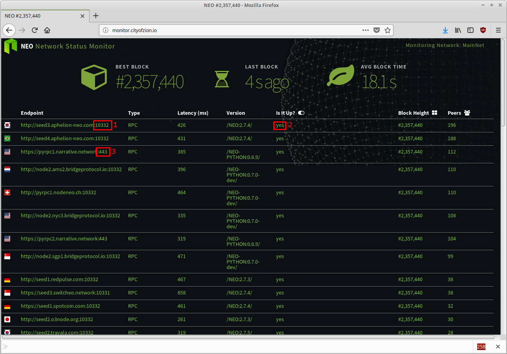

# Neo-CLI SeedList

## 关于 SeedList
简单来说，SeedList 是一个 URL 列表，是 Neo-CLI 在启动时尝试连接的节点。在 neo-cli 目录下的 `protcol.json` 文件中可以找到 SeedList。

```json
{
  "ProtocolConfiguration": {
    "Magic": ...,
    "MillisecondsPerBlock": ...,
    "StandbyValidators": [
      ...
    ],
    "SeedList": [
      "seed1.neo.org:10333",
      "seed2.neo.org:10333",
      "seed3.neo.org:10333",
      "seed4.neo.org:10333",
      "seed5.neo.org:10333"
    ]
  }
}
```
在上面的文件中，Neo-CLI 配置为通过 `PORT:10333` 连接 `seed1.neo.org` ，`seed2.neo.org` 等系列节点。

### 潜在的问题
假如以上列表中的每个节点故障，Neo-CLI 会尝试连接相邻节点。但是这种方法存在很多未知因素，例如相邻节点出问题了，可能导致等待时间相当漫长。

## 更新 SeedList
通过使用我们确定的活跃节点更新 SeedList，可以避免上述潜在问题中提到的漫长等待风险。

### 活跃节点
如何寻找活跃节点呢？***City of Zion*** 的技术人员创建了一个优秀 [资源](https://github.com/CityOfZion/neo-mon) 用来不间断地对世界各地的节点进行 ping 操作，可以通过 [tracker](http://monitor.cityofzion.io/) 查看。


在上图中可以看到可用节点列表，最新的节点显示在最上方。通常，绿色并显示  `yes` 的节点为活跃节点。

我们会根据以下端口的标准协议进行选择，比如我们会选择上图中的节点 1 而不选节点 3，因为节点 1 符合标准而节点 3 不符合。

|                    | 主网 | 测试网 |
| ------------------ | ------------ | ------------- |
| JSON-RPC via HTTPS | 10331        | 20331         |
| JSON-RPC via HTTP  | 10332        | 20332         |
| P2P via TCP        | 10333        | 20333         |
| P2P via WebSocket  | 10334        | 20334         |

以下是选出的几个 (任意数量) 活跃节点地址：

- `seed3.aphelion-neo.com`
- `seed4.aphelion-neo.com`
- `node2.ams2.bridgeprotocol.io`
- `pyrpc1.nodeneo.ch`
- `node2.nyc3.bridgeprotocol.io`
- ……

*Neo-CLI 通信的主要端口是 10333。目前只对 RPC 执行 ping 操作。我们假设如果一个节点的 RPC 端口启动，那它的 P2P 端口也将启动*。


### 编辑 protocol 文件
为了告知 Neo-CLI 新的节点列表，需要将前面几个地址粘贴到 `protocol.json`，以下是示例的 protocol.json 文件。

```json
{
  "ProtocolConfiguration": {
    "Magic": 7630401,
    "MillisecondsPerBlock": 15000,
    "StandbyValidators": [
      "03b209fd4f53a7170ea4444e0cb0a6bb6a53c2bd016926989cf85f9b0fba17a70c",
      "02df48f60e8f3e01c48ff40b9b7f1310d7a8b2a193188befe1c2e3df740e895093",
      "03b8d9d5771d8f513aa0869b9cc8d50986403b78c6da36890638c3d46a5adce04a",
      "02ca0e27697b9c248f6f16e085fd0061e26f44da85b58ee835c110caa5ec3ba554",
      "024c7b7fb6c310fccf1ba33b082519d82964ea93868d676662d4a59ad548df0e7d",
      "02aaec38470f6aad0042c6e877cfd8087d2676b0f516fddd362801b9bd3936399e",
      "02486fd15702c4490a26703112a5cc1d0923fd697a33406bd5a1c00e0013b09a70"
    ],
    "SeedList": [
      "seed1.neo.org:10333",
      "seed2.neo.org:10333",
      "seed3.neo.org:10333",
      "seed4.neo.org:10333",
      "seed5.neo.org:10333",
      "seed4.aphelion-neo.com:10333",
      "node2.sgp1.bridgeprotocol.io:10333",
      "seed2.aphelion-neo.com:10333",
      "seed3.aphelion-neo.com:10333",
      "node2.ams2.bridgeprotocol.io:10333",
      "pyrpc1.narrative.network:10333",
      "node2.nyc3.bridgeprotocol.io:10333",
      "pyrpc4.narrative.network:10333",
      "pyrpc2.narrative.network:10333",
      "pyrpc3.narrative.network:10333",
      "seed1.aphelion-neo.com:10333",
      "seed1.switcheo.network:10333",
      "seed2.switcheo.network:10333",
      "seed5.cityofzion.io:10333",
      "seed3.cityofzion.io:10333",
      "seed3.switcheo.network:10333",
      "seed1.o3node.org:10333",
      "seed3.travala.com:10333",
      "seed4.cityofzion.io:10333",
      "seed2.cityofzion.io:10333",
      "seed2.o3node.org:10333",
      "seed3.o3node.org:10333",
      "node1.sgp1.bridgeprotocol.io:10333",
      "seed2.travala.com:10333",
      "seed4.switcheo.network:10333",
      "seed1.spotcoin.com:10333",
      "node1.nyc3.bridgeprotocol.io:10333"
    ]   
  }
}
```

请注意，我们在每个地址的末尾添加了 `:10333` ，以告知 Neo-CLI 使用 P2P 协议进行连接。

到此，你就可以像往常一样启动 Neo-CLI 了。

### 相关工具
如果觉得上述操作繁琐，可以编写一个自动更新 `protocol.json ` 的脚本，具体参见 [这里](https://github.com/HandsomeJeff/neo-cli-protocol-maker)。
