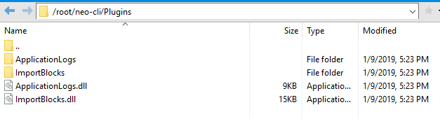

# 安装 NEO-CLI

本文将介绍如何安装 NEO-CLI 的官方发布程序包以及启动 NEO 节点。你也可以选择直接从 GitHub 上下载 NEO-CLI 源代码并发布成可执行文件。如果使用 macOS，则只能通过后一种方式安装运行 NEO-CLI。相关信息请参考 [发布 NEO-CLI 源码](publish.md)。

## 配置要求

建议运行 NEO-CLI 的计算机配置固态硬盘，以免同步区块数据时速度太慢。

## 安装客户端

1. 在 GitHub 上下载系统对应的 [Neo-CLI](https://github.com/neo-project/neo-cli/releases) 程序包并解压。

2. 对于 Linux 系统，需要安装 LevelDB 和 SQLite3 开发包。例如，在 ubuntu 17.10 上输入以下命令：

   ```
   sudo apt-get install libleveldb-dev sqlite3 libsqlite3-dev libunwind8-dev
   ```

   对于 Windows 系统，[Neo-CLI](https://github.com/neo-project/neo-cli/releases) 的安装包中已经包含了 LevelDB，可跳过该步骤。  

## 修改配置文件

在启动 NEO-CLI 前需先配置 config.json 文件，开启自动绑定并打开钱包功能，钱包打开后才可以调用与钱包相关的 API。下面是一个标准设置的例子，其中 Path 是钱包的路径，Password 是钱包的密码，IsActive 设为 true 表示允许自动打开钱包。

```
  {
  "ApplicationConfiguration": {
    "Paths": {
      "Chain": "Chain_{0}",
      "Index": "Index_{0}"
    },
    "P2P": {
      "Port": 10333,
      "WsPort": 10334
    },
    "RPC": {
      "BindAddress": "127.0.0.1",
      "Port": 10332,
      "SslCert": "",
      "SslCertPassword": ""
    },
    "UnlockWallet": {
      "Path": "wallet.json",
      "Password": "11111111",
      "StartConsensus": false,
      "IsActive": true
    }
  }
}
```
> [!Note]
>
> 在 NEO-CLI 2.9.1 中新增了 BindAddress 选项，默认为本地 127.0.0.1。可以绑定指定网卡的 ipv4 地址以允许远程调用 RPC。若没有指定对象，则可以设成 0.0.0.0。

## 安装插件

从 NEO-CLI 2.9.0 开始，一些附加功能被独立封装在插件中用以调用，目的是为了提升节点的安全性，稳定性和灵活性。用户可以自行选取所需要的扩展功能而不用每次在启动 NEO-CLI时通过附加参数来调用，避免了很多人为的失误操作同时简化了打开钱包，调用 API 等一系列繁琐的指令。

下表列出了所有插件，选取所需要的插件进行下载。

<table class="table table-hover">
    <thead>
        <tr>
            <th style="width: 25%;">插件</th>
            <th style="width: 35%;">功能</th>
            <th style="width: 20%;">包含 API</th>
            <th style="width: 20%;"></th>
        </tr>
    </thead>
    <tbody>
        <tr>
            <td><a
                    href="https://github.com/neo-project/neo-plugins/releases/download/v2.10.3/ApplicationLogs.zip">ApplicationLogs</a>
            </td>
            <td>在 RPC 模式下自动同步智能合约日志（ApplicationLogs），目前日志已经改为以 LevelDB 格式存储。</td>
            <td><a href="../../reference/rpc/latest-version/api/getapplicationlog.html">getapplicationlog</a></td>
            <td>交易所必选</td>
        </tr>
        <tr>
            <td><a
                    href="https://github.com/neo-project/neo-plugins/releases/download/v2.10.3/CoreMetrics.zip">CoreMetrics</a>
            </td>
            <td>查询历史区块的时间戳。</td>
            <td><a href="../../reference/rpc/latest-version/api/getmetricblocktimestamp.html">getmetricblocktimestamp</a></td>
            <td>交易所推荐使用</td>
        </tr>
        <tr>
            <td><a
                    href="https://github.com/neo-project/neo-plugins/releases/download/v2.10.3/ImportBlocks.zip">ImportBlocks</a>
            </td>
            <td>同步离线包。</td>
            <td></td>
            <td>必选</td>
        </tr>
        <tr>
            <td><a
                    href="https://github.com/neo-project/neo-plugins/releases/download/v2.10.3/RpcWallet.zip">RpcWallet</a>
            </td>
            <td>提供钱包相关的 RPC 功能。</td>
            <td><a href="../../reference/rpc/latest-version/api/claimgas.html">claimgas</a><br><a
                    href="../../reference/rpc/latest-version/api/dumpprivkey.html">dumpprivkey</a><br><a
                    href="../../reference/rpc/latest-version/api/getbalance.html">getbalance</a><br><a
                    href="../../reference/rpc/latest-version/api/getnewaddress.html">getnewaddress</a><br><a
                    href="../../reference/rpc/latest-version/api/getunclaimedgas.html">getunclaimedgas</a><br><a
                    href="../../reference/rpc/latest-version/api/getwalletheight.html">getwalletheight</a><br><a
                    href="../../reference/rpc/latest-version/api/importprivkey.html">importprivkey</a><br><a
                    href="../../reference/rpc/latest-version/api/listaddress.html">listaddress</a><br><a
                    href="../../reference/rpc/latest-version/api/sendfrom.html">sendfrom</a><br><a
                    href="../../reference/rpc/latest-version/api/sendmany.html">sendmany</a><br><a
                    href="../../reference/rpc/latest-version/api/sendtoaddress.html">sendtoaddress</a><br><a
                    href="../../reference/rpc/latest-version/api/invokefunction.html">invokefunction</a><br><a
                    href="../../reference/rpc/latest-version/api/invokescript.html">invokescript</a></td>
            <td>必选</td>
        </tr>
        <tr>
            <td><a
                    href="https://github.com/neo-project/neo-plugins/releases/download/v2.10.3/SimplePolicy.zip">SimplePolicy</a>
            </td>
            <td>过滤非法交易。</td>
            <td></td>
            <td>必选</td>
        </tr>
        <tr>
            <td><a
                    href="https://github.com/neo-project/neo-plugins/releases/download/v2.10.3/RpcSecurity.zip">RpcSecurity</a>
            </td>
            <td>对HTTP Request进行base64加密，提升RPC请求的安全性。需要在该插件的config.json文件中设置username和password</td>
            <td></td>
            <td>可选</td>
        </tr>
        <tr>
            <td><a
                    href="https://github.com/neo-project/neo-plugins/releases/download/v2.10.3/RpcSystemAssetTracker.zip">RpcSystemAssetTracker</a>
            </td>
            <td>查询 UTXO 资产相关信息。</td>
            <td><a href="../../reference/rpc/latest-version/api/getunclaimed.html">getunclaimed</a><br><a
                    href="../../reference/rpc/latest-version/api/getclaimable.html">getclaimable</a><br><a
                    href="../../reference/rpc/latest-version/api/getunspents.html">getunspents</a></td>
            <td>交易所推荐使用</td>
        </tr>
        <tr>
            <td><a
                    href="https://github.com/neo-project/neo-plugins/releases/download/v2.10.3/StatesDumper.zip">StatesDumper</a>
            </td>
            <td>导出 NEO-CLI 状态数据。</td>
            <td></td>
            <td>可选</td>
        </tr>
        <tr>
            <td><a
                    href="https://github.com/neo-project/neo-plugins/releases/download/v2.10.3/RpcNep5Tracker.zip">RpcNep5Tracker</a>
            </td>
            <td>提供 NEP-5 余额及交易历史的 RPC 查询功能。</td>
            <td><a href="../../reference/rpc/latest-version/api/getnep5balances.html">getnep5balances</a><br><a
                    href="../../reference/rpc/latest-version/api/getnep5transfers.html">getnep5transfers</a></td>
            <td>交易所推荐使用</td>
        </tr>
    </tbody>
</table>


要安装插件，在 neo-cli 根目录新建 Plugins 文件夹（注意首字母大写），将解压出来的插件拷贝到其中。



对于 NEO-CLI 2.9.4 及之后版本，支持使用内部命令自动下载或卸载插件，操作更为简便。例如：

```
install ImportBlocks
uninstall ApplicationLogs

```
在安装完毕后，请重启 NEO-CLI 以使插件生效。

## 启动 NEO 节点

打开命令行，定位到 NEO-CLI 所在目录，输入以下命令启动 NEO 节点 。

**Windows 10**:

```
dotnet neo-cli.dll
```

或

```
neo-cli.exe
```

**Linux (ubuntu 17.10)**:

```
./neo-cli
```

或

```
dotnet neo-cli.dll
```

> [!Note]
>
> 如果使用 dotnet，需要先安装 .net core 环境。

如果想在启动节点的同时启动 API 服务，可以输入参数 `--rpc`  或 `/rpc` 或 `-r`

```
neo-cli.dll --rpc
```
如果你想让外部程序访问该节点的 API 需要开放防火墙端口：10331-10334, 20331-20334 

> [!WARNING]
>
> 如果开通了 API 服务，并且在 NEO-CLI 中打开钱包的话，需要设置防火墙策略，例如设置防火墙的白名单，这些端口仅对白名单的 IP 地址开放。如果完全对外开放，其它人可能会通过 API 导出私钥或者进行转账。

## 快速同步区块数据

客户端运行时会自动同步区块数据，打开钱包时也会自动同步钱包数据，当同步完成后才可以正常使用客户端以及查看钱包内资产。由于区块链数据庞大，初次同步时等待时间通常很久，建议采用离线同步包进行同步，相关信息，请参见 [快速同步区块数据](../syncblocks.md)。
