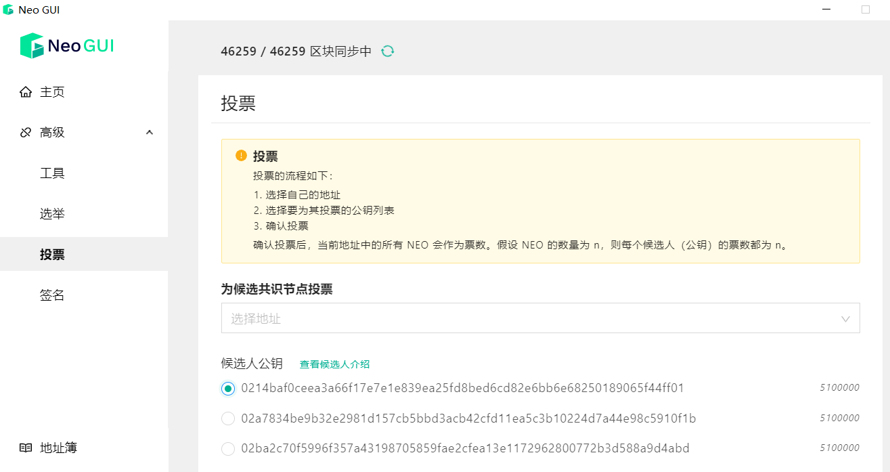

# 选举与投票

使用 Neo-GUI 可以报名成为共识节点的候选人，也可以对候选节点进行投票。Neo 共识节点将通过 dBFT 算法达成共识，生成新的区块。投票在 Neo 网络实时持续进行，其流程大致为：

1. 报名成为候选人
2. NEO 持有者对候选人进行投票
3. 根据投票数和候选人数计算选出共识节点

## 报名成为候选人

成为候选人后就可以根据投票数竞选成为共识节点，报名成为候选人需要花费一定的 GAS。参加选举需要具备以下条件：

+ 打开钱包
+ 钱包中有足够的GAS支付手续费（大约为6 GAS）

要成为候选人：

1. 在 Neo-GUI 主页面中点击`高级`-> `选举`。
2. 选择参加选举的地址公钥，点击 `确定`。

如果选举交易发送成功，可以通过以下一种方式确定是否成功成为候选人：

+ 使用 API [getvalidators](../../reference/rpc/latest-version/api/getvalidators.html) 查看是否成功成为候选人，候选人公钥会显示在该 API 的响应正文中 （publickey）;

+ 在Neo-GUI的投票页面，查看自己的公钥有没有出现在候选人列表。

  

## 投票

每个 Neo 节点都可以对候选人进行投票，当前投票账户中的 NEO 数量会自动计算为所投候选人的票数。 例如当前账户有 100 个 NEO，从该账户投票给候选人后，候选人得到 100 票。投票后如果花费了该账户的 NEO，则候选人的票数也将实时更改为当前账户 NEO 余额数。

要进行投票：

1. 在Neo-GUI中打开钱包，然后进入 `高级`->`投票`
2. 选择自己的地址
3. 在候选人框内输入要投票的候选人公钥
4. 确认投票

投票成功后可以使用 API [getvalidators](../../reference/rpc/latest-version/api/getvalidators.html) 查看候选人票数；

也可以等区块数据更新以后，在候选人列表查看票数是否成功累计。