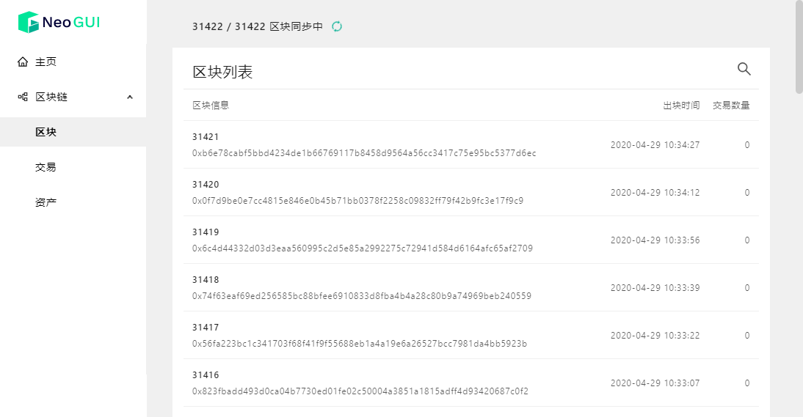
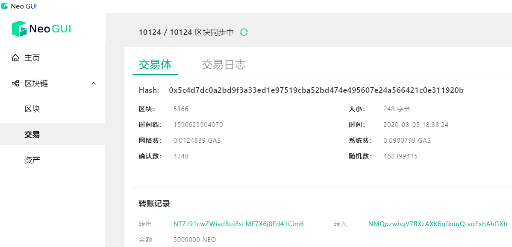

# 查看区块链信息

在 Neo-GUI 主页面点击 **区块链**，可进入区块链页面，查看 Neo 链上区块、交易和资产的详细信息。

## 区块

区块（Block）是区块链的最基本的单位，是一种逻辑结构。数据通过区块，永久记录在区块链网络上。关于区块的基本概念请参考 [区块 ](../../tooldev/concept/blockchain/block.md)。

### 查看区块列表

区块列表页面显示了最新生成的区块。可以查看到每个区块的高度、生成时间、区块哈希，包含的交易数量等信息。

通过页面右上角的搜索框，可以输入区块高度查找具体区块。

点击列表中的区块高度，可以进入该区块的详情页面。

### 区块详情

区块详情页面显示以下信息：

- 区块头：区块的基础数据，如 `区块高度`、`生成时间`、`区块大小`、`区块哈希`、`随机数`、`见证人` 等。

- 交易列表：该区块打包的所有交易。

## 交易

一个区块可以有一个或多个交易。一个交易可能是一笔或多笔转账的集合，也可能是一次智能合约的调用。

### 交易列表

交易列表显示了当前区块链网络中的待确认交易和最新交易。点击已确认交易条目可以进入交易详情页面。

### 交易详情

在该页面切换选项卡可以查看以下信息：

- **交易体**：显示交易的基本信息，如所在区块、大小、时间戳等，以及交易的转账记录和交易的见证人。
- **交易日志**：显示交易中智能合约的执行日志，包括 NEP-5 转账是否成功等信息。

关于交易的基本概念请参考 [交易](../../tooldev/transaction/transaction.md)。

## 资产

Neo3 中所有的数字资产都是合约资产，包括 NEO 和 GAS。

### 资产列表

资产列表显示了区块链上的全部资产，包括资产的 `脚本哈希`、`精度` 等信息。

点击具体资产条目，可以进入资产详情页面，查看和该资产相关的全部交易记录。

