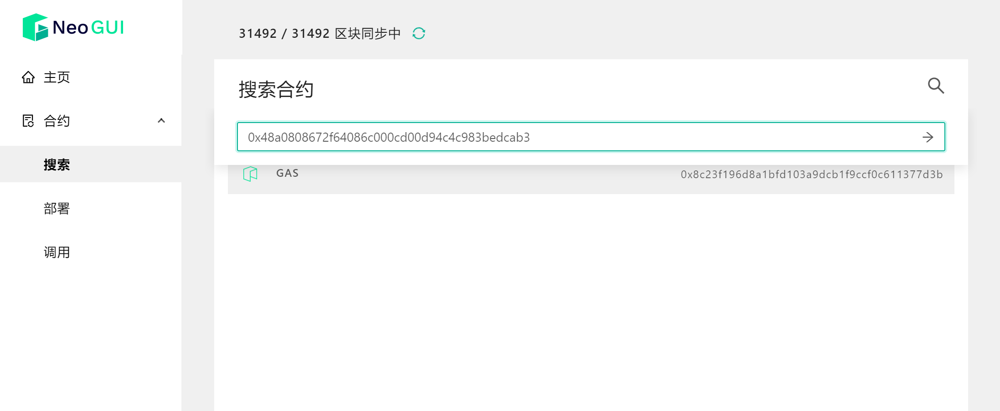
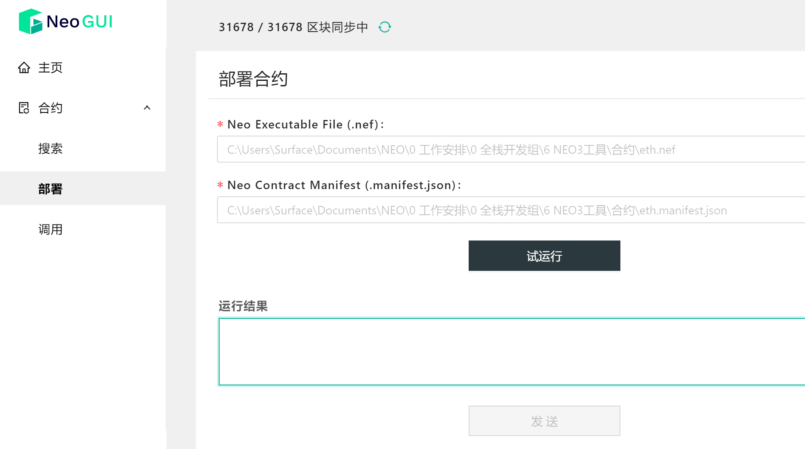
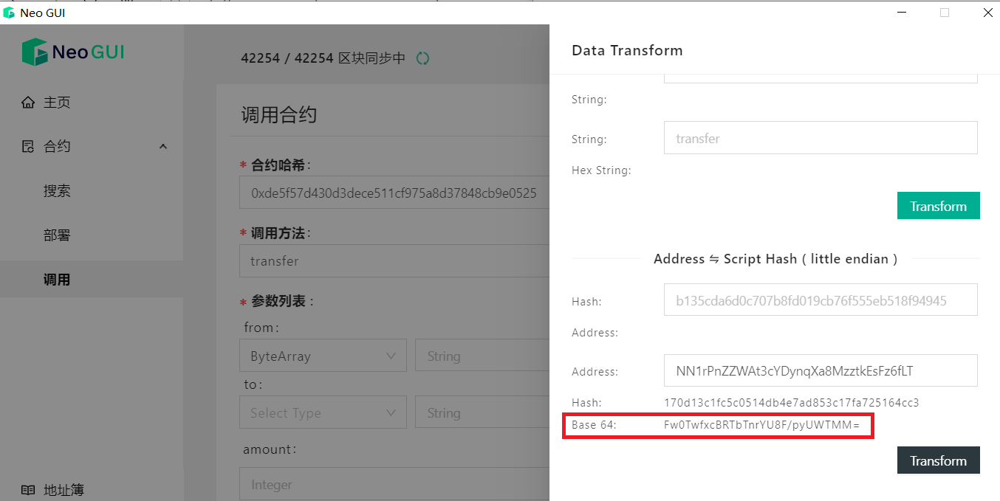
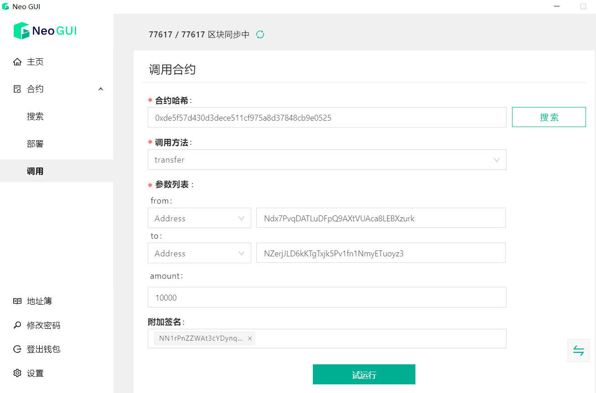

# 合约

在Neo-GUI主页上点击合约模块，进入合约页面。在这里可以快速搜索合约，部署以及调用合约。

## 搜索合约

在搜索框中可以通过合约的 `合约哈希` 来搜索合约。

合约搜索完成后，直接进入该合约的详情页面，查看以下信息：

-  `合约哈希`：合约脚本通过 RIPEMD-160 算法后生成的散列
-  `ID`：合约的序号，其中负数代表原生合约，正数代表普通智能合约
- `合约方法&通知`：合约中包含的方法以及事件/通知的详细信息，包括方法名、参数以及返回值

## 部署合约

要部署一个已经编写好的合约到区块链上，需要先打开一个钱包，然后进行以下操作：

1. 进入`部署合约`页面

2. 选择合约预先编译好的 nef 文件和 manifest 文件

   

3. 点击 `试运行` 查看运行结果。

   如果出错，可能有以下几种原因：

   - 合约已经存在
   - nef 文件和 manifest 文件不匹配
   - nef 文件或 manifest 错误
   - 手续费不足

4. 如果试运行成功，点击 `确认部署`。

等待部署合约的交易成功上链以后，就可以通过合约哈希搜索以及调用合约。

更多信息可参考 [智能合约部署](../../develop/deploy/deploy.md)。

## 调用合约

部署好合约后就可以进入`调用`页面通过合约哈希调用合约。

1. 在搜索框中输入合约哈希，搜索要调用的合约

   Neo-GUI 会从链上获取到该合约哈希对应的manifest文件，列出当前合约可以调用的方法和参数列表。

2. 选择调用方法，并填写相应的参数。例如，要调用一个nep17标准中的transfer方法，填写如下参数：

   + `from`/ `to`：资产转出/转入地址。可选择以下一种数据类型输入：

     + Address - 标准地址
     + Hash160 - 地址的大端序哈希
     + ByteArray - 地址的Base64小端序哈希

     地址到大端序以及Base64小端序的转换可以使用GUI的数据转换工具（点击页面右侧按钮）完成。

     

   + `amount`：1*10000 (精度)。

     调用nep17标准中的tranfer方法时，参数中的金额需要乘以该nep17的精度。

     

   + `附加签名`：（可选）在调用某些合约方法的时候，需要附加签名，可以在`附加签名`中选择标准账户，如上图所示。

     > [!Note]
     >
     > 如果使用多签地址签名该笔合约调用交易，需要收集足够的签名数才可以广播交易。

4. 点击`试运行`，查看运行结果

   所谓试运行是指在本地创建了一个 NeoVM，模拟运行，并不会对区块链产生影响。

5. 试运行成功后，如果想在区块链上调用，点击 ` 调用 ` 按钮。

关于调用合约和附加签名等更多信息可参考 [智能合约调用](../../develop/deploy/invoke.md)。
