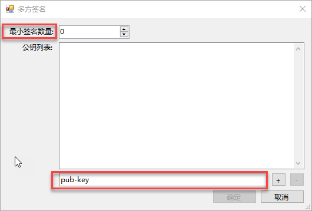
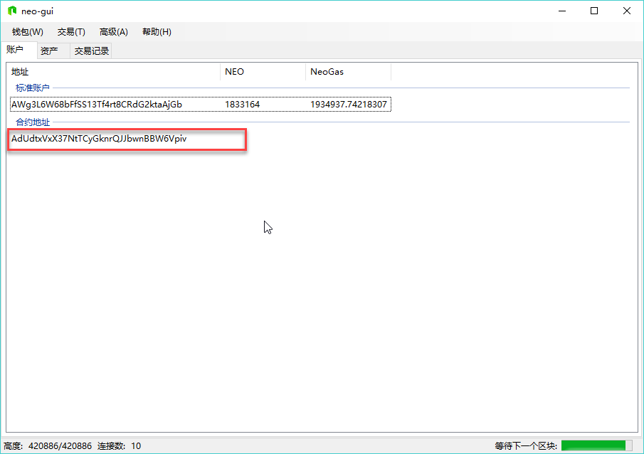
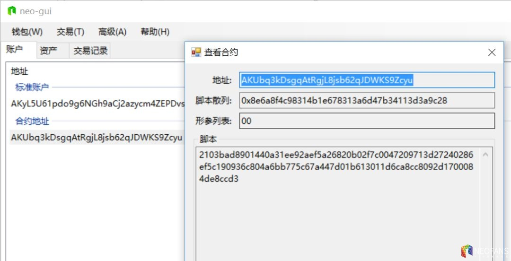

# 与智能合约交互

## 多方签名地址

多方签名地址是由多个公钥组成的，需要一方或多方签名的合约地址。   

在 NEO-GUI 客户端中，右键单击账户页面空白处，选择`创建合约地址` -> `多方签名`，在下方的文本框中依次输入各个公钥，设定 `最小签名数量`，如下图所示：    

即可成功创建出合约地址，并出现在账户页面中，如下图所示：    

## 锁仓合约

锁仓合约为账户设置了一个时间戳，在解锁时间到达之前该合约账户中的任何资产都无法转出。

创建锁仓合约有两种方法：

- 自己编写一个锁仓合约，参见 [锁仓合约示例教程](../../sc/sample/Lock2.md)
- 使用 NEO-GUI 创建锁仓合约，参见下文。

### 创建锁仓合约

1. 在 NEO-GUI 上，创建一个钱包账户。
2. 右键单击账户空白区域，选择 `创建合约地址` -> `锁仓`。
3. 选择账户并设置解锁日期，点击 `创建`。

可以看到账户中出现了新创建的合约地址。右键单击该地址，点击 查看合约。 可以查看到合约的地址和脚本。

### 验证合约脚本

你可以通过 http://lockverify.azurewebsites.net/ 验证合约脚本是否是标准的锁仓合约。

下图显示的是一个验证成功的例子，可以看到该合约的解锁日期以及合约地址。

如果合约脚本不正确，这里会提示错误。

## 部署与调用合约

已编译好的智能合约，可以通过 NEO-GUI 在 NEO 区块链上部署和调用。详细内容，请参见 [部署和调用智能合约](../../sc/deploy/deploy.md)。

