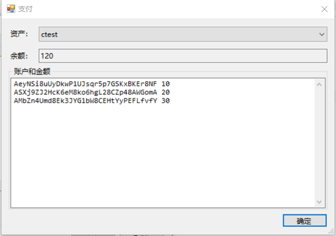
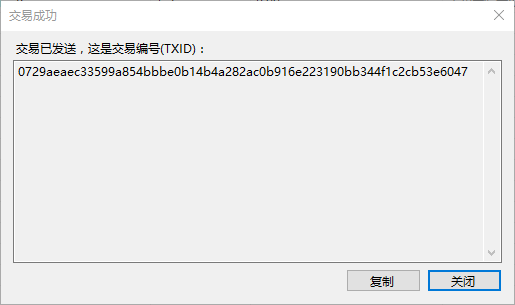
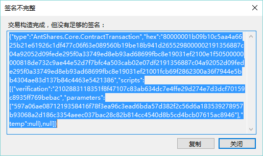
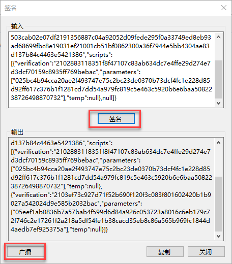
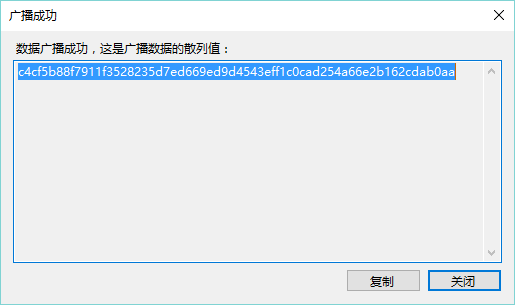
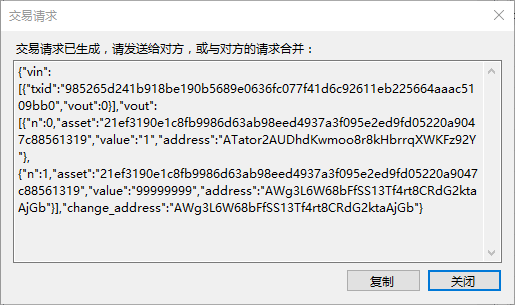
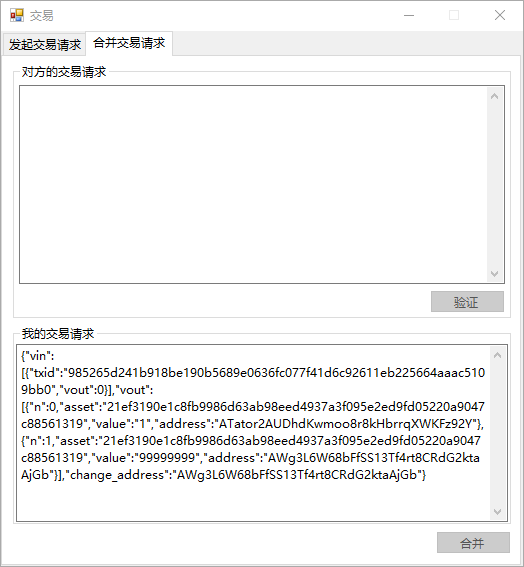

# 交易

## 转账

向对方进行资产转移，若资产类型为 Share，需双方签名确认，其他类型资产转账无需确认。

1. 在 NEO-GUI 中点击 `交易` ->`转账` 。

2. 选择以下一种操作：

   1. 要给单个地址转账，点击 `+` ，输入转账信息，如资产类型，转入地址和金额。
   2. 要给多个地址转账，点击，输入地址和金额并以空格分隔，如下图所示：

   

3. 点击`确定`。

4. （可选）点击 `高级` 展开面板，设置以下选项：

   - 转自：选择一个地址账户转出资产
   - 手续费：默认为0，设置手续费可以提高交易优先级
   - 找零地址：当转账金额小于转出地址账户余额时，转账后剩余资产将转回找零地址。

   > [!Note]
   >
   > 找零地址列表不提供钱包内的 watch-only 地址。

5. （可选）点击填写备注信息，备注信息会记录到 NEO 区块链上。

6. 检查转账信息，确认无误点击 `确定`。

   如果是代币类转账，交易成功后显示交易编号。

   

   如果是股权类转账，显示需要更多签名。点击 `复制`，复制交易信息并发送给对方。交易的另一方需要在 NEO-GUI 客户端中进行签名并广播，才能完成交易。详细内容请参见 [签名](#签名)。

   

## 签名

在进行股权类资产转账或资产交换交易时，需要对方签名才能完成交易。

1. 在 NEO-GUI 客户端中点击 `交易` -> `签名`，将对方发来的交易信息粘贴在输入框内，点击 `签名`，生成输出数据。

   `广播` 按钮显示出来。 广播会将签名后的交易信息发送到全网，由各节点进行确认，完成交易。

   

2. 点击 `广播` ，交易成功发送，等待确认后便可完成该笔交易。

## 资产交易

与对方进行资产交换交易，是一种线上的以物换物，需双方签名确认。如交易方 A 和 B 进行资产交换交易的流程为：

1. 双方发起交易请求，将生成的请求发送给对方
2. 将收到的请求进行验证
3. 合并双方交易请求，生成签名，并发给对方
4. 双方签名后进行广播，完成该笔交易

下面将详细讲解操作步骤。

### 步骤1 - 发起交易请求

以A方操作为例：

1. 在 NEO-GUI 中点击 `交易` -> `交易`。

2. 填写对方账户，点击 `+` 输入要发送的资产信息并确认。

3. 点击`发起请求`，将生成的交易请求复制并发送给 B。 点击`关闭`。

   

4. 进入合并交易请求页面，等待 B 发来交易请求。

   B 方进行同样的操作发起交易请求，并将请求发送给A。

### 步骤2 - 合并交易请求

以 A 方操作为例：

1. 将 B 发来的交易请求粘贴到输入框。点击 `验证`。

   

2. 确认交易信息，如果无误，点击 `接收` 。

3. 点击 `合并`，将双发请求合并并生成签名信息。

4. 复制签名信息，发送给 B。

5. B 进行同样的操作并将签名信息发给 A。

### 步骤3 - 签名并广播

交易双方进行签名并广播，完成交易。详细步骤请参考 [签名](#签名)。

## NEP-5 资产

NEO-GUI 客户端支持 NEP-5 资产交易。要进行 NEP-5 资产交易，需要先在 NEO-GUI 中点击 `高级`-> `选项`，添加 NEP-5 资产的脚本散列。之后便可以在资产转账或交易时选择 NEP-5 资产类型。