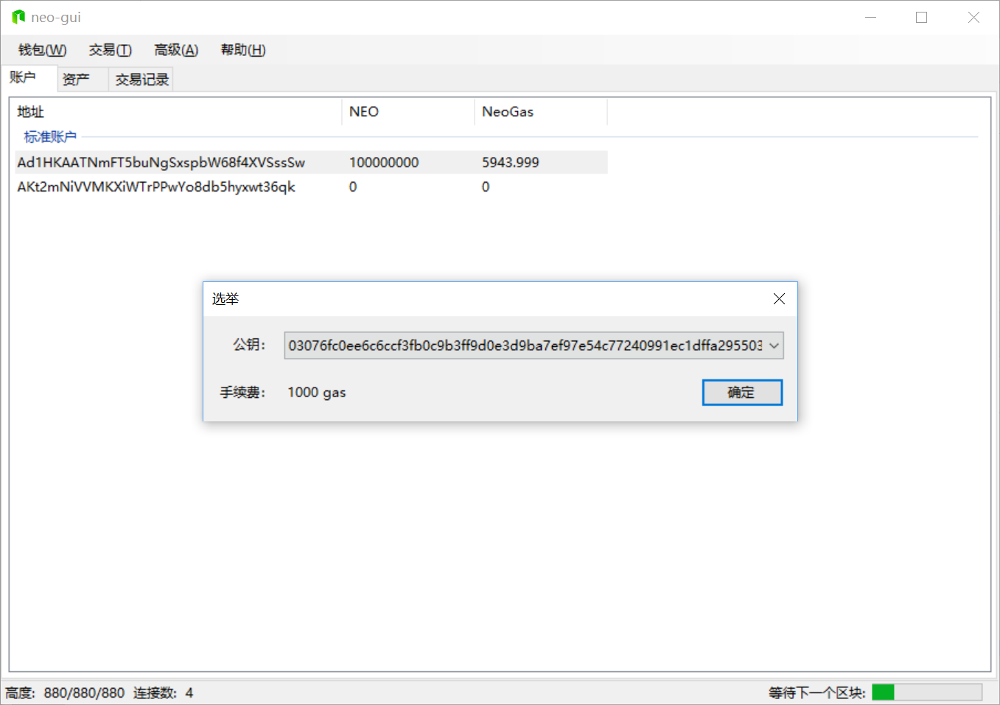
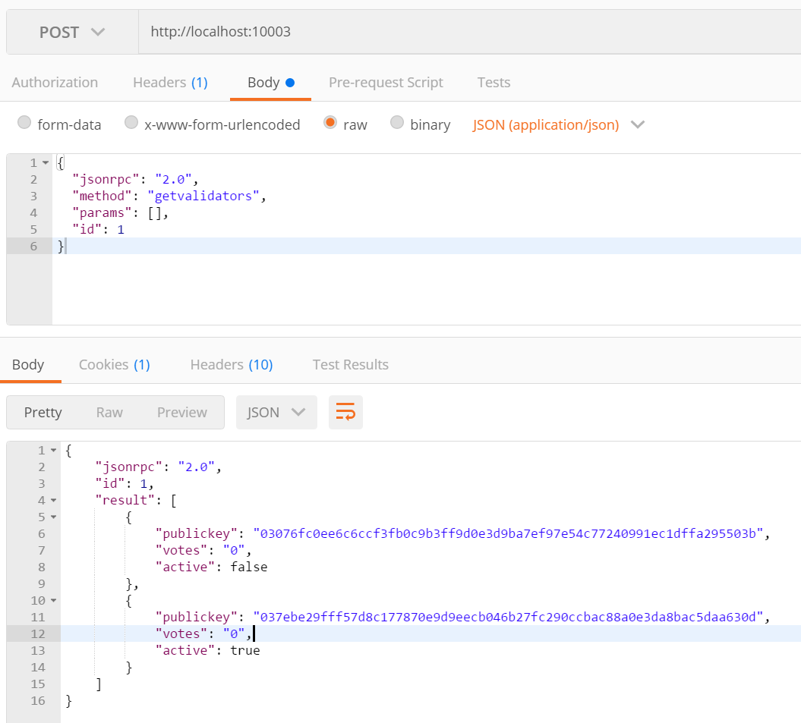
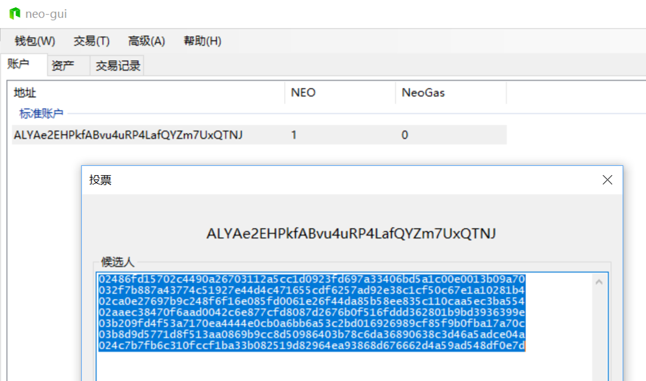
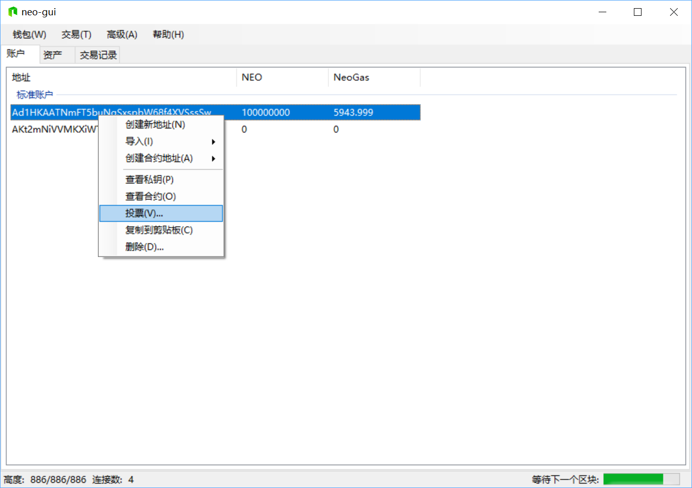

# 选举与投票

使用 NEO-GUI 可以对 NEO 区块链的共识节点进行选举投票。NEO 共识节点将通过 DBFT 算法达成共识，生成新的区块。投票在 NEO 网络实时持续进行，其流程大致为：

1. 报名成为候选人
2. NEO token 持有者对候选人进行投票
3. 根据投票数和候选人数计算选出共识节点

## 报名成为候选人

成为候选人后就可以根据投票数竞选成为共识节点。报名成为候选人需要花费手续费 1000 GAS。

要成为候选人：

1. 在 NEO-GUI 中，打开要报名候选人的钱包账户，点击 `高级` -> `选举`。
2. 选取该地址公钥，点击 `确定`。注意此操作将花费 1000 GAS。

     

将看到交易构造成功提示。可以使用 API [getvalidators](../../reference/rpc/latest-version/api/getvalidators.md) 查看是否成功成为候选人，候选人公钥会显示在该API的响应正文中 （publickey）：

## 投票

每个 NEO 节点都可以对候选人进行投票，当前投票账户中的 NEO 数量会自动计算为所投候选人的票数，当投票给多位候选人时，每位候选人都将获得与当前投票账户中 NEO 数量相等的票数。例如当前账户有 100 个 NEO，从该账户投票给三位候选人，则每位候选人得到 100 票。投票后如果花费了该账户的 NEO，则候选人的票数也将实时更改为当前账户 NEO 余额数。

投票后，NEO 网络将根据每个账户所投候选人数进行实时计算，选出共识节点。计算方法为：

1. 对每个账户所投候选人数按大小排序，得到数组 C1, C2, ..., Cn
2. 去掉数组中前 25% 和后 25% 的数值
3. 对剩余的 50% 数值进行加权平均，得出 NEO 共识节点数 N
4. 选出得票数最高的前 N 名候选人成为共识节点

要进行投票：

1. 在 NEO-GUI 中，打开要投票的钱包账户。右键点击该 `账户` -> `投票`。

2. 在候选人框内输入要投票的候选人公钥，换行可以输入多个公钥，但注意每行不能包含空格，如下图所示：

   

将看到交易构造成功提示。可以使用 API [getvalidators](../../reference/rpc/latest-version/api/getvalidators.md) 查看候选人票数。如下图所示，从余额为 100000000 的账户投票给候选人（公钥 03076fc0ee6c6ccf3fb0c9b3ff9d0e3d9ba7ef97e54c77240991ec1dffa295503b）， 通过 API getvalidators 可以查看到返回的响应正文中显示出该公钥与对应的的票数。

