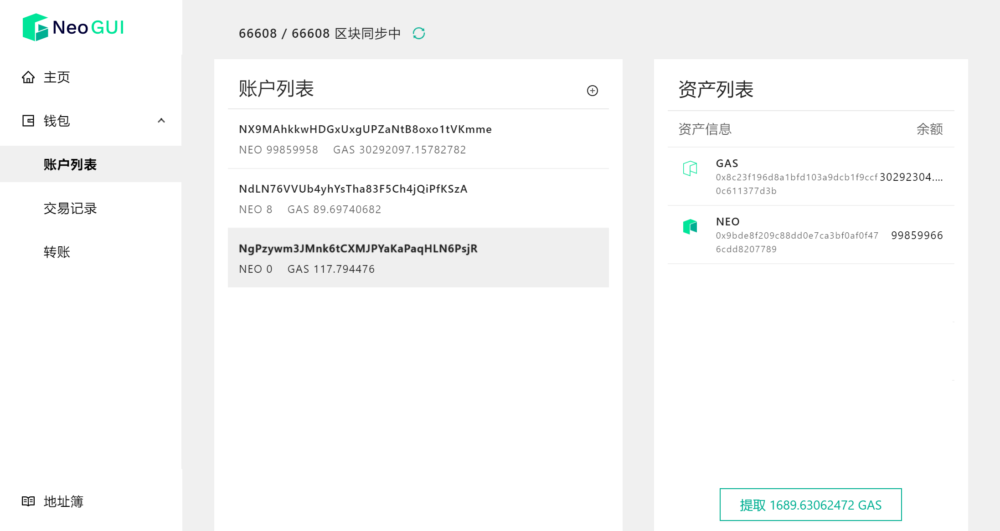
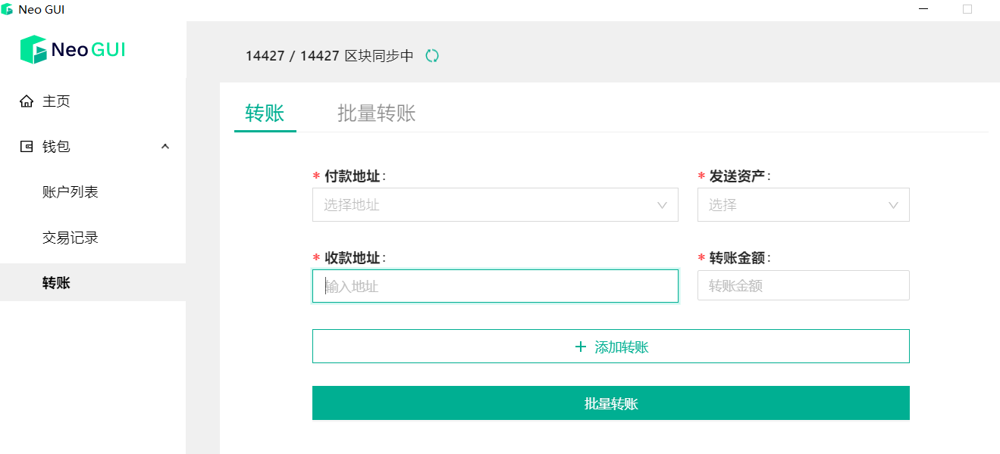

# 钱包

钱包用来存储 Neo 账户及账户中的资产信息，是 Neo-GUI 的钱包数据库文件。该文件非常重要，需要 **妥善保管** 和 **安全备份**。

> [!CAUTION]
>
> #### 警告
>
> 请不要在不安全的电脑上创建和打开钱包。钱包文件或钱包密码一旦丢失，将导致您资产的损失。所以请将钱包文件安全备份，妥善保管，并牢记钱包密码。
>

## 创建钱包

1. 在 Neo-GUI 中点击 `钱包` -> `创建钱包文件`。
2. 选择钱包文件存储位置，并设置好文件名称，然后点击保存。
3. 输入 `密码` 与 `确认密码` ，并保存好自己的密码。
4. 点击 `创建钱包` 后，钱包创建成功，此时钱包里会默认带有一个标准账户。

> [!Warning]
>
> 钱包创建成功以后，请备份好钱包文件；
>
> 不建议将钱包文件直接保存在Neo-GUI根目录，避免升级软件丢失钱包文件。

## 打开钱包

1. 在 Neo-GUI 中点击 `钱包` -> `打开钱包文件`。
2. 选择钱包文件，并输入密码，点击 `打开` 即可。

> [!Note]
>
> 在Neo2创建的钱包无法使用新版Neo-GUI打开，但可以通过导入钱包功能，使用钱包私钥导入已有钱包。

## 导入钱包

你可以将已创建好的钱包导入到Neo-GUI中。支持通过私钥，以及加密私钥导入已有钱包。即将支持通过导入助记词。

## 查看账户列表

创建或打开钱包后会自动跳转到账户列表，该页面显示了以下信息：

- 账户列表：钱包内的所有账户，以及每个账户中的 NEO 和 GAS 数量

- 资产列表：钱包中的所有资产类型和余额，包括 NEO、GAS 以及其它 NEP-5 资产等

  账户中显示的 GAS 余额是已提取的 GAS 数量，页面下方的提取GAS按钮显示了未提取的GAS数量。点击该按钮，系统将自动进行一次对自己的NEO转账，从而将GAS提取到账户中。

点击账户地址，可以查看地址对应的私钥，或删除地址。

> [!CAUTION]
>
> #### 警告
>
> 任何时刻不要向他人泄露私钥，也不要使用明文存储或发送私钥。私钥一旦泄露，很可能会导致您资产的损失。

## 查看交易列表

点击 `交易列表` ，可以查看与该钱包有关的所有交易记录。包括已经确认的交易和刚发起还未确认的交易。

+ **未确认交易**：该钱包发起的交易，在等待打包上链。
+ **最新交易**：已经被共识节点打包上链的交易

## 转账

在转账页面，你可以输入收款账户，输入转账金额，选择发送的资产进行转账。

> [!Note]
>
> 即将支持批量转账功能。

## 地址薄

地址簿中显示了当前打开钱包中的所有地址，方便用户使用。
