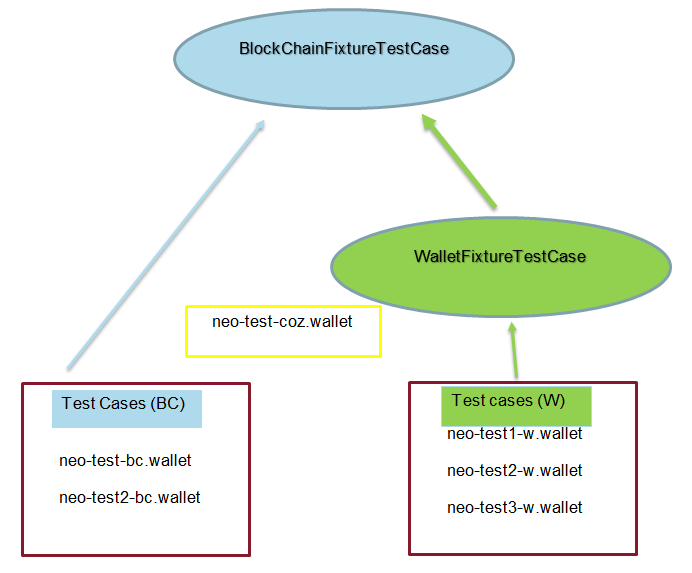

# 测试装置指南

以下指南与所有依赖于 `BlockChainFixtureTestCase` 或 `WalletFixtureTestCase` 的`unit-tests` 相关。这种测试依赖于 `neo-python-privnet-unittest` 映像生成的装置。该映像位于[这里](https://hub.docker.com/r/cityofzion/neo-python-privnet-unittest/tags/)。

- 直接依赖  `BlockChainFixtureTestCase` 的测试是使用 BC 钱包（`neo-test-bc.wallet`， `neo-test2-bc.wallet`）里的地址之间的交易生成的。有时在少数测试中也使用 `neo-test-coz.wallet` 里的默认地址。COZ 钱包很特别，它是原始的 COZ 私网钱包，拥有 100000000 NEO。
- 直接依赖  `WalletFixtureTestCase` 的测试是使用 W 钱包  (`neo-test1-w.wallet`, `neo-test2-w.wallet`, `neo-test3-w.wallet`) 里的地址之间的交易生成的。

 下图可以更好的说明测试 BC 和 W：

 

向私网测试装置新增测试时请遵循以下方针，以便最小化单元测试间的依赖：

- 从便于维护的角度来说，尽量不要在测试中直接使用 `neo-test-coz.wallet`，因为该钱包是其它测试钱包的 NEO 和 GAS的来源，会经常被更改。如果测试中使用了`neo-test-coz.wallet`，你将随时需要进行更新。
- 尽量使用 privnet fixture 中现成的交易创建新测试。
- 仅在必要时才向 privnet fixture 添加新交易，因为这会有破坏现有测试的风险。
- 如果想要隔离你的测试，请创建你自己的通证。
- 只有在绝对必要的情况下，才能创造新的钱包。

**上述最后三条要求更新测试装置，操作如下：** 

1. 拉取最新 [neo-python-privnet-unittest](https://hub.docker.com/r/cityofzion/neo-python-privnet-unittest/tags/) image：

   ```
   docker pull cityofzion/neo-python-privnet-unittest:v0.0.xx
   ```

2. 运行 image：

   ```
   docker run --rm -d --name neo-privnet-unittest -p 20333-20336:20333-20336/tcp -p 30333-30336:30333-30336/tcp dautt/neo-privnet-unittest:v0.0.xx``
   ```

3. 清除当前 `unittest` 链：

   ```
   rm -rf ~/.neopython/Chains/unittest
   rm -rf ~/.neopython/Chains/unittest_notif
   ```

4. 激活你的虚拟环境：

   ```
   source venv/bin/activate
   ```

5. 启动 NEO 节点：

   ```
   python prompt.py -u
   ```

6. 使用以下钱包生成交易：

   ```
   neo-test-coz.wallet     (pwd = coz)
   neo-test1-bc.wallet     (pwd = 1234567890)
   neo-test2-bc.wallet     (pwd = 1234567890)
   neo-test1-w.wallet      (pwd = 1234567890)
   neo-test2-w.wallet      (pwd = 1234567890)
   neo-test3-w.wallet      (pwd = 1234567890)
   ```

   （要添加直接依赖 `BlockchainFixtureTestCase` 的新测试，请使用 `-bc.wallet` 类型的钱包。要添加直接依赖 `WalletFixtureTestCase` 的新测试，请使用 `-w.wallet` 类型的钱包）

7. 如果你需要创建一个新智能合约，考虑使用这里现有的合约：

   ```
   fixtures/UnitTest-SM.zip
   ```

   （如果以上 zip 包中没有新合约的源代码，请添加。）

8. 如果你已经在 `neo-python-privnet-unittest` 映像上部署了一个新合约，请在指定合约名称时使用 test 为前缀，这样可以使用以下命令查找出所有部署在映像上的合约：

   ```
   contract search test
   ```

9. 当你对新的单元测试满意后，保存测试，然后重启 docker 映像并重新部署你的测试。然后通过增加版本号 (xx+1) 创建一个新的映像：

   ```
   docker commit  neo-privnet-unittest dautt/neo-privnet-unittest:v0.0.xx+1
   ```

   这样做的原因是我们需要使映像尽可能小。你的映像文件可能在不经意间积累了几天或几周的新块，例如，在分阶段执行新测试时，这会不必要地增加映像的大小。我们的测试装置在构建系统中被重置和提取20多次，所以任何尺寸的增加都会增加延迟 20倍或更多。

10. 通过增加数字后缀创建测试装置 (x+1)：

    ```
    notif_fixtures_vx+1.tar.gz
    fixtures_vx+1.tar.gz
    ```

11. 在如下文件的静态类变量中更新装置名称：

    ```
    neo.Utils.BlockchainFixtureTestCase.py
    neo.api.REST.test_rest_api.py
    ```

12. 创建一个新的PR，链接到新的映像和新建的测试装置。
