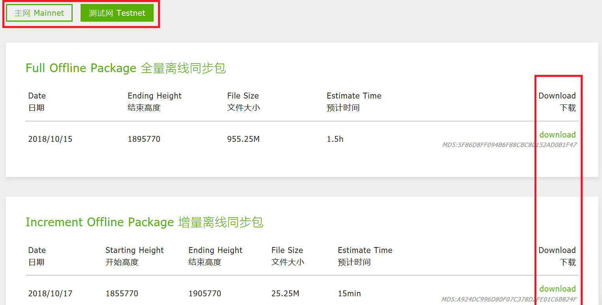
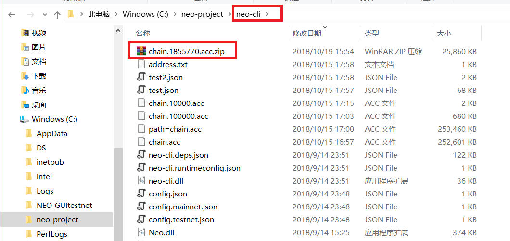
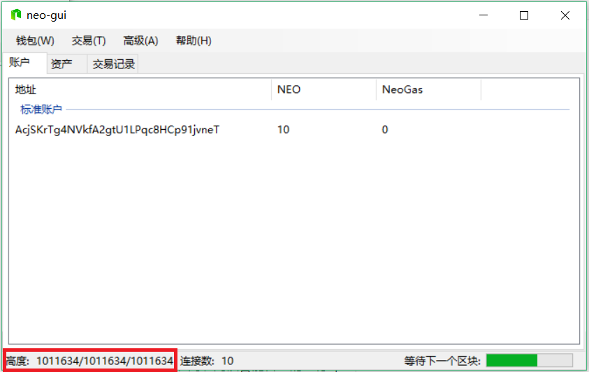

# 快速同步区块数据

NEO 客户端必须先完成与区块链的同步才能正常使用。由于区块链数据庞大，客户端同步时间通常很久，建议采用离线同步包加速同步过程。

> [!Note]
>
> 进行区块离线同步前，请确认你的NEO 客户端已安装 [ImportBlocks](https://github.com/neo-project/neo-plugins/releases/download/v2.10.3/ImportBlocks.zip) 插件。详情请参考客户端的安装说明。
>

## 第一步 - 获取离线包

1. 关闭客户端，进入[离线包下载页面](https://sync.ngd.network/)。

2. 在离线包下载页面，根据你所在网络点击 **主网** 或 **测试网** 标签，然后选择以下一种离线包进行下载 （无需解压）：

   - **全量离线包**：包含了最完整的区块高度数据，适用于初次运行的客户端。下载到的文件为 chain.acc.zip。
   - **增量离线包**：包含起始高度到结束高度范围内的数据，当你的客户端已经同步到增量包的起始高度之上时，可使用增量包继续进行同步。下载到的文件为 chain.x.acc.zip，x 为增量包的起始高度，如 chain.1855770.acc.zip。

   

## 第二步 - 放置离线包

将下载的压缩包文件 chain.acc.zip 或 chain.xxx.acc.zip 直接放置到客户端 NEO-CLI 或 NEO-GUI 根目录下。下图以 NEO-CLI 为例。

> [!Caution]
>
> #### 警告
>
> 切勿修改离线包文件名，否则会导致无法同步。 

## 第三步 - 查看同步状态

再次打开客户端查看同步状态：

- 对于 NEO-GUI，将发现客户端以超快速度进行同步。同步完成后，界面左下角三个数值相同且保持相近速度稳步增加。这三个数据依次代表：钱包高度/区块高度/区块头高度。

- 对于 NEO-CLI，输入 `open wallet <path>` 打开 NEO 命令行钱包后，输入 `show state` 查看区块同步状态，当画面显示连接 node 数为 0 并且同步速度明显加快时， 说明已进入离线同步模式。当 "Height" 后面的三个数值相同表示同步完成。

> [!Note]
>
> - NEO-CLI 2.9.0 之前的版本在用离线包同步时，客户端无法与外界通信，此时 node 数为 0，且无法调用 API。当离线包使用完毕后，客户端才会恢复与外界的通信。
>
> - 也可以使用 NEO-CLI 的 `export blocks` 命令，将同步好的区块数据导出成离线同步包。 `export blocks` 后面无参数时默认导出所有区块数据，当附加 `<start> [count]` 参数时，可以从指定区块高度导出指定数量的区块数据，方便备份以及在原有区块数据上追加同步。相关信息请参见 [CLI命令参考](cli/cli.md) 。