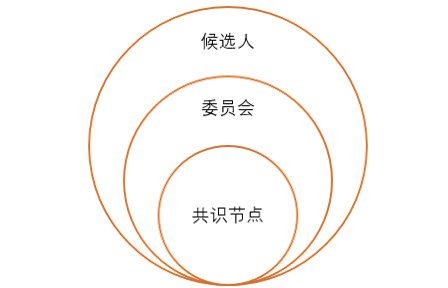

# Neo3 治理API

## 经济模型

Neo3继承Neo2继续使用NEO和GAS双通证机制，其中NEO用于治理，GAS用于流通。

### NEO

NEO总额1亿，最小单位为1，即不可分割。NEO持有者是Neo网络的所有者和管理者。通过在Neo网络上构造投票交易来行使管理权，如选举共识节点，共识策略调整，计价模型调整等，并根据NEO的持有量，可提取相应份额的GAS。

### GAS

GAS最小单位为10-8。GAS代表着Neo网络的使用权，可通过持有NEO提取或者购买获取。在使用Neo网络时，需要支付一定数量的GAS作为费用，如用户转账，注册资产，发布资产，DApp应用等。

| 原生合约   | 合约hash                                   |
| ---------- | ------------------------------------------ |
| `NeoToken` | 0xde5f57d430d3dece511cf975a8d37848cb9e0525 |
| `GasToken` | 0x668e0c1f9d7b70a99dd9e06eadd4c784d641afbc |
| `Policy`   | 0xce06595079cd69583126dbfd1d2e25cca74cffe9 |

原生合约调用方法，与普通合约调用方法一样：`Contract.Call(NEO.hash, method, params)`

## 治理机制

### 候选人（Candidate）

#### 职能

候选人本身并无职能。但委员会成员以及共识节点从候选人中，根据选票数量排序选出。三者之间逻辑关系如下图所示。委员会和共识节点没有明确的大小关系，但默认的委员会数目（21）大于共识节点数（7），一般认为共识节点包含于委员会。

#### 产生方式

通过注册可以成为候选人，也可以通过注销解除候选人资格。相应的合约方法如下：

| 方法 | 参数 | 费用（GAS） |
| ---- | ------------------------------------ | ---- |
| registercandidate | byte[] publicKey | 0.05 |
| unregistercandidate | byte[] publicKey | 0.05 |

> [!Note]
>
> 注册/注销候选人均需要验证候选人地址的签名，即只有候选人自己才能执行注册/注销操作。

#### 候选人投票

每个地址均有投票给一个地址的权利，被投票的地址即为候选人。候选人票数为所有向该账户投票的地址的NEO余额之和。通过票数将候选人排序，排在最前面的一定数量的候选人将被选为委员会成员和共识节点。这里注意，投给非候选人的地址的票数会被统计但不会被计入票数，只有当该地址注册为候选人投票才会生效。初始块所有默认候选人均会向自己投票。

投票相关合约方法如下，这里注意，投票需要验证投票者的签名。

| 方法 | 参数 | 费用（GAS） |
| ---- | ------------------------------------ | ---- |
| `vote` | byte[] account, byte[] voteTo | 5 |

由于账户NEO余额会随交易而不断变化，而且投票和注册的候选人也在不断变化，因此在每个区块都会根据以上变化更新候选人及相应投票结果。

| 方法 | 参数 | 费用（GAS） |
| ---- | ------------------------------------ | ---- |
| `getcandidates` | null | 1 |

### 委员会（Committee）

#### 职能

委员会可以通过投票的方式对Neo网络的一些参数进行修改，目前包括以下内容：

* 设置区块最大大小
* 设置区块包含最大交易量
* 设置交易每字节网络费
* 地址屏蔽/解除屏蔽

其对应的合约方法及相关费用如下所示：

| 方法 | 参数 | 费用（GAS） |
| ---- | ------------------------------------ | ---- |
| `setmaxblocksize` | uint blockSize | 0.03 |
| `setmaxtransactionsperblock` | uint maxTransactions | 0.03 |
| `setfeeperbyte` | long feePerByte | 0.03 |
| `blockaccount` | byte[] account | 0.03 |
| `unblockaccount` | byte[] account | 0.03 |

委员会可以通过发送包含多签的，调用相应合约方法的交易上链使投票生效。投票数超过委员会数量的一半的向上取整即为有效投票，相应操作将被执行生效。

另外，PolicyContract也支持以下数据的读方法：

| 方法 | 参数 | 费用（GAS） |
| ---- | ------------------------------------ | ---- |
| `getmaxblocksize` | null | 0.01 |
| `getmaxtransactionsperblock` | null | 0.01 |
| `getfeeperbyte` | null | 0.01 |
| `getblockedaccounts` | null | 0.01 |

#### 产生方式

将候选人根据票数多少排序，取最前面的一定数量候选人（默认21个）作为委员会。委员会名单将在每个区块根据最新投票更新。

#### 相关合约方法

| 方法 | 参数 | 费用（GAS） | 返回结果 |
| ---- | ------------------------------------ | ---- | ---- |
| `getcommittee` | null | 1 | 返回当前委员会（Array<ECPoint>） |

### 共识节点（Validator）

#### 职能

共识节点即具有发起新块提案和提案投票权限的节点。关于共识的详细信息，请参考NEO3白皮书。

#### 产生方式

将候选人根据票数多少排序，取最前面的一定数量候选人（默认7个）作为共识节点。与委员会类似，共识节点名单将在每个区块根据最新投票更新。

#### 相关合约方法

| 方法 | 参数 | 费用（GAS） | 返回结果 |
| ---- | ------------------------------------ | ---- | ---- |
| `getvalidators` | null | 1 | 返回当前共识节点（Array<ECPoint>） |
| `getnextblockvalidators` | null | 1 | 返回下个块（正在持久化的块）的共识节点（Array<ECPoint>） |

## Token分配

初始高度下，NEO总额的一半，即5千万份，分配给所有的初始委员会成员。分配方法如下：

1. 根据protocol.json配置，得到委员会成员数目N1和其中共识节点的数目N2；

2. 将5千万NEO分成 (N1 + N2) 份，分配给所有的委员会成员，其中非共识节点拿一份，共识节点拿双份；

3. 剩下的一半NEO，分配给初始共识节点的多签地址。
   
   所有在Neo网络中的互动均通过交易（Transaction）进行，而交易需要GAS作为费用支付方式。交易包含系统费和网络费两种费用。其中，系统费作为交易执行的资源被消耗掉，而网络费将作为上链奖励，发放给交易所在区块的议长。

## Nep5合约方法

NEO及GAS均为[Nep5](https://github.com/neo-project/proposals/blob/master/nep-5.mediawiki)合约。Nep5的合约方法如下：

| 方法 | 参数 | 费用（GAS） | 返回结果 |
| ---- | ---- | ---- | ---- |
| `name` | null | 0 | 返回Token名称（String）|
| `symbol` | null | 0 | 返回Token标志（String） |
| `decimals` | null | 0.01 | 返回Token精度（UInt） |
| `totalsupply` | null | 0.01 | 返回Token当前流通量（BigInteger） |
| `balanceof` | byte[] account | 0.01 | 返回该账户的余额（BigInteger） |
| `transfer` | byte[] from, byte[] to, BigInteger amount | 0.08 | 将指定数额的Token从from转往to，注意这里需要校验from的签名，方法调用者是否为from，to是否能够收款，以及from余额是否充足 |

Neo扩展的合约方法如下：

| 方法 | 参数 | 费用（GAS） | 返回结果 |
| ---- | ------------------------------------ | ---- | ---- |
| `unclaimedgas` | byte[] account | 0.03 | 返回该账户未提取的GAS（uint） |
