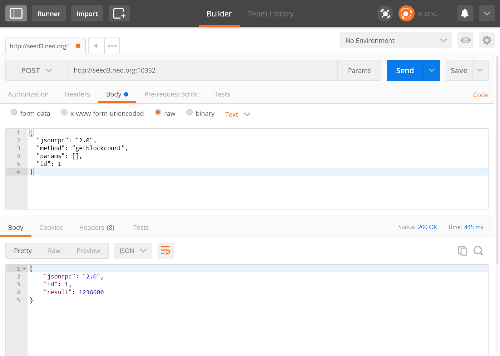

# API 参考

每个 Neo-CLI 节点都可选的提供了一套 API 接口，用于从该节点获取区块链数据，使得开发区块链应用变得十分方便。接口通过 [JSON-RPC](http://wiki.geekdream.com/Specification/json-rpc_2.0.html) 的方式提供，底层使用 HTTP/HTTPS 协议进行通讯。

要启用 RPC服务，你需要安装 [RpcServer插件](https://github.com/neo-project/neo-modules/releases)，启动 Neo-CLI 时无需添加参数。

## 监听端口

JSON-RPC 服务器启动后，会监听 TCP 端口，默认端口如下。P2P 和 WebSocket 的端口详见 [Neo 节点介绍](../../../node/introduction.md)。

|                | 主网（Main Net） | 测试网（Test Net） |
| -------------- | ------------ | ------------- |
| JSON-RPC HTTPS | 10331        | 20331         |
| JSON-RPC HTTP  | 10332        | 20332         |

## 命令列表

### 区块链

| 方法                                                | 参数                         | 说明                                           |
| --------------------------------------------------- | ---------------------------- | ---------------------------------------------- |
| [getbestblockhash](api/getbestblockhash.md)         |                              | 获取主链中高度最大的区块的散列                 |
| [getblock](api/getblock.md)                         | \<hash \| index> [verbose=0] | 根据指定的哈希或索引，返回对应的区块信息       |
| [getblockcount](api/getblockcount.md)               |                              | 获取主链中区块的数量                           |
| [getblockhash](api/getblockhash.md)                 | \<index>                     | 根据指定的索引，返回对应区块的散列值           |
| [getblockheader](api/getblockheader.md)             | \<hash \| index> [verbose=0] | 根据指定的哈希或索引，返回对应的区块头信息     |
| [getcontractstate](api/getcontractstate.md)         | \<script_hash>               | 根据合约脚本散列，查询合约信息                 |
| [getrawmempool](api/getrawmempool.md)               | [shouldGetUnverified=0]      | 获取内存中未确认的交易列表                     |
| [getrawtransaction](api/getrawtransaction.md)       | \<txid> [verbose=0]          | 根据指定的散列值，返回对应的交易信息           |
| [getstorage](api/getstorage.md)                     | \<script_hash>  \<key>       | 根据合约脚本散列和存储的 key，返回存储的 value |
| [gettransactionheight](api/gettransactionheight.md) | \<txid>                      | 获取交易高度                                   |
| [getvalidators](api/getvalidators.md)               |                              | 查看当前共识节点的信息                         |

### 节点

| 方法                                            | 参数   | 说明                                       |
| ----------------------------------------------- | ------ | ------------------------------------------ |
| [getconnectioncount](api/getconnectioncount.md) |        | 获取节点当前的连接数                       |
| [getpeers](api/getpeers.md)                     |        | 获得该节点当前已连接/未连接的节点列表      |
| [getversion](api/getversion.md)                 |        | 获取查询节点的版本信息                     |
| [sendrawtransaction](api/sendrawtransaction.md) | \<hex> | 广播交易                                   |
| [submitblock](api/submitblock.md)               | \<hex> | 提交新的区块<br>**注意**：需要成为共识节点 |

### 智能合约

| 方法                                    | 参数                                    | 说明                                           |
| --------------------------------------- | --------------------------------------- | ---------------------------------------------- |
| [invokefunction](api/invokefunction.md) | \<script_hash>  \<operation>  \<params> \<checkWitnessHashes> | 以指定的脚本散列值调用智能合约，传入操作及参数 |
| [invokescript](api/invokescript.md)     | \<script>  \<checkWitnessHashes>                  | 通过虚拟机运行脚本并返回结果                   |

### 工具

| 方法                                      | 参数       | 说明                          |
| ----------------------------------------- | ---------- | ----------------------------- |
| [listplugins](api/listplugins.md)         |            | 列出节点已加载的所有插件      |
| [validateaddress](api/validateaddress.md) | \<address> | 验证地址是否是正确的 Neo 地址 |

### 钱包

| 方法                                       | 参数                                       | 说明                           |
| ---------------------------------------- | ---------------------------------------- | ---------------------------- |
| [closewallet](api/closewallet.md) |  | 关闭当前打开着的钱包 |
| [dumpprivkey](api/dumpprivkey.md) | \<address>                              | 导出指定地址的私钥 |
| [getbalance](api/getbalance.md) | \<asset_id> | 查询资产余额 |
| [getnewaddress](api/getnewaddress.md) |  | 创建一个新的地址 |
| [getunclaimedgas](api/getunclaimedgas.md) |  | 显示钱包中未提取的 GAS 数量 |
| [importprivkey](api/importprivkey.md) | \<key> | 导入私钥到钱包 |
| [listaddress](api/listaddress.md) |  | 列出当前钱包内的所有地址 |
| [openwallet](api/openwallet.md) | \<path> \<password> | 打开指定钱包 |
| [sendfrom](api/sendfrom.md) | \<asset_id>\<from>\<to>\<value> | 从指定地址，向指定地址转账 |
| [sendmany](api/sendmany.md) | \<outputs_array> | 在一笔交易中向指定地址发起多笔转账 |
| [sendtoaddress](api/sendtoaddress.md) | \<asset_id>\<address>\<value> | 向指定地址转账 |

### ApplicationLogs 插件

| 方法                                          | 参数    | 说明                                  |
| --------------------------------------------- | ------- | ------------------------------------- |
| [getapplicationlog](api/getapplicationlog.md) | \<txid> | 根据指定的 NEP-5 交易 ID 获取合约日志 |

### RpcNep5Tracker 插件

| 方法                                        | 参数                  | 说明                                |
| ------------------------------------------- | --------------------- | ----------------------------------- |
| [getnep5balances](api/getnep5balances.md)   | \<address>            | 返回指定地址内的所有 NEP-5 资产余额 |
| [getnep5transfers](api/getnep5transfers.md) | \<address>[timestamp] | 返回指定地址内的所有 NEP-5 交易记录 |

## GET 请求示例

一次典型的 JSON-RPC GET 请求格式如下：

下面以获取主链中区块的数量方法为例。

请求 URL：

```
http://somewebsite.com:10332?jsonrpc=2.0&method=getblockcount&params=[]&id=1
```

发送请求后，将会得到如下的响应：

```json
{
  "jsonrpc": "2.0",
  "id": 1,
  "result": 909129
}
```

## POST 请求示例

一次典型的 JSON-RPC Post 请求的格式如下：

下面以获取主链中区块的数量方法为例。

请求 URL：

```
http://somewebsite.com:10332
```

请求 Body：

```json
{
  "jsonrpc": "2.0",
  "method": "getblockcount",
  "params": [],
  "id": 1
}
```

发送请求后，将会得到如下的响应：

```json
{
  "jsonrpc": "2.0",
  "id": 1,
  "result": 909122
}
```

> [!Note]
>
> 请将区块同步到最新高度后再使用 API，否则返回的结果可能不是最新的。

## 测试工具

你可以用 [Postman](https://www.postman.com/) 来方便地进行测试，下面是测试截图：



## 其它参考

[C# JSON-RPC 使用方法](https://github.com/chenzhitong/CSharp-JSON-RPC/blob/master/json_rpc/Program.cs)