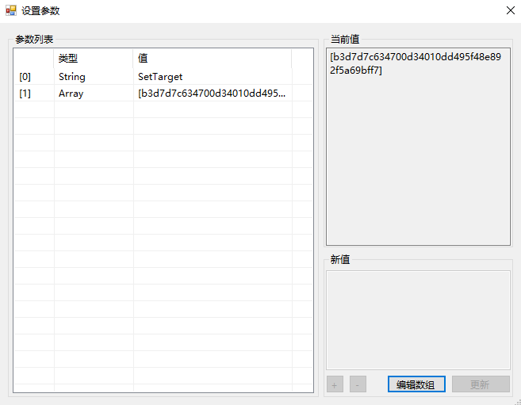

# 调用合约

智能合约的调用特指针对一个发布作为类库的智能合约如何调用。

## 静态调用

要从合约中静态调用另一个合约，需要通过 AppCall 和要调用的合约的脚本散列来在 C# 中添加声明，然后就可以在代码中对其进行调用了。

```c#
[Appcall("XXXXXXXXXX")]//ScriptHash
public static extern int AnotherContract(string arg);

public static void Main()
{
    AnotherContract("Hello");    
}
```

## 动态调用

在合约中，如果希望调用的合约不确定，需要以参数形式传入，可以使用动态调用的方式处理。

### 动态调用代码

以下是一个动态调用合约的代码示例：

```c#
using Neo.SmartContract.Framework;
using Neo.SmartContract.Framework.Services.Neo;
using Helper = Neo.SmartContract.Framework.Helper;
using System;
using System.Numerics;

namespace DynCall
{
    public class DynCallDemo : SmartContract
    {
        delegate object Dyncall(string method, object[] args);

        public static object Main(string operation, object[] args)
        {
            if (operation == "DynCall")
            {
                if (args.Length != 2)
                {
                    return false;
                }
                byte[] target = Storage.Get(Storage.CurrentContext, "BaseAddress");
                Dyncall dyncall = (Dyncall)target.ToDelegate();
                object[] newarg = new object[1];
                string method = (string)args[0];
                newarg[0] = args[1];
                return dyncall(method, newarg);
            }
            else if (operation == "SetTarget")
            {
                Storage.Put(Storage.CurrentContext, "BaseAddress", (byte[])args[0]);
                return true;
            }
            else if (operation == "ShowTarget")
            {
                byte[] target = Storage.Get(Storage.CurrentContext, "BaseAddress");
                if (target.Length != 0)
                {
                    return target;
                }
                else
                {
                    return 0;
                }
            }
            else
            {
                return false;
            }

        }
    }
}
```

示例代码中定义了三个方法：

- DynCall: 根据设定的地址动态调用其它合约
- SetTarget：通过参数设定调用地址（小端序）
- ShowTarget: 返回设定的调用地址

### 动态调用演示

在 Visual Studio 2017 中将示例代码编译为智能合约文件 d.avm。接下来，我们将使用 NEO-GUI 来演示如何动态调用一个普通合约 a.avm。

#### 部署合约

根据以下步骤，分别部署两个合约文件，a.avm 和 d.avm：

1. 打开任意钱包文件，点击 `高级` -> `部署合约`。

2. 在部署合约对话框中，点击 `加载` 选择合约文件。

   此时代码框下方会显示合约脚本哈希，将其复制供调用合约时使用。

3. 填写信息与元数据区域的参数。每个参数都需要填写，否则无法激活 `部署` 按钮。

   具体填写规则可参考 [智能合约参数和返回值](../deploy/Parameter.md)。

   勾选 `需要创建存储区`。部署动态调用合约 d.avm 时，还要勾选 `需要动态调用`。

4. 完成所有参数填写后，点击 `部署`。

5. 在弹出的调用合约窗口中点击 `试运行`，确认无误，点击 `调用`。

   部署合约需要花费100 ~1000 GAS，详情请参见 [系统手续费](../fees.md)。

#### 转换小端序

使用 [大小端序转换工具](https://peterlinx.github.io/DataTransformationTools/) 将普通合约 a.avm 的脚本哈希 (大端序) 转换成小端序脚本哈希，记录备用。

#### 调用合约

现在使用上一步发布的动态调用合约 d.avm 来调用合约 a.avm。

1. 点击 `高级` -> `调用合约` -> `函数调用`。

2. 将 d.avm 的脚本哈希填入 `ScriptHash`，点击搜索键，该合约相关信息会自动显示出来。

3. 点击 `参数列表` 旁的 `...` 进入编辑窗口。

   

4. 调用 SetTarget 方法：

   1. 点击 [0]，在值中填写 “SetTarget”
   2. 点击 [1]，填写参数为合约 a.avm 的**小端序**脚本哈希
   3. 点击`更新`。

   

5. 调用 ShowTarget 方法查看设定是否成功，如下图所示：

   

6. 调用 DynCall 方法调用合约 a.avm，假设我们调用合约中的 Height 方法，其参数为 Simple，如下图所示:

   

   


