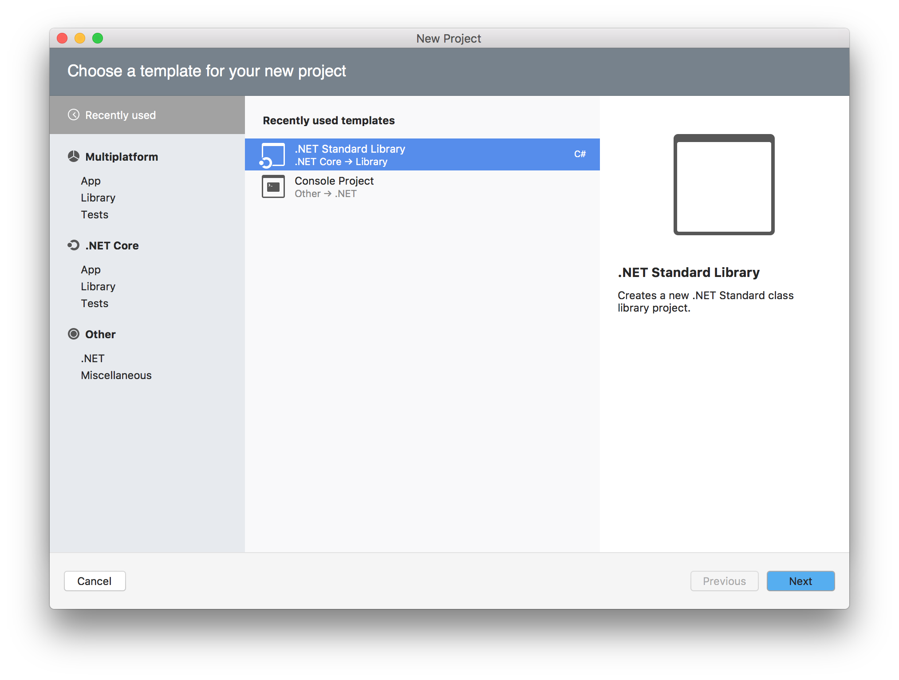

# 在 macOS 上使用 C# 编写合约

本文将指导开发者在macOS中配置智能合约的C#开发环境，使用示例代码创建合约项目并完成编译。

## 安装Visual Studio for Mac 

下载 [Visual Studio for Mac](https://www.visualstudio.com/zh-hans/vs/visual-studio-mac/)，按照屏幕提示进行安装。安装过程中只需勾选基本功能，无需安装 Android / iOS / macOS 等平台组件。

> [!Note]
>
> 如果勾选了 Android / iOS / macOS 平台，安装时间可能会需要数小时，而且由于网络情况可能会容易失败，所以不建议安装。

## 新建项目

1. 运行 Visual Studio for Mac，新建项目，选择 .NET Standard Library。

   

3. 选择 .NET Standard 2.0 并根据屏幕提示创建项目，命名为test。

3. 在解决方案栏中右键单击 `依赖项` -> `管理NuGet包`

4. 搜索 “neo.smart” ，选择 “Neo.SmartContract.Framework”，最后点击 `添加包`。

   

   程序开始添加 Neo 智能合约框架，完成后将显示已成功添加。

5. 安装成功后，编写如下示例代码：

   ```c#
   using Neo.SmartContract.Framework;
   using Neo.SmartContract.Framework.Services.Neo;
   
   namespace Neo.SmartContract
   {
       public class Class1 : Framework.SmartContract
       {
           public static bool Main()
           {
               return true;
           }
       }
   }
   ```

6. 在菜单栏中点击 `生成` -> `全部生成` 编译相应代码。

   编译成功后，会在 bin/Debug/netstandard2.0/ 目录下生成 test.dll 文件，之后会用 neon 将其二次编译为 .avm 智能合约文件。


## 下载编译器

1. 在 GitHub 上下载 [neo-devpack-dotnet](https://github.com/neo-project/neo-devpack-dotnet) 项目。

2. 进入目录 `neo-devpack-dotnet/src/Neo.Compiler.MSIL/`，使用文本编辑器打开文件 Neo.Compiler.MSIL.csproj 进行编辑，将以下语句

   ```
   <TargetFrameworks>netcoreapp3.1;netstandard2.1</TargetFrameworks>
   ```

   替换为：

   ```
   <TargetFramework>netcoreapp3.1</TargetFramework>
   ```

3. 用 Visual Studio for Mac 打开解决方案neo-devpack-dotnet.sln，右键单击Neo.Compiler.MSIL并选择发布

4. 将 neon 发布到默认路径 。发布成功后，会在该目录下生成 neon.dll 文件，记住这个文件夹，之后会用到。


## 编译合约

1. 下载并安装  [.NET Core](https://www.microsoft.com/net/download/macos )。


   

2. 将新建项目后生成的文件test.dll复制到neon.dll所在文件夹。

3. 打开 终端，用 `cd` 命令进入neon.dll所在文件夹目录，输入 `dotnet neon.dll -f test.dll `开始编译。

   


编译器输出如上内容，编译成功，在目录中会生成 test.avm 文件。
