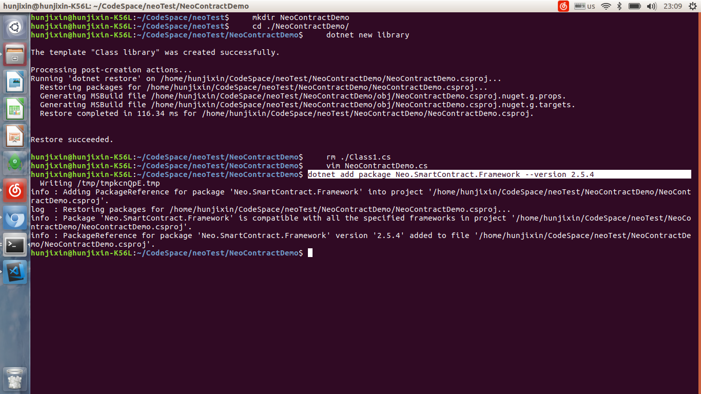
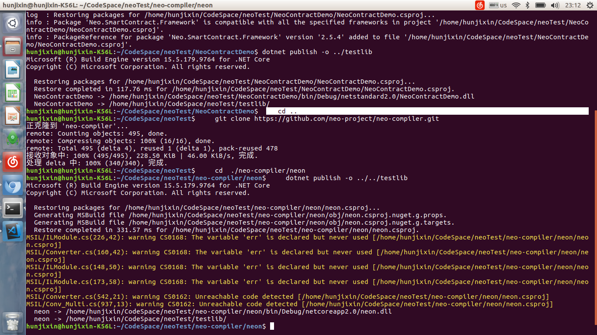

# 在 ubuntu 上使用 C# 编写合约

在 ubuntu 中使用C#编写智能合约，需要进行如下操作：

   1. 创建 library 项目，编写代码，引入智能合约库。
   2. 编译 neo-compiler/neon 生成编译器。
   3. 执行命令运行 neon 生成.avm 文件。

## 新建合约项目

1. 在 dotnet 命令行中创建 library 项目:

   ```c#
   mkdir NeoContractDemo
   cd ./NeoContractDemo/
   dotnet new classlib
   rm ./Class1.cs
   vim NeoContractDemo.cs
   ```

2. 键入下面代码后按 `ESC`+`wq!` 保存退出。

   ```c#
   using Neo.SmartContract.Framework;
   using Neo.SmartContract.Framework.Services.Neo;
   
   public class NeoContractDemo: SmartContract
   {
       public static bool Main()
       {
           return true;
       }
   }
   ```

3. 添加智能合约引用：

   ```
   dotnet add package Neo.SmartContract.Framework --version 2.5.4
   ```

   

4. 编译智能合约项目：

   ```
   dotnet publish -o ../testlib
   ```

   

## 生成编译器

    cd ..
    git clone https://github.com/neo-project/neo-compiler.git
    cd  ./neo-compiler/neon
    dotnet publish -o ../../testlib



## 生成 .avm 文件

    cd ../../testlib
    dotnet neon.dll NeoContractDemo.dll
    mkdir ../output
    cp NeoContractDemo.avm ../output/NeoContractDemo.avm


(完整脚本参考)[https://raw.githubusercontent.com/hunjixin/NeoContractBuildScriptOnUbuntu/master/SmartContract.sh]
