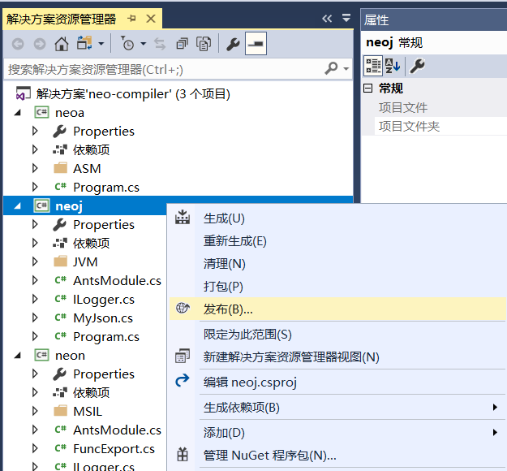
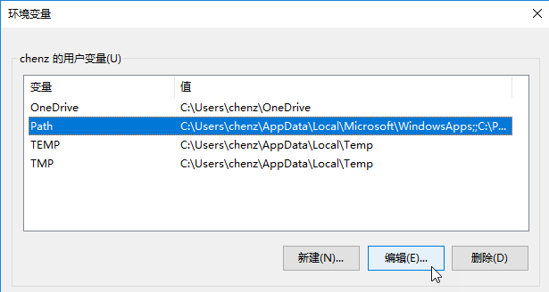
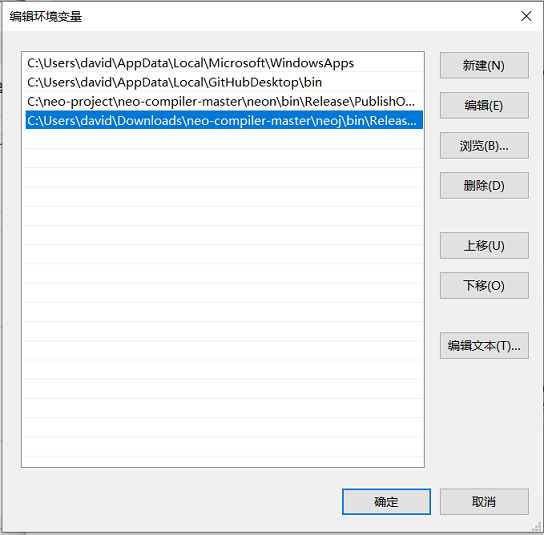
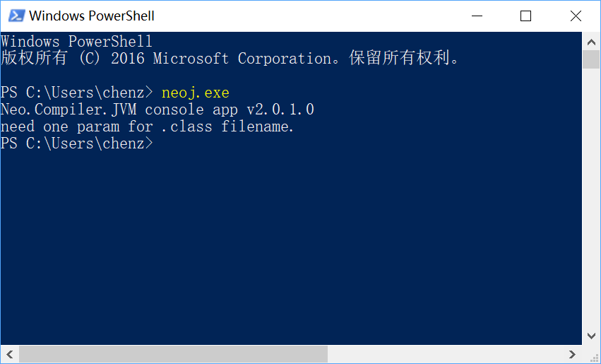
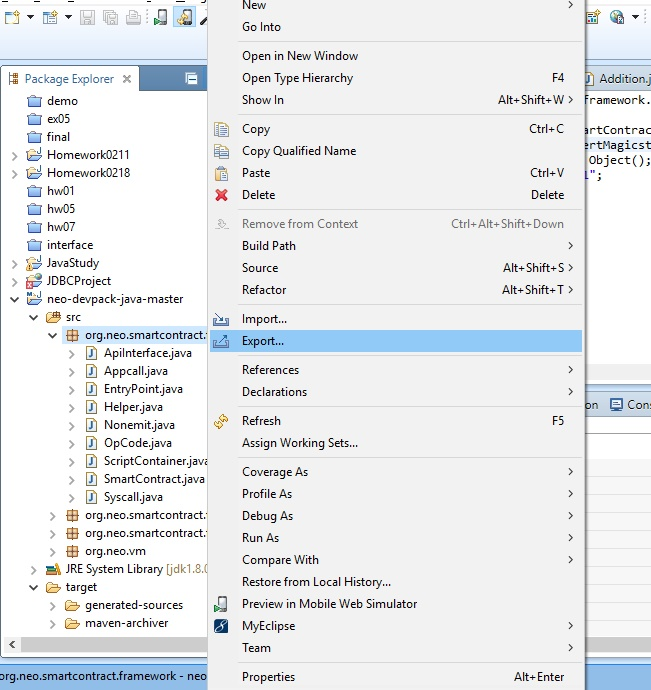
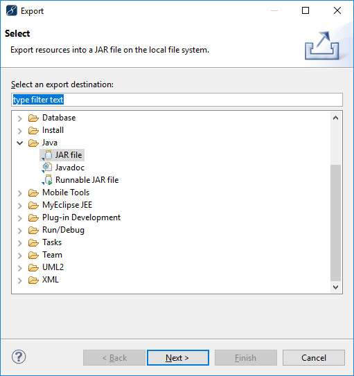
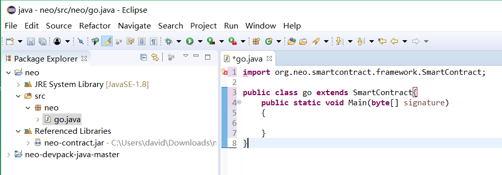
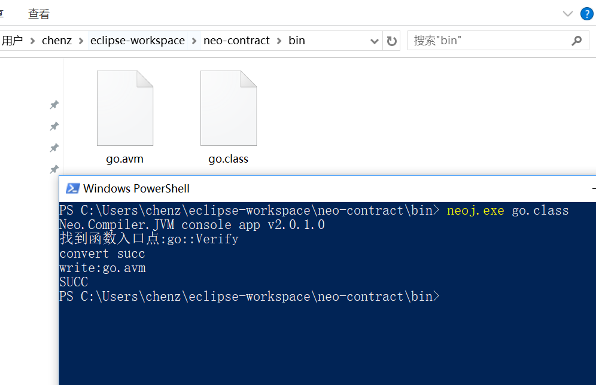

# 使用 Java 编写合约

此部分包含简短的教程，可指导你配置 NEO 智能合约的 Java 开发环境，并使你了解如何创建智能合约项目，以及如何编译。

## 开发工具

### Java 开发环境

JDK：[下载地址](http://www.oracle.com/technetwork/java/javase/downloads/jdk8-downloads-2133151.html)

eclipse：[下载地址](http://www.eclipse.org/downloads/)

> [!Note]
>
> eclipse 需安装 maven 插件并确认 JDK 版本与 pom.xml 中的设置一致。

### neo-compiler

neo-compiler 是 NeoContract 的编译器，可以将高级语言的代码编译为智能合约的指令。其中 neoj 项目是 NeoContract 的 Java 编译器。

安装和配置方法：

在 Github 上下载 [neo-compiler](https://github.com/neo-project/neo-compiler) 项目，用 Visual Studio 2017 打开该解决方案，发布其中的 neoj 项目，如图




发布成功后，会在 bin\Release\PublishOutput 目录下生成 neoj.exe 文件

然后需要添加 path，让任何位置都能访问这个 exe 程序

添加 path 方法：

按 Windows + S 键，输入“环境变量”，选择“编辑账户的环境变量”回车


然后选择 Path, 点击 ` 编辑 `



在弹出来的窗口中点击”新建“输入 neoj.exe 所在的目录，点击 ` 确定 ` ，` 确定 `



添加完 path 后，运行 CMD 或者 PowerShell 测试一下，输入 neoj.exe 后，没有报错，输出如图所示的版本号的提示信息即表示环境变量配置成功



## 创建项目

以上两步安装配置成功后，即可在 eclipse 中创建 NEO 智能合约项目。

1. 通过 [neo-devpack-java](https://github.com/neo-project/neo-devpack-java) 项目编译智能合约 jar 包，然后使用这个 jar 包创建一个 Java 项目。

2. 将 org.neo.smartcontract.framework 的程序包 export 成名为 org.neo.smartcontract.framework.jar 的 jar 包并放在 neoj 的 ..\neoj\bin\Release\netcoreapp1.1\win10-x64\publish\ 目录下面。

   

   

   

3. 创建一个类，如 Go.java，将如下代码粘贴到文件中。

```java
import org.neo.smartcontract.framework.SmartContract;

public class Go extends SmartContract{
	public static void Main(byte[] signature)
	{
		
	}
}
```

## 编译项目

在 eclipse 中编译 go.java 文件，编译后会在 bin 目录中生成 Go.class 文件。



打开 PowerShell/CMD 进入 bin 目录，输入 `neoj.exe Go.class` 即可编译成 go.avm 文件，该文件即是生成的 NEO 智能合约文件。



现在，你已经完成了 NEO 智能合约开发环境的配置。

