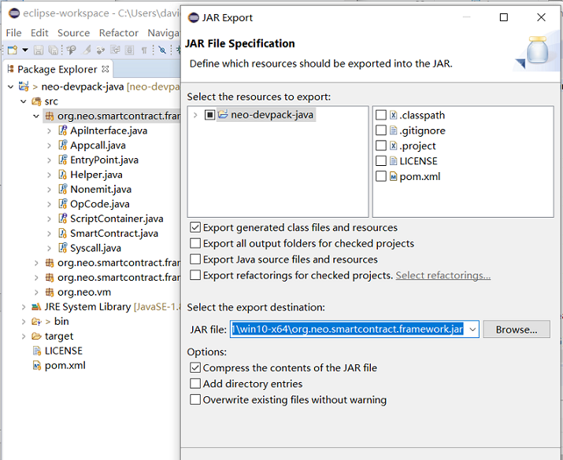

# 使用 Java 编写合约

本文将指导开发者配置智能合约的Java开发环境，使用示例代码创建合约项目并完成编译。

## 安装开发环境

1. 下载并安装Java开发环境，这里我们使用 [JDK](http://www.oracle.com/technetwork/java/javase/downloads/jdk8-downloads-2133151.html) 和 [eclipse](http://www.eclipse.org/downloads/)进行演示。

   如果使用Intellij，操作流程基本相似。

2. （仅针对Windows系统）下载 [Visual Studio 2019](https://visualstudio.microsoft.com/vs/community/)并根据提示完成安装。注意安装时需要勾选 `.NET Core 跨平台开发 ` 。

   目前Java编译器neoj需要手动发布，推荐使用Visual Studio。

## 安装与配置编译器

neo-compiler 是 NeoContract 的编译器，可以将高级语言的代码编译为智能合约的指令。其中 neoj 项目是 NeoContract 的 Java 编译器。

### 发布编译器

1. 在 Github 上下载 [neo-compiler](https://github.com/neo-project/neo-compiler) 项目，用 Visual Studio 2019 打开解决方案neo-compiler.sln
2. 在解决方案栏中右键单击neoj，并选择`发布`。
3. 将neoj发布到默认路径。发布成功后，会在该目录下生成 neoj.exe 文件。

### 设置环境变量

添加 path，让任何位置都能访问这个程序：

1. 按 Windows + S 键，输入“环境变量”，选择“编辑账户的环境变量”

2. 选择 Path, 点击 ` 编辑 `

   

3. 在弹出来的窗口中点击`新建`，输入 neoj.exe 所在的目录，点击 ` 确定 `。

   

   添加完 path 后，运行 CMD 或者 PowerShell 测试一下，输入 neoj.exe 后，没有报错，输出如图所示的版本号的提示信息即表示环境变量配置成功

   

## 创建项目

安装配置成功后，即可在 eclipse 中创建 Neo 智能合约项目。

1. 通过 [neo-devpack-java](https://github.com/neo-project/neo-devpack-java) 项目编译智能合约 jar 包，然后使用这个 jar 包创建一个 Java 项目。

2. 右键单击 org.neo.smartcontract.framework 并选择Export，将程序包导出成名为 org.neo.smartcontract.framework.jar 的 jar 包。

   

3. 在弹出的对话框列表中点击`Java`->`JAR file`->`Next`.

   

4.    设置导出的jar包存放目录为 neoj 的 ..\neoj\bin\Release\netcoreapp1.1\win10-x64\publish\ 

   

5. 创建一个新项目，并导入org.neo.smartcontract.framework.jar包。

6. 在该项目中创建一个类，如 go.java，将如下代码粘贴到文件中。

   ```java
   import org.neo.smartcontract.framework.SmartContract;
   
   public class Go extends SmartContract{
      public static void Main(byte[] signature)
      {
   	
       }
   }
   ```

7. 在 eclipse 中点击`Project`->`Build Project`编译 go.java 文件，编译后会在 bin 目录中生成 go.class 文件。

   

## 编译智能合约

打开 PowerShell/CMD 进入 bin 目录，输入 `neoj.exe go.class` 即可编译成 go.avm 文件，该文件即是生成的 Neo 智能合约文件。


