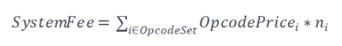

# 系统费用

系统费用是根据NeoVM要执行的指令计算得出的费用。NEO3取消了每笔交易10 GAS的免费额度，系统费用总额受合约脚本的指令数量和指令类型影响。计算公式如下所示：

其中，*OpcodeSet* 为指令集，𝑂𝑝𝑐𝑜𝑑𝑒𝑃𝑟𝑖𝑐𝑒𝑖为第 *i* 种指令的费用，𝑛𝑖为第 *i* 种指令在合约脚本中的执行次数。

每条互操作服务和指令的费用请参见下表。

### 互操作服务费用

| 互操作服务 | 费用 (GAS) |
|--|--|
| System.Binary.Serialize | 0.00100000  |
| System.Binary.Deserialize| 0.00500000  |
| System.Blockchain.GetHeight | 0.00000400  |
| System.Blockchain.GetBlock | 0.02500000  |
| System.Blockchain.GetTransaction | 0.01000000  |
| System.Blockchain.GetTransactionHeight | 0.01000000  |
| System.Blockchain.GetTransactionFromBlock | 0.01000000  |
| System.Blockchain.GetContract | 0.01000000  |
| System.Contract.Create | (Script.Size + Manifest.Size) * GasPerByte  |
| System.Contract.Update | (Script.Size + Manifest.Size) * GasPerByte  |
| System.Contract.Destroy | 0.01000000  |
| System.Contract.Call | 0.01000000  |
| System.Contract.CallEx | 0.01000000  |
| System.Contract.IsStandard | 0.00030000  |
| System.Enumerator.Create | 0.00000400  |
| System.Enumerator.Next | 0.01000000  |
| System.Enumerator.Value | 0.00000400  |
| System.Enumerator.Concat | 0.00000400  |
| System.Iterator.Create | 0.00000400  |
| System.Iterator.Key | 0.00000400  |
| System.Iterator.Keys | 0.00000400  |
| System.Iterator.Values | 0.00000400  |
| System.Iterator.Concat | 0.00000400  |
| System.Json.Serialize | 0.00100000  |
| System.Json.Deserialize | 0.00500000  |
| System.Runtime.Platform | 0.00000250  |
| System.Runtime.GetTrigger | 0.00000250  |
| System.Runtime.GetTime | 0.00000250  |
| System.Runtime.GetScriptContainer | 0.00000250  |
| System.Runtime.GetExecutingScriptHash | 0.00000400  |
| System.Runtime.GetCallingScriptHash | 0.00000400  |
| System.Runtime.GetEntryScriptHash | 0.00000400  |
| System.Runtime.CheckWitness | 0.00030000  |
| System.Runtime.GetInvocationCounter | 0.00000400 |
| System.Runtime.Log | 0.01000000 |
| System.Runtime.Notify | 0.01000000  |
| System.Runtime.GetNotifications | 0.00010000 |
| System.Runtime.GasLeft | 0.00000400 |
| System.Storage.GetContext| 0.00000400  |
| System.Storage.GetReadOnlyContext| 0.00000400 |
| System.StorageContext.AsReadOnly| 0.00000400  |
| System.Storage.Get| 0.01000000  |
| System.Storage.Find| 0.01000000  |
| System.Storage.Put| 参见 [1] |
| System.Storage.PutEx| 参见 [1] |
| System.Storage.Delete| 1 * GasPerByte  |
| Neo.Native.Deploy| 0  |
| Neo.Crypto.ECDsaVerify| 0.01000000  |
| Neo.Crypto.ECDsaCheckMultiSig| 0.01000000 * n |

> [!Note]
>
> [1] 向数据库中写入Key和Value时，
>
> - 如果新的键值对字节数大于旧的键值对，则 fee = [(newKey.Size +newValue.Size) - (oldKey.Size + oldValue.Size)] * GasPerByte
> - 如果新的键值对字节数小于等于旧的键值对，则 fee = 1 * GasPerByte
> - 如果数据库中不存在旧的键值对，则 fee = (key.Size + value.Size) * GasPerByte

<table class="table table-hover">
	<tr>
	    <th>互操作服务</th>
	    <th>方法名</th>
	    <th>费用 (GAS)</th>  
	</tr >
	<tr >
	    <td rowspan="11">Neo.Native.Tokens.NEO</td>
	    <td>name</td>
	    <td>0</td>
	</tr>
    <tr>
	    <td>symbol</td>
	    <td>0</td>
	</tr>
	<tr>
	    <td>decimals</td>
	    <td>0</td>
	</tr>
	<tr>
	    <td>totalSupply</td>
	    <td>0.01000000</td>
	</tr>
	<tr>
	    <td>balanceOf</td>
	    <td>0.01000000</td>
	</tr>
	<tr>
	    <td>transfer</td>
	    <td>0.08000000</td>
	</tr>
    <tr>
	    <td>registerValidator</td>
	    <td>0.05000000</td>
	</tr>
	<tr>
	    <td>vote</td>
	    <td>5.00000000</td>
	</tr>
	<tr>
	    <td>getRegisteredValidators</td>
	    <td>1.00000000</td>
	</tr>
	<tr>
	    <td>getValidators</td>
	    <td>1.00000000</td>
	</tr>
	<tr><td>unclaimedGas</td>
	    <td>0.03000000</td>
	</tr>
</table>

 

<table class="table table-hover">
	<tr>
	    <th>互操作服务</th>
	    <th>方法名</th>
	    <th>费用 (GAS)</th>  
	</tr >
	<tr >
	    <td rowspan="7">Neo.Native.Tokens.GAS</td>
	     <td>name</td>
	    <td>0</td>
	</tr>
    <tr>
	    <td>symbol</td>
	    <td>0</td>
	</tr>
	<tr>
	    <td>decimals</td>
	    <td>0</td>
	</tr>
	<tr>
	    <td>totalSupply</td>
	    <td>0.01000000</td>
	</tr>
	<tr>
	    <td>balanceOf</td>
	    <td>0.01000000</td>
	</tr>
	<tr>
	    <td>transfer</td>
	    <td>0.08000000</td>
	</tr>
</table>

 

<table class="table table-hover">
	<tr>
	    <th>互操作服务</th>
	    <th>方法名</th>
	    <th>费用 (GAS)</th>  
	</tr >
	<tr >
	    <td rowspan="9">Neo.Native.Policy</td>
	    <td>getMaxTransactionsPerBlock</td>
	    <td>0.01000000</td>
	</tr>
	<tr>
	    <td>getMaxBlockSize</td>
	    <td>0.01000000</td>
	</tr>
	<tr>
	    <td>getFeePerByte</td>
	    <td>0.01000000</td>
	</tr>
	<tr>
	    <td>setMaxBlockSize</td>
	    <td>0.03000000</td>
	</tr>
	<tr><td>getBlockedAccounts</td>
	    <td>0.01000000</td>
	</tr>
    <tr><td>setMaxTransactionsPerBlock</td>
	    <td>0.03000000</td>
	</tr>
    <tr><td>setFeePerByte</td>
	    <td>0.03000000</td>
	</tr>
    <tr><td>blockAccount</td>
	    <td>0.03000000</td>
	</tr>
    <tr><td>unblockAccount</td>
	    <td>0.03000000</td>
	</tr>
</table>

关于表格中API的含义，请参见 [NEO命名空间](../reference/scapi/api/neo.md)。

### 指令费用

| 指令         | 费用 (GAS) |
|--|--|
|PUSHINT8|0.00000030|
|PUSHINT16|0.00000030|
|PUSHINT32|0.00000030|
|PUSHINT64|0.00000030|
|PUSHINT128|0.00000120|
|PUSHINT256|0.00000120|
|PUSHA|0.00000120|
|PUSHNULL|0.00000030|
|PUSHDATA1|0.00000180|
|PUSHDATA2|0.00013000|
|PUSHDATA4|0.00110000|
|PUSHM1|0.00000030|
|PUSH0\~PUSH16|0.00000030|
|NOP|0.00000030|
|JMP|0.00000070|
|JMP_L|0.00000070|
|JMPIF|0.00000070|
|JMPIF_L|0.00000070|
|JMPIFNOT|0.00000070|
|JMPIFNOT_L|0.00000070|
|JMPEQ|0.00000070|
|JMPEQ_L|0.00000070|
|JMPNE|0.00000070|
|JMPNE_L|0.00000070|
|JMPGT|0.00000070|
|JMPGT_L|0.00000070|
|JMPGE|0.00000070|
|JMPGE_L|0.00000070|
|JMPLT|0.00000070|
|JMPLT_L|0.00000070|
|JMPLE|0.00000070|
|JMPLE_L|0.00000070|
|CALL|0.00022000|
|CALL_L|0.00022000|
|CALLA|0.00022000|
|ABORT|0.00000030|
|ASSERT|0.00000030|
|THROW|0.00000030|
|RET|0|
|SYSCALL|0|
|DEPTH|0.00000060|
|DROP|0.00000060|
|NIP|0.00000060|
|XDROP|0.00000400|
|CLEAR|0.00000400|
|DUP|0.00000060|
|OVER|0.00000060|
|PICK|0.00000060|
|TUCK|0.00000060|
|SWAP|0.00000060|
|ROT|0.00000060|
|ROLL|0.00000400|
|REVERSE3|0.00000060|
|REVERSE4|0.00000060|
|REVERSEN|0.00000400|
|INITSSLOT|0.00000400|
|INITSLOT|0.00000800|
|LDSFLD0\~LDSFLD6|0.00000060|
|LDSFLD|0.00000060|
|STSFLD0\~STSFLD6|0.0000006|
|STSFLD|0.0000006|
|LDLOC0\~LDLOC6|0.00000060|
|LDLOC|0.00000060|
|STLOC0\~STLOC6 |0.00000060|
|STLOC|0.00000060|
|LDARG0\~LDARG6|0.00000060|
|LDARG|0.00000060|
|STARG0\~STARG6|0.00000060|
|STARG|0.00000060|
|NEWBUFFER|0.00080000|
|MEMCPY|0.00080000|
|CAT|0.00080000|
|SUBSTR|0.00080000|
|LEFT|0.00080000|
|RIGHT|0.00080000|
|INVERT|0.00000100|
|AND|0.00000200|
|OR|0.00000200|
|XOR|0.00000200|
|EQUAL|0.00000200|
|NOTEQUAL|0.00000200|
|SIGN|0.00000100|
|ABS|0.00000100|
|NEGATE|0.00000100|
|INC|0.00000100|
|DEC|0.00000100|
|ADD|0.00000200|
|SUB|0.00000200|
|MUL|0.00000300|
|DIV|0.00000300|
|MOD|0.00000300|
|SHL|0.00000300|
|SHR|0.00000300|
|NOT|0.00000100|
|BOOLAND|0.00000200|
|BOOLOR|0.00000200|
|NZ|0.00000100|
|NUMEQUAL|0.00000200|
|NUMNOTEQUAL|0.00000200|
|LT|0.00000200|
|LE|0.00000200|
|GT|0.00000200|
|GE|0.00000200|
|MIN|0.00000200|
|MAX|0.00000200|
|WITHIN|0.00000200|
|PACK|0.00007000|
|UNPACK|0.00007000|
|NEWARRAY0|0.00000400|
|NEWARRAY|0.00015000|
|NEWARRAY_T|0.00015000|
|NEWSTRUCT0|0.00000400|
|NEWSTRUCT|0.00015000|
|NEWMAP|0.00000200|
|SIZE|0.00000150|
|HASKEY|0.00270000|
|KEYS|0.00000500|
|VALUES|0.00007000|
|PICKITEM|0.00270000|
|APPEND|0.00015000|
|SETITEM|0.00270000|
|REVERSEITEMS|0.00000500|
|REMOVE|0.00000500|
|CLEARITEMS|0.00000400|
|ISNULL|0.00000060|
|ISTYPE|0.00000060|
|CONVERT|0.00080000|
