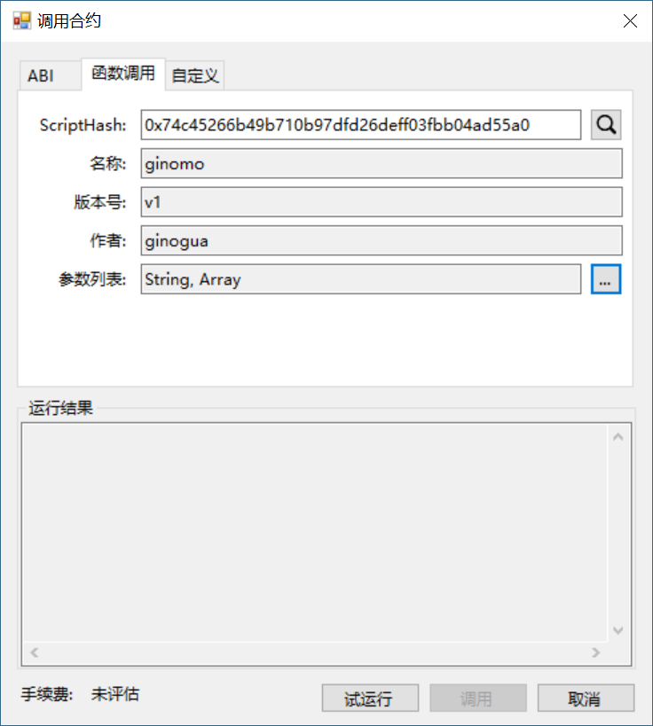

# 部署与调用合约

在本节我们将部署并调用上一节编写好的 NEP-5 合约。

## 部署合约

生成合约文件后，我们可以使用 NEO-GUI 进行部署。

1. 打开钱包文件 0.json，点击 `高级` -> `部署合约`。

2. 在部署合约对话框中，点击 `加载` 选择编译好的合约文件。

   此时代码框下方会显示合约脚本散列，将其复制供调用合约时使用。

3. 填写信息与元数据区域的参数。每个参数都需要填写，否则无法激活 `部署` 按钮。

   对于NEP-5资产合约，参数列表填 0710，返回值填 05。

   具体填写规则可参考 [智能合约参数和返回值](../deploy/Parameter.md)。

   勾选 `需要创建存储区`，NEP5 标准使用存储区来维护帐户，因此需要勾选此项。

    `需要动态调用`和 `Payable`暂时无需勾选。

4. 完成所有参数填写后，点击 `部署`。

5. 在弹出的调用合约窗口中点击 `试运行`，确认无误，点击 `调用`。

   部署合约需要花费100 ~1000 GAS，详情请参见 [系统手续费](../fees.md)。

部署成功后，你的智能合约已经发布到区块链上了。

## 调用合约

现在调用上一步发布的智能合约。

1. 点击 `高级` -> `调用合约` -> `函数调用`。

2. 将之前复制好的合约脚本填入 `ScriptHash`，再按搜索键，该合约相关信息会自动显示出来。

3. 点击 `参数列表` 旁的 `...` 进入编辑窗口。

   

4. 对应你写的智能合约，[0] 是该函数名，[1] 是该函数的输入参数，如果没有可忽略。我们现在要调用 deploy 函数发布该资产到链上，则点击 [0]，在新值中填写 “deploy”，注意一定要小写，然后点击`更新`，关掉当前窗口。

   

5. 点击 `试运行`，可以测试该合约。确认无误，点击 `调用`，调用合约也需要消耗少量的 GAS 。

## 查看合约资产

在 NEO-GUI 中点击 `高级`-> `选项`，添加刚部署的资产的脚本散列，即可在资产页面看到你的 NEP-5 资产。

至此，祝贺你已经成功地在NEO 私链上发布了智能合约。

