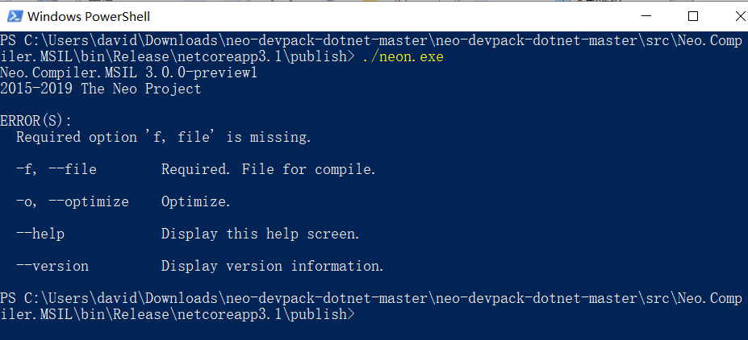
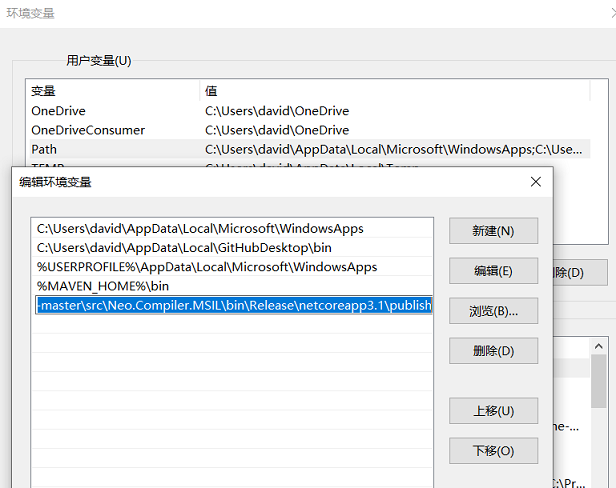

# 开发示例合约

我们已经搭建私链并启动节点连接私链，下文将以使用 windows 10 和 C# 为例，带领开发者配置环境、编写、编译以及在私链上部署和调用 Neo 智能合约。

在本节我们将完成以下任务：

1. 安装合约开发环境
2. 创建一个 NEP-5 合约项目
3. 编译合约

## 安装开发环境

### 安装 Visual Studio 2019

1. 下载 [Visual Studio 2019](https://www.visualstudio.com/products/visual-studio-community-vs) 并安装。

   注意安装时需要勾选 `.NET Core 跨平台开发` 和 `Visual Studio 扩展开发`。

2. 安装 [.NET Framework 4.6.2 Developer Pack](https://dotnet.microsoft.com/download/dotnet-framework/thank-you/net462-developer-pack-offline-installer) 以便接下来正确加载项目。

### 安装 NeoContractPlugin 插件

> [!Note]
>
> 如果Visual Studio中安装了Neo2的NeoContractPlugin插件，需要先卸载才能安装Neo3的插件。

1. 拉取 [neo-devpack-dotnet](https://github.com/neo-project/neo-devpack-dotnet) 项目，在Visual Studio中打开项目文件neo-devpack-dotnet.sln

2. 在解决方案项目列表中右键单击 src/Installer，点击 `生成` 编译该项目。

   成功编译后将在neo-devpack-dotnet-master\src\Installer\bin\Debug目录下生成 `Neo.SmartContract.Installer.vsix` 文件。

3. 运行该文件，安装 NeoContractPlugin 并重启 Visual Studio。

### 配置编译器

1. 运行 Visual Studio，重新打开项目文件 neo-devpack-dotnet.sln

2. 在解决方案列表中右键单击 `Neo.Compiler.MSIL` ，选择 `发布`，将该项目发布到默认文件夹\bin\Release\netcoreapp3.1\publish

3. 进入上一步的发布路径，启动 PowerShell，输入命令 `./neon.exe` 确保 neon 可以正常启动，如下图所示：

   

4. 将发布目录添加到环境变量 Path 中 :

   > [!Note]
   >
   > 如果存在旧版本的neon，需要先删除。

   

5. 在任意位置启动 PowerShell，输入命令 `neon.exe` 确保环境变量已正确配置。

### 编译智能合约框架

1. 返回Visual Studio，在解决方案 `neo-devpack-dotnet` 项目列表中右键单击 `Neo.SmartContract.Framework`，点击 `生成` 编译该项目。
2. 进入编译后的文件输出目录，复制 `Neo.SmartContract.Framework.dll` 备用。

## 创建 NEP-5 合约项目

### 创建项目

1. 在 Visual Studio 中点击 `文件` -> `新建` -> `项目`。

2. 在项目模板对话框中，搜索neocontract，选择C#对应的NeoContact，并根据向导完成项目创建。

   

3. 在解决方案中，右键单击项目名 -> `管理 NuGet 程序包`，卸载 `Neo.SmartContract.Framework` 的 NuGet 引用。

4. 右键单击项目名 -> `粘贴`，将上一步复制的 `Neo.SmartContract.Framework.dll` 文件粘贴到NeoContract 项目下。

5. 右键单击 `依赖项` -> `添加引用`，选择刚复制到该项目下的 `Neo.SmartContract.Framework.dll` 文件，将其添加到项目。

### 编辑 NEP-5 代码

创建项目后，会自动生成一个智能合约的代码模板，功能是向存储区存入 "Hello" "World" 的键值对。

很多开发者比较关心的是如何在 Neo 公链上发布自己的合约资产，下面我们就在私链上一步步实现。

1. 从 Github 上下载 Neo3 的 [NEP5 示例](https://github.com/neo-ngd/Neo3-Smart-Contract-Examples/blob/master/NEP5/Contract1.cs)。

2. 在之前创建的合约项目里打开示例文件 Contract1.cs

   示例中主要写了资产的基本信息和供调用的方法，你可以根据自己的需要增删或修改。

> [!Note]
>
> 相对于 Neo2 来说， Neo3 的 NEP-5 合约模板有以下改动：
>
> - 在智能合约类上方添加了自定义特性：
>
>   ```c#
>   [Features(ContractFeatures.HasStorage)]
>   public class NEP5 : SmartContract
>   ……
>   ```
>
> - 将所有的 `ToBigInteger()` 方法改为 `TryToBigInteger()`
>
> - 添加了Deploy 方法以供第一次分发资产，开发者可以根据需求自定义方法
>

## 编译合约文件

完成合约代码编写后，点击菜单栏上的 `生成` -> `生成解决方案`（快捷键 Ctrl + Shift + B）编译程序。

编译成功后会在该项目的 `bin/Debug` 目录生成以下文件：

- `NEP5.nef` ：与 Neo2 中的 .avm 文件类似，.nef 是 Neo3 的智能合约执行文件。
- `NEP5.manifest.json` ：智能合约的描述文档，文档中对合约的功能、ScriptHash、入口、方法、参数、返回值等进行了描述。

## 继续阅读

[部署与调用合约](deploy.md)
