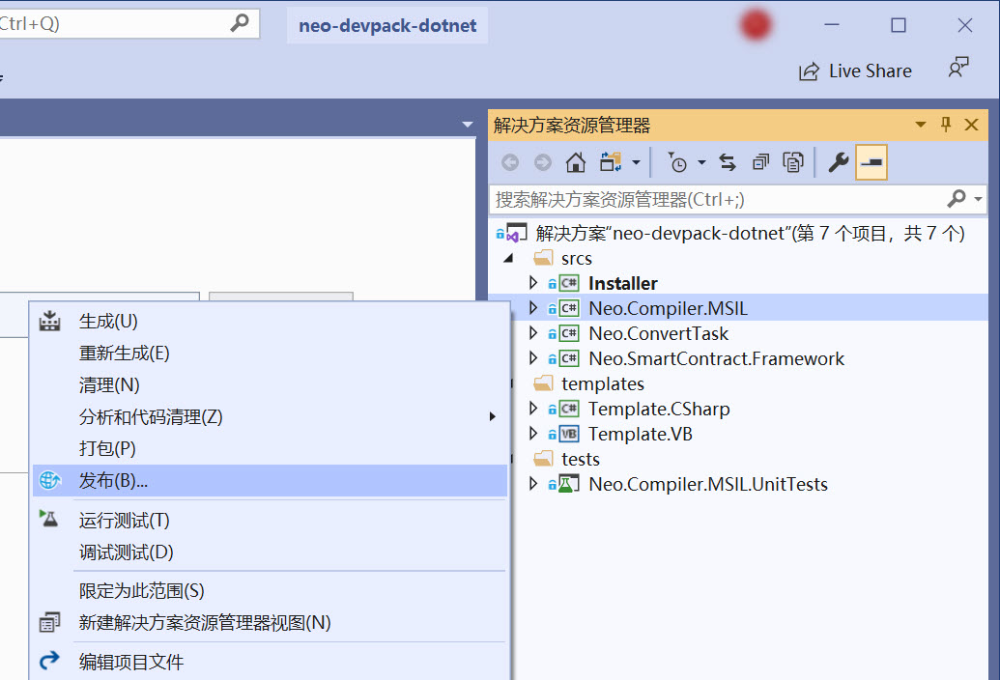
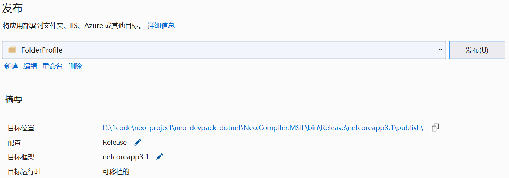
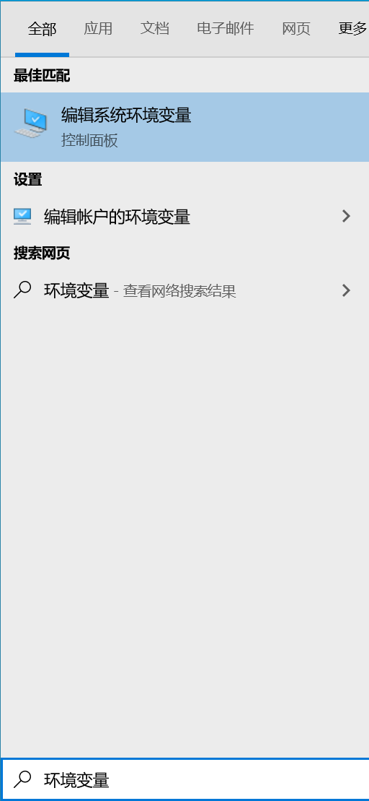
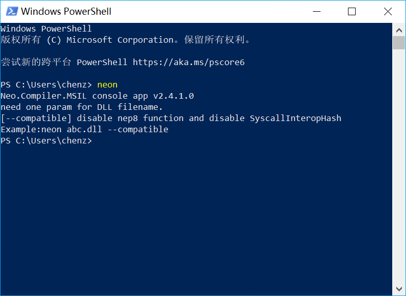
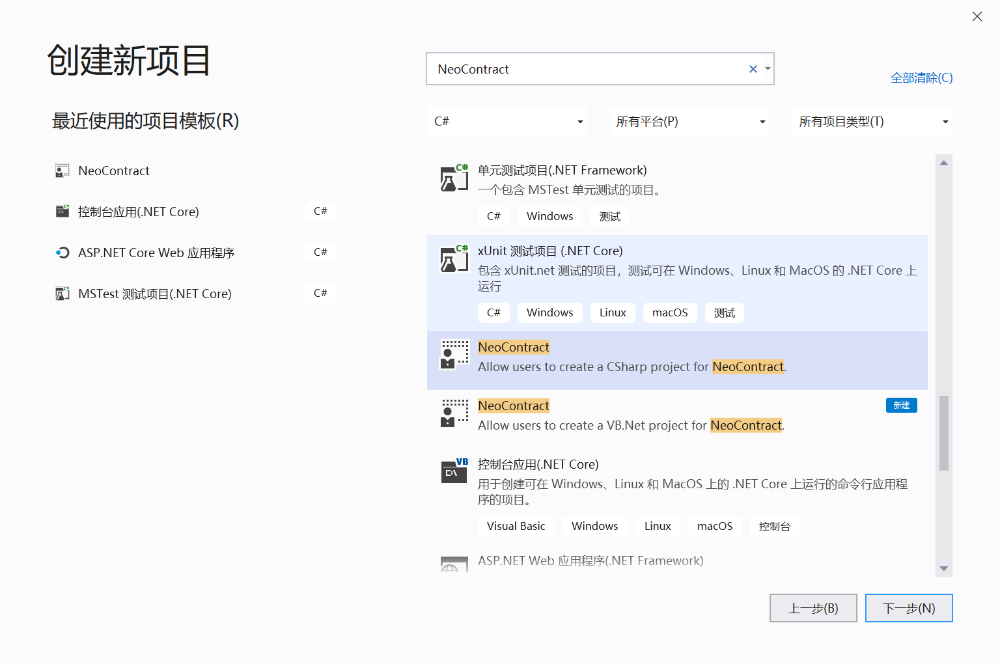
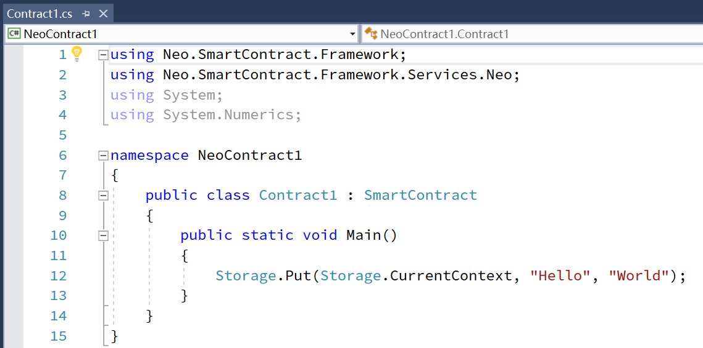
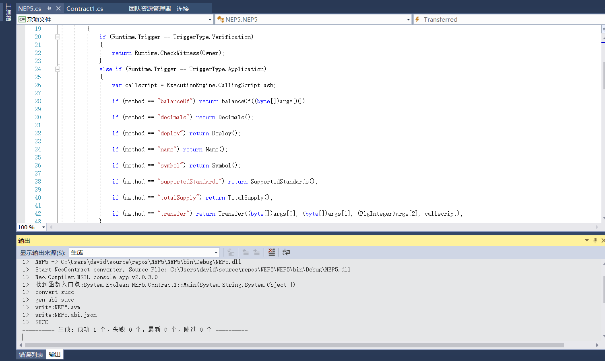

# 开发示例合约

我们已经搭建私链并启动节点连接私链，下文将以使用 windows 10 和 C# 为例，带领开发者配置环境、编写、编译以及在私链上部署和调用 NEO 智能合约。

在本节我们将完成以下任务：

- 安装合约开发环境
- 创建一个 NEP-5 合约项目
- 编译合约

## 安装开发环境

### 安装 Visual Studio 2017

下载 [Visual Studio 2017](https://www.visualstudio.com/products/visual-studio-community-vs) 并安装，注意安装时需要勾选 `.NET Core 跨平台开发` 。


### 安装 NeoContractPlugin 插件

打开 Visual Studio 2017，点击 `工具` -> `扩展和更新` ，在左侧点击 `联机` ，搜索 Neo，安装 NeoContractPlugin 插件（该过程需要联网）。


### 配置 neo-compiler

1. 在 Github 上下载 [neo-compiler](https://github.com/neo-project/neo-compiler) 项目到本地。

2. 在 Visual Studio 2017 上点击 `文件` -> `打开` -> `项目/解决方案`，选择项目文件中的 neo-compiler.sln

3. 右键单击列表中的 neon 项目，点击 `发布`。

   

4. 配置好发布路径后，点击 `发布`。

   发布成功后，会在 bin\Release\PublishOutput 目录下生成 neon.exe 文件。

   

> [!Note]
>
> 发布过程中如果遇到如下错误提示：*无法复制文件”obj\Release\netcoreapp1.0\win10-x64\neon.dll“，原因是找不到该文件？*这可能是 VS 2017 （如 15.4，15.5）的一个 Bug，此时需要手动将 `\obj\Release\netcoreapp1.0\neon.dll` 文件复制到 `\obj\Release\netcoreapp1.0\win10-x64\` 文件夹中，然后重新发布即可。

### 设置环境变量

接下来需要添加 path，让任何位置都能访问 neon.exe。方法如下：

1. 在 Windows10 上 按 Windows + S 键，输入环境变量，选择 `编辑账户的环境变量` 

   

2. 选择 Path, 点击 `编辑`:

   

3. 在弹出来的窗口中点击 `新建` 并输入你自己的 neon.exe 所在的文件夹目录，点击 `确定` 。

> [!Note]
>
> 在环境变量中不要添加 “…… neon.exe” 字样的路径，要填写 neon.exe **所在的文件夹目录** 而非 neon.exe 本身的路径。


添加完 path 后，运行 CMD 或者 PowerShell 测试一下（如果添加 path 前就已经启动了 CMD 则要关掉重启），输入 neon 后，没有报错，如图所示输出版本号的提示信息即表示环境变量配置成功。



## 创建 NEO 合约项目

完成以上步骤后，即可在 Visual Studio 2017 中创建 NEO 智能合约项目（.NET Framework 版本任意）：

1. 点击 `文件` -> `新建` -> `项目`。
2. 在列表中选择 `NeoContract` 并进行必要设置后，点击 `确定`。



创建项目后，会自动生成一个 C# 文件，默认的类继承于 SmartContract，如图，此刻你已经拥有一个 Hello World 了！



当然这只是一个简单的向私有化存储区中以 key-value 方式存储数据的操作。

## 编辑 NEP-5 代码

很多开发者比较关心的是如何在 NEO 公链上发布自己的合约资产，现在我们就在私链上一步步实现。

1. 从 [Github](https://github.com/neo-project/examples)上下载 NEP5 示例。

2. 在 Visual Studio 2017 中创建一个 NEO 智能合约项目，这里命名为 NEP5。

3. 打开示例文件 NEP5.cs

   代码中主要写了资产的基本信息和供调用的方法，你可以根据自己的需要增删或修改。

   > [!NOTE]
   >
   > 如果代码中有很多画红线的地方，提示找不到 Neo 命名空间，而且在项目的引用中有感叹号，可进行如下操作：
   >
   > 在 VS 中右击解决方案文件，点击 `管理 NuGet 程序包`，在新打开的页面中将 Neo.SmartContract.Framework 更新到最新稳定版。如果更新完之后依然存在红线，并且右侧 “引用” 中仍有个感叹号，可以尝试双击感叹号。如果仍然无法解决问题，可以尝试下面的办法：
   >
   > 1. 在 [这里](https://www.nuget.org/downloads) 下载 nuget.exe，然后将其复制到 NeoContract 项目的根目录。
   > 2. 打开 Power Shell 或命令提示符（CMD）。
   > 3. 转到 NeoContract 项目的根目录，运行 `nuget restore` 即可。

4. 这里我们对示例文件进行一些修改：

   - 设定资产总值和`deploy` 方法
   - 将 "Owner" 替换成钱包 0.json 中的地址 （否则将无法使用钱包中的资产）

   代码如下：

```c#
using Neo.SmartContract.Framework;
using Neo.SmartContract.Framework.Services.Neo;
using Neo.SmartContract.Framework.Services.System;
using System;
using System.ComponentModel;
using System.Numerics;

namespace NEP5
{
    public class NEP5 : SmartContract
    {
        [DisplayName("transfer")]
        public static event Action<byte[], byte[], BigInteger> Transferred;

        private static readonly byte[] Owner = "Ad1HKAATNmFT5buNgSxspbW68f4XVSssSw".ToScriptHash(); //Owner Address
        private static readonly BigInteger TotalSupplyValue = 10000000000000000;

        public static object Main(string method, object[] args)
        {
            if (Runtime.Trigger == TriggerType.Verification)
            {
                return Runtime.CheckWitness(Owner);
            }
            else if (Runtime.Trigger == TriggerType.Application)
            {
                var callscript = ExecutionEngine.CallingScriptHash;

                if (method == "balanceOf") return BalanceOf((byte[])args[0]);

                if (method == "decimals") return Decimals();

                if (method == "deploy") return Deploy();

                if (method == "name") return Name();

                if (method == "symbol") return Symbol();

                if (method == "supportedStandards") return SupportedStandards();

                if (method == "totalSupply") return TotalSupply();

                if (method == "transfer") return Transfer((byte[])args[0], (byte[])args[1], (BigInteger)args[2], callscript);
            }
            return false;
        }

        [DisplayName("balanceOf")]
        public static BigInteger BalanceOf(byte[] account)
        {
            if (account.Length != 20)
                throw new InvalidOperationException("The parameter account SHOULD be 20-byte addresses.");
            StorageMap asset = Storage.CurrentContext.CreateMap(nameof(asset));
            return asset.Get(account).AsBigInteger();
        }
        [DisplayName("decimals")]
        public static byte Decimals() => 8;

        private static bool IsPayable(byte[] to)
        {
            var c = Blockchain.GetContract(to);
            return c == null || c.IsPayable;
        }

        [DisplayName("deploy")]
        public static bool Deploy()
        {
            if (TotalSupply() != 0) return false;
            StorageMap contract = Storage.CurrentContext.CreateMap(nameof(contract));
            contract.Put("totalSupply", TotalSupplyValue);
            StorageMap asset = Storage.CurrentContext.CreateMap(nameof(asset));
            asset.Put(Owner, TotalSupplyValue);
            Transferred(null, Owner, TotalSupplyValue);
            return true;
        }

        [DisplayName("name")]
        public static string Name() => "GinoMo"; //name of the token

        [DisplayName("symbol")]
        public static string Symbol() => "GM"; //symbol of the token

        [DisplayName("supportedStandards")]
        public static string[] SupportedStandards() => new string[] { "NEP-5", "NEP-7", "NEP-10" };

        [DisplayName("totalSupply")]
        public static BigInteger TotalSupply()
        {
            StorageMap contract = Storage.CurrentContext.CreateMap(nameof(contract));
            return contract.Get("totalSupply").AsBigInteger();
        }
#if DEBUG
        [DisplayName("transfer")] //Only for ABI file
        public static bool Transfer(byte[] from, byte[] to, BigInteger amount) => true;
#endif
        //Methods of actual execution
        private static bool Transfer(byte[] from, byte[] to, BigInteger amount, byte[] callscript)
        {
            //Check parameters
            if (from.Length != 20 || to.Length != 20)
                throw new InvalidOperationException("The parameters from and to SHOULD be 20-byte addresses.");
            if (amount <= 0)
                throw new InvalidOperationException("The parameter amount MUST be greater than 0.");
            if (!IsPayable(to))
                return false;
            if (!Runtime.CheckWitness(from) && from.AsBigInteger() != callscript.AsBigInteger())
                return false;
            StorageMap asset = Storage.CurrentContext.CreateMap(nameof(asset));
            var fromAmount = asset.Get(from).AsBigInteger();
            if (fromAmount < amount)
                return false;
            if (from == to)
                return true;

            //Reduce payer balances
            if (fromAmount == amount)
                asset.Delete(from);
            else
                asset.Put(from, fromAmount - amount);

            //Increase the payee balance
            var toAmount = asset.Get(to).AsBigInteger();
            asset.Put(to, toAmount + amount);

            Transferred(from, to, amount);
            return true;
        }
    }
}

```

编辑完之后，我们已经完成了一份智能合约的代码部分。

## 编译合约文件

点击菜单栏上的 `生成`->`生成解决方案`（快捷键 Ctrl + Shift + B）开始编译程序。



编译成功后你会在该项目的 `bin/Debug` 目录下看到生成的 `NEP5.avm` 文件，该文件即是生成的 NEO 智能合约文件。


`NEP5.abi.json` 是智能合约的描述文档，文档中对合约的 ScriptHash、入口、方法、参数、返回值等进行了描述。关于更多智能合约 ABI 的信息，可以参考 [NeoContract ABI](https://github.com/neo-project/proposals/blob/master/nep-3.mediawiki)。

> [!Note]
>
> 由于 neon 默认使用 nep-8 的模式编译 dll，与旧版本 NeoVM 不兼容，所以我们需要用编译器的 compatible 模式编译，否则调用合约时会出错。
>
> 打开Power Shell 或命令提示符（CMD），进入 bin/Debug 目录，输入如下命令（将nep5.dll替换成你自己的项目文件）：
>
> `neon nep5.dll --compatible`
>
> 生成的 `nep5.avm` 文件和`nep5.abi.json` 文件将会覆盖之前的对应文件。

## 继续阅读

[部署与调用合约](deploy.md)

