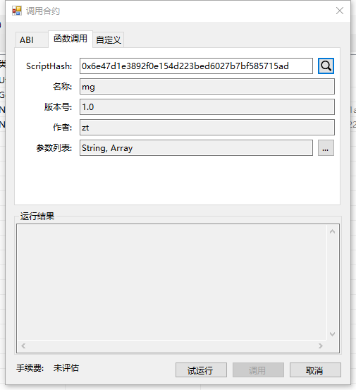
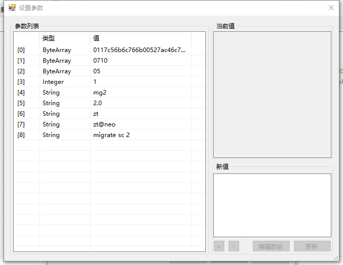
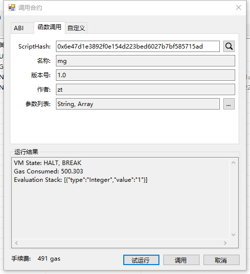
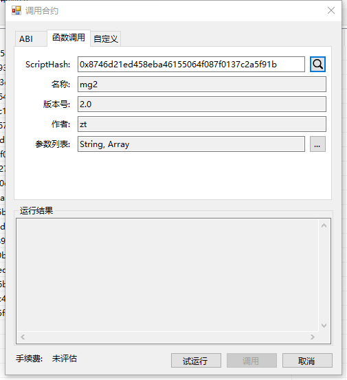
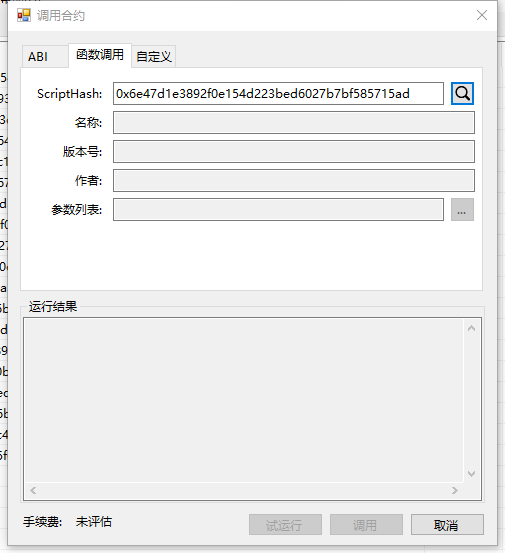

# 合约迁移与销毁

合约支持在发布之后进行迁移或销毁，但需要在合约里预留某些接口。

## 合约迁移

当需要将原来已经部署使用的合约进行升级或者想将旧合约的存储区迁移到新合约的时候，需要用到合约迁移的功能。

本教程演示基于：

- Visual Studio 2017 中创建的示例
- 智能合约框架 NeoSmartContractPlugin v2.9.3
- 最新版 [Neo-GUI](https://github.com/neo-project/neo-gui/releases)

### 实现 Migrate 接口
要使用合约迁移的功能，需要在原有合约中实现迁移接口，如下所示：

```c#
public static object Main(string method, params object[] args)
{
    ...
    if (method == "migrate")
    {
        if (args.Length < 9) return false;
        byte[] script = (byte[])args[0];
        byte[] plist = (byte[])args[1];
        byte rtype = (byte)args[2];
        ContractPropertyState cps = (ContractPropertyState)args[3];
        string name = (string)args[4];
        string version = (string)args[5];
        string author = (string)args[6];
        string email = (string)args[7];
        string description = (string)args[8];
        return Migrate(script, plist, rtype, cps, name, version, author, email, description);
    }
    ...
}

private static Boolean Migrate(byte[] script, byte[] plist, byte rtype, ContractPropertyState cps, string name, string version, string author, string email, string description)
{
    var contract = Contract.Migrate(script, plist,rtype, cps, name, version, author, email, description);
    return true;
}

... // 省略了部分代码
```

如果希望未来对合约进行迁移，那么此合约在部署之前必须实现 Migrate 接口。关于部署合约，请参考 [部署和调用合约](deploy/deploy.md)。

### 进行合约迁移
首先准备好新合约，然后通过 NEO-GUI 调用旧合约的 Migrate 的接口。

1. 在 NEO-GUI 中，点击 `高级` > `部署合约`，然后 `加载` 新合约。复制合约脚本和 ScriptHash 备用。

2. 点击 `高级` > `调用合约`，输入旧合约的 ScriptHash, 可以查看到已部署的旧合约信息。

   

3. 点击 `调用`，输入调用 Migrate 接口所需要的参数。注意第一个参数输入之前复制的新合约脚本。

   

4. 输入完成后点击 `试运行` 查看结果，可以看到返回1-True，手续费为 491 GAS。

   

5. 点击 `调用`，等待区块链确认交易。

6. 确认后，在调用合约界面输入新的合约 ScriptHash，可以查看到新的合约内容。

   

7. 再输入旧合约 ScriptHash，发现已经查询不到了。

   

此时旧合约的存储区已迁移到新的合约上，旧合约被销毁。

## 合约销毁

智能合约支持在发布之后进行销毁操作，但需要在旧合约内预留销毁接口。

合约销毁主要调用了 Neo.Contract.Destroy 方法:

```c#
void Destroy();
```

Destroy 方法不需要参数，调用该方法后，合约将会被删除，如果合约有存储区，则存储区也将被删除。之后合约将不可用。

