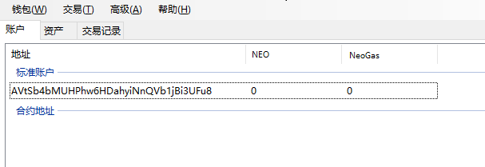
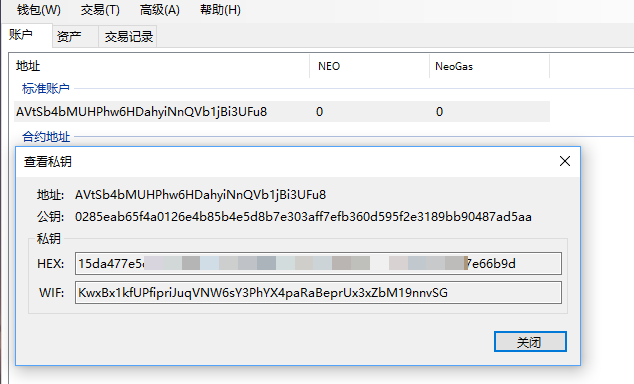
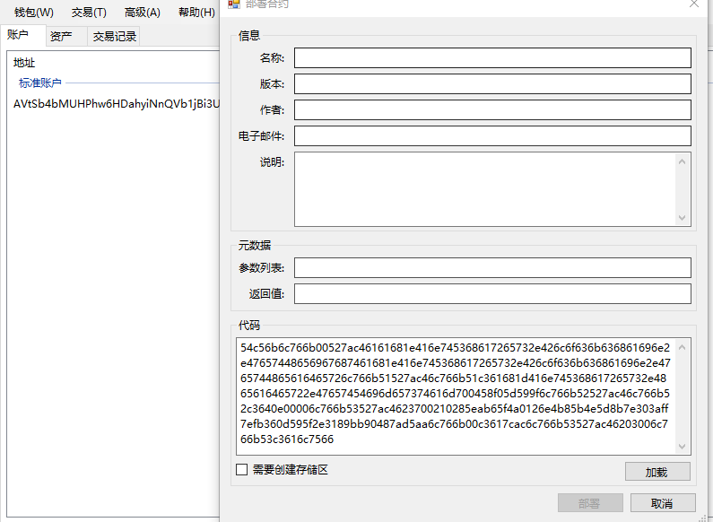
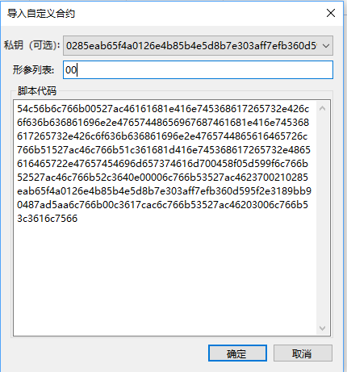
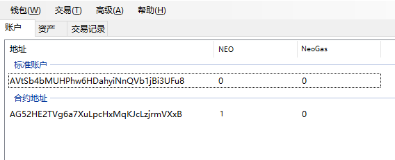
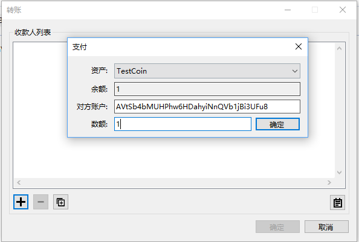

# 锁仓合约示例教程

锁仓合约实现一个这样的功能：指定一个时间戳（timestamp），在区块链系统的时间到达该指定的时间之前，任何人也不能从该合约中将资金取出，当区块链系统的时间过了指定的时间后，合约持有者可以将资金取出。 

代码中通过区块链中最新区块的时间来获得当前时间（误差大约在 15 秒以内）。详情可参考 [Blockchain 类](../../reference/scapi/fw/dotnet/neo/Blockchain.md)，   [Header 类](../../reference/scapi/fw/dotnet/neo/Header.md)。

该合约可以部署到区块链上供其他人调用。本文将介绍如何在钱包中部署一个锁仓合约。

## 创建钱包

在 NEO-GUI 客户端中，点击 ` 钱包 ` ->` 创建钱包数据库  `，创建一个钱包。



## 获得公钥

新创建的钱包会自动生成一个标准账户，右键单击该账户，选择` 查看私钥 `，复制第二行的公钥，如图所示：



下面我们写一个本地程序，把公钥转成字节数组，C# 代码如下：

```c#
namespace ConsoleApp1
{
    class Program
    {
        static void Main(string[] args)
        {
            // 这里替换为上一步复制的公钥
            byte[] b = HexToBytes("0285eab65f4a0126e4b85b4e5d8b7e303aff7efb360d595f2e3189bb90487ad5aa"); 
            foreach (var item in b)
            {
                Console.Write($"{item}, ");
            }
            Console.ReadLine();
        }

        static byte[] HexToBytes(string hexString)
        {
            hexString = hexString.Trim();
            byte[] returnBytes = new byte[hexString.Length / 2];
            for (int i = 0; i < returnBytes.Length; i++)
            {
                returnBytes[i] = Convert.ToByte(hexString.Substring(i * 2, 2), 16);
            }
            return returnBytes;
        }
    }
}
```

运行后，会在屏幕中输出公钥的 byte 数组，将其复制下来，下一步会用到。

## 编写智能合约

创建智能合约项目，编写如下的智能合约。

```c#
using Neo.SmartContract.Framework;
using Neo.SmartContract.Framework.Services.Neo;

namespace Neo.SmartContract
{
    public class Lock : SmartContract
    {
        public static bool Main(byte[] signature)
        {
            Header header = Blockchain.GetHeader(Blockchain.GetHeight());
            if (header.Timestamp < 1499328600) // 2017-6-6 18:10
                return false;
            // 这里粘贴上一步复制的公钥字节数组
            return VerifySignature(signature, new byte[] { 2, 133, 234, 182, 95, 74, 1, 38, 228, 184, 91, 78, 93, 139, 126, 48, 58, 255, 126, 251, 54, 13, 89, 95, 46, 49, 137, 187, 144, 72, 122, 213, 170 });
        }
    }
}
```

以上代码有两个地方需要修改：

- 在合约代码中粘贴上一步复制的公钥字节数组

- 更改示例代码中的锁仓时间，该时间为 Unix 时间戳。此时间戳可以自己写代码计算出来，也可以直接在网上查询 [Unix 时间戳在线转换](https://unixtime.51240.com/)。


替换好以上两个地方后编译合约，生成文件 Lock.avm 。

## 获取合约脚本

可以选择以下一种方法获取合约脚本：

- 使用如下的 C# 代码读取 .avm 文件：

  ```c#
  byte[] bytes = System.IO.File.ReadAllBytes("Test.avm");
  for (int i = 0; i < bytes.Length; i++)
      Console.Write(bytes[i].ToString("x2"));
  ```

  获取到 Test.avm 的合约脚本（二进制数据）为：    
  52c56b6c766b00527ac461516c766b51527ac46203006c766b51c3616c7566

- 使用 NEO-GUI 客户端获取：
  1. 在客户端中点击 ` 高级 ` -> ` 部署合约 `
  2. 在右下角点击 ` 加载 `，选择编译后的 Test.avm 文件
  3. 在 ` 代码 ` 框显示出合约脚本，将其复制备用。



## 创建合约地址

1. 创建完钱包后，在客户端中点击鼠标右键 -> `创建合约地址` -> `自定义`，使用上一步生成的合约脚本创建合约地址。
2. 在 `导入自定义合约` 对话框中设置以下选项：
   a. 形参列表：参考 [智能合约参数和返回值](../deploy/Parameter.md)，由于我们的合约中有一个 signature 参数，所以此处要填写 00 。
   b. 脚本代码：填写上一步复制的合约脚本代码。
   c. 私钥：可选参数，当合约执行过程中需要签名时，设置用于签名的私钥。



## 测试

下面就可以对刚创建的智能合约鉴权账户进行测试，测试方法就是先向合约鉴权账户转入一笔资产，再将其转出。

> [!Note]
> 为了保证测试的准确性，钱包中的标准账户里最好不要有资产，或者转账金额要大于标准账户资产，以确定资产是从合约账户转出。

### 转入资产到合约地址

转一定数量的资产到你的合约账户：



### 转出合约资产

从你的智能合约账户中转出资产：



### 结论

如果你以上操作正确，转出资产时会发生以下情况：

在当前时间小于锁仓时间时，转账将会未确认，即转账失败。

这时 ` 重建钱包索引 ` 后，过大约 5 分钟后，未确认的转账会消失，资产恢复到之前的状态。

在当前时间大于锁仓时间时，转账会成功。
