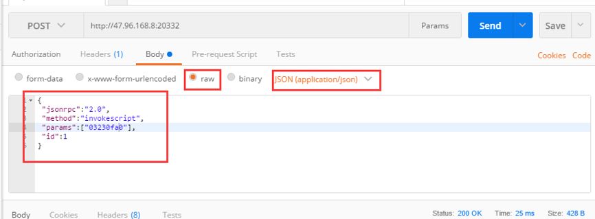
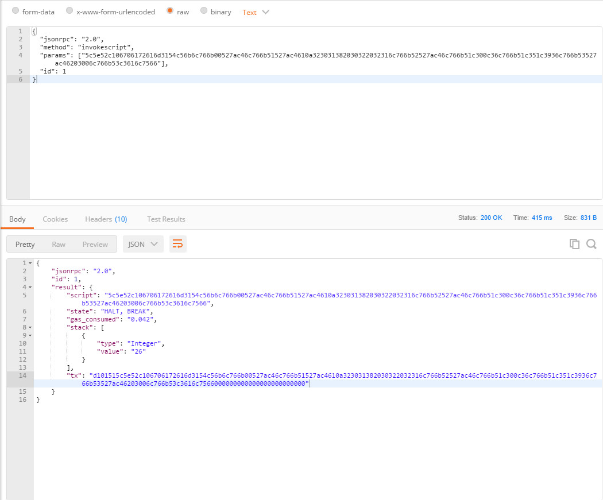

# 测试

可以使用 NEO-CLI 提供的 [invokeScript](../reference/rpc/latest-version/api/invokescript.md) 方法来进行测试。

### 测试工具

发起测试就是一条 POST 请求，本文使用一个通用的 POST 工具，POSTMAN 来进行测试。你也可以自己编写一个 POST 工具。

编写好智能合约并获取合约脚本后，可使用 POSTMAN 进行测试，基本步骤如下：

1. 配置 CLI 地址。选择 Post 方式，填入 NEO-CLI 的 RPC 接口地址。

2. 选择参数，**raw**，**JSON**，配置如下：

   ```
   {
    "jsonrpc":"2.0",
    "method":"invokescript",
    "params":["03230fa0"],
    "id":1
   }
   ```

   将 `params` 中的字符串替换为要测试的智能合约的脚本，点 **Send** 开始测试。参考下图：

   

###  示例 1 - 测试无参数合约

1. 编写如下智能合约，将生成的 avm 文件保存为  `d:\\1.avm`。

    ```c#
    public class Test01 : SmartContract
    {
        public static object Main()
        {
            var magicstr = "Hello, World!";
            return magicstr;
        }
    }
    ```


2. 创建一个 netcore 项目，引入 Neo 项目。

   

   编写如下代码获取合约脚本：

   ```c#
   class Program
       {
           static void Main(string[] args)
           {
               var noparamAVM = System.IO.File.ReadAllBytes("d:\\1.avm");
               var str = Neo.Helper.ToHexString(noparamAVM);
               Console.WriteLine("AVM=" + str);
               Console.ReadLine();
           }
   }
   ```

   运行此程序可得合约脚本为       “52c56b6c766b00527ac461516c766b51527ac46203006c766b51c3616c7566”。

3. 使用 postman 进行测试，如下图所示：

   

"state": "HALT, BREAK" 表示测试成功。

Stack 是留在栈上的值，此值为 string “Hello, World!” 对应的 bytearray。

###  示例2 - 测试有参数合约

1. 编写如下智能合约，并将 AVM 文件存为 `d:\\2.avm`。

   ```c#
   public class Test01 : SmartContract
   {
       public static object Main(string param1,int[] value)
       {
             var magicstr = "2018 02 21";
             return value[0]+value[1];
       }
   }
   ```


2. 编写如下测试代码，生成测试脚本:

   ```c#
    static void Main(string[] args)
           {
               var noparamAVM = System.IO.File.ReadAllBytes("d:\\2.avm");
               var str = Neo.Helper.ToHexString(noparamAVM);

               Neo.VM.ScriptBuilder sb = new Neo.VM.ScriptBuilder();
               sb.EmitPush(12);
               sb.EmitPush(14);
               sb.EmitPush(2);
               sb.Emit(Neo.VM.OpCode.PACK);
               sb.EmitPush("param1");
               var _params = sb.ToArray();
               var str2 = Neo.Helper.ToHexString(_params);

               Console.WriteLine("AVM=" + str2 + str);
               Console.ReadLine();
           }
   ```

3. 使用 PostMan 进行测试：

   


### 示例 3 - 测试已经部署到链上的合约

其它步骤请参考前两个示例。

测试代码如下：

```c#
static void Main(string[] args)
{
     //var noparamAVM = System.IO.File.ReadAllBytes("d:\\2.avm");
     //var str = Neo.Helper.ToHexString(noparamAVM);
     Neo.VM.ScriptBuilder sb = new Neo.VM.ScriptBuilder();
     sb.EmitPush(12);
     sb.EmitPush(14);
     sb.EmitPush(2);
     sb.Emit(Neo.VM.OpCode.PACK);
     sb.EmitPush("param1");
     //调用已发布的合约，最后加一条EmitAppCall即可
     var addr = Neo.UInt160.Parse("0x10ad2338f972e90406fd2ebea9a60f38f4aebd53");
     sb.EmitAppCall(addr.ToArray());
     var _params = sb.ToArray();
     var str2 = Neo.Helper.ToHexString(_params);
     Console.WriteLine("AVM=" + str2);
     Console.ReadLine();
}
```

