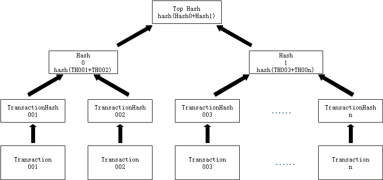

# 梅克尔树

梅克尔树是一种二叉树，能快速检查和归纳大量数据，可用于验证区块中交易记录的完整性。NEO使用梅克尔树来构建区块模型。NEO中每个区块的区块头都会保存一份该区块所有所有交易的梅克尔树根，区块的数据区存放交易数组。

梅克尔树基本特点：

  - Merkle Tree是一种树，大多数是二叉树（NEO采用二叉树形式），具有树结构的所有特点；

  - Merkle Tree的叶子节点的值是数据集合的单元数据或者单元数据的散列值。

  - 非叶子节点的值是根据它下面所有的叶子节点值，然后按照哈希法计算而得出的。

交易验证原理：

通过Transcation001、Transcation002、Hash1计算Top Hash与原本的Top Hash比对，即可验证Transcation001的有效性。

应用场景：

  - 构建区块头时会维护一个 MerkleTree 根

  - 使用SPV钱包，验证区块数据

更多关于梅克尔树的信息，请参考<https://en.wikipedia.org/wiki/Merkle_tree>。
