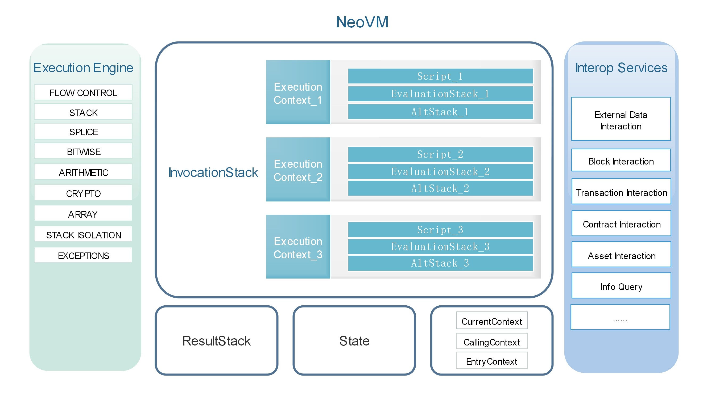

<center> <h2> NeoVM 虚拟机  </h2> </center>

&emsp;&emsp;NeoVM 是执行 NEO 智能合约代码的虚拟机。本文所讲述的虚拟机概念比较狭义，并非是借助于操作系统对物理机器的一种模拟，与 vmware 或者 Hyper-V 不同，主要针对具体语言所实现的虚拟机。

&emsp;&emsp;例如在 java 的 JVM 或者 .Net 的 CLR 中，java 或者 .Net 源码会被编译成相关字节码，然后在对应虚拟机上运行， JVM 或 CLR 会对这些字节码进行取指令，译码，执行，结果回写等操作，这些步骤和真实物理机器上的概念都很相似。相对应的二进制指令仍然是在物理机器上运行，物理机器从内存中取指令，通过总线传输到 CPU，然后译码、执行、结果存储。

# 虚拟设备
[](../images/neo_vm/nvm.jpg)

上图是NEO虚拟机的系统架构图，其主要由执行引擎、存储器、互操作接口等部分构成。

一个完整的运行流程如下：
1. 将编写好的C#、Java等智能合约源码通过编译器编译成字节码。

2. 将字节码以及相关参数等作为一个运行上下文压入调用栈中。

3. 执行引擎每次会根据当前上下文取出需要执行的操作码，然后针对不同的操作码去执行对应的操作，执行过程的数据将会存储在当前上下文的计算栈和临时栈。

4. 如果需要访问外部数据等时，调用互操作接口。

5. 所有脚本执行完后，将运行结果保存在结果栈中。

## 执行引擎

左侧部分是虚拟机执行引擎（相当于 CPU），它可以执行常见的指令，例如流程控制、栈操作、位操作、算数运算、逻辑运算、密码学方法等，还可以通过系统调用，与互操作服务层进行交互。虚拟机执行引擎具体支持的指令集将会在下文进行详细介绍。
NeoVM一共有四种状态，分别为 `NONE`、`HALT`、`FAULT`、`BREAK`。

* `NONE` 为正常状态。

* `HALT` 为停止状态，当调用栈为空，即所有脚本执行完毕后，会将虚拟机状态置为HALT。

* `FAULT` 为错误状态，当指令操作出错时会将虚拟机状态置为FAULT。

* `BREAK` 为中断状态，一般用于智能合约的调试过程中。

每次虚拟机启动时，执行引擎首先会检测虚拟机状态，只有当虚拟机状态为NONE时，才能开始运行。
## 存储器
NeoVM中一共有四种存储器，调用栈（InvocationStack）、计算栈(EvaluationStack)、临时栈(AltStack)和结果栈（ReaultStack）。
如系统架构图中所示，
* 调用栈，主要用来存储当前虚拟机的所有运行上下文(ExecutionContext)，每个运行上下文对应一段独立的脚本及其计算栈和临时栈，不同的上下文之间的栈是互相隔离的。上下文的切换是依靠当前上下文（CurrentContext）、调用上下文（CallingContext）和入口上下文（EntryContext）来完成的。其中当前上下文指向调用栈的栈顶元素，在系统架构图中对应ExecutionContext_1；调用上下文指向调用栈的第二个元素，在系统架构图中对应ExecutionContext_2；入口上下文指向调用栈的栈底元素，在系统架构图中对应ExecutionContext_3。

* 每个运行上下文都有自己的计算栈和临时栈。计算栈主要用来根据指令执行相应的操作，临时栈用于保存计算过程中的临时数据。

* 所有脚本执行完后，将运行结果保存在结果栈中。


# 互操作接口

右侧部分是虚拟机的互操作服务层（相当于外设）。目前互操作服务层提供了智能合约所能访问区块链数据的一些 API，利用这些 API，可以访问区块信息、交易信息、合约信息、资产信息等。

除此之外互操作服务层还为每个合约提供了一个持久化存储区的功能。NEO 的每个智能合约在创建的时候都可选地启用一个私有存储区，存储区是 key-value 形式的，NEO 智能合约由合约的被调用者决定持久化存储区的上下文，而非调用者来决定。当然，调用者需要将自己的存储上下文传给被调用者（即完成授权）后，被调用者才可以执行读写操作。

关于互操作服务的详细介绍在智能合约部分。

# 内置数据类型

NeoVM内置的数据类型一共有7种：


| 类型 | 描述 |
|------|------|
| Boolean |  布尔类型，实现为一个bool值和两个字节数组TRUE和FALSE。|
| Integer | 整型，实现为一个BigInteger值。 |
| ByteArray | 字节数组，实现为一个byte[]。  |
| Array |  数组，实现为一个List<StackItem>，StackItem是一个抽象类，NeoVM内置的数据类型均继承自StackItem。 |
| Struct | 结构体，继承自Array。结构与Array相同，只是添加了Clone方法和重写了Equals方法。 |
| Map |  实现为一个键值对为StackItem的字典类型Dictionary<StackItem, StackItem> 。 |
| InteropInterface |  互操作接口 |


```c#
// boolean 类型
private static readonly byte[] TRUE = { 1 };
private static readonly byte[] FALSE = new byte[0];

private bool value;
```


# 指令集
Neo.VM虚拟机一共实现了113个指令（另外有4个被注释未实现指令），类别如下：

| 常数 | 流程控制 | 栈操作 | 字符串操作 | 逻辑运算 | 算术运算 | 密码学 | 高级数据结构 |栈隔离| 异常处理 |
| ---- | -------- | ------ | ------ | -------- | -------- | ------ | -------- | ------ | ---- |
| 25 | 9| 16| 5 | 5 | 25 | 7  | 14 | 5 | 2 |

下面将分别介绍各个指令的详细内容。
## 1.常数
常数部分指令主要完成向计算栈中压入常数或者数组的功能。

### PUSH0

| 指令   | PUSH0                                 |
|--------|----------|
| 字节码 | 0x00                                  |
| 别名： | PUSHF是PUSH0的别名                    |
| 功能： | 向计算栈中压入一个长度为0的字节数组。 |

### PUSHBYTES

| 指令：   | PUSHBYTES1\~PUSHBYTES75                                    |
|----------|-----------------------------|
| 字节码： | 0x01\~0x4B                                                 |
| 功能：   | 向计算栈中压入一个字节数组，其长度等于本指令字节码的数值。 |

### PUSHDATA

| 指令：   | PUSHDATA1, PUSHDATA2, PUSHDATA4                                   |
|----------|---------------------------------------|
| 字节码： | 0x4C, 0x4D, 0x4E                                                  |
| 功能：   | 向计算栈中压入一个字节数组，其长度由本指令后的 1\|2\|4 字节指定。 |

### PUSHM1
------

| 指令：   | PUSHM1                                   |
|----------|------------------------------------------|
| 字节码： | 0x4F                                     |
| 功能：   | 向计算栈中压入一个大整数，其数值等于-1。 |

### PUSHN
-----

| 指令：   | PUSH1\~PUSH16                               |
|----------|---------------------------------------------|
| 字节码： | 0x51\~0x60                                  |
| 别名：   | PUSHT是PUSH1的别名                          |
| 功能：   | 向计算栈中压入一个大整数，其数值等于1\~16。 |

## 2.流程控制
用于控制的虚拟机运行流程，包括跳转、调用等指令。

### NOP

| 指令：   | NOP                                         |
|----------|---------------------------------------------|
| 字节码： | 0x61                                        |
| 功能：   | 空操作，但是会使指令计步器加1。 |

### JMP

| 指令：   | JMP                                                     |
|----------|---------------------------------------------------------|
| 字节码： | 0x62                                                    |
| 功能：   | 无条件跳转到指定偏移位置，偏移量由本指令后的2字节指定。 |

### JMPIF

| 指令：   | JMPIF                                                                                                                |
|----------|----------------------------------------------------------------------------------------------------------------------|
| 字节码： | 0x63                                                                                                                 |
| 功能：   | 当计算栈栈顶元素不等于0时，跳转到指定偏移位置，</br>偏移量由本指令后的2字节指定。不论条件判断成功与否，栈顶元素将被移除。 |

### JMPIFNOT

| 指令：   | JMPIFNOT                                                           |
|----------|--------------------------------------------------------------------|
| 字节码： | 0x64                                                               |
| 功能：   | 当计算栈栈顶元素等于0时，跳转到指定偏移位置，偏移量由本指令后的2字节指定 |

### CALL

| 指令：   | CALL                                                  |
|----------|-------------------------------------------------------|
| 字节码： | 0x65                                                  |
| 功能：   | 调用指定偏移位置的函数，偏移量由本指令后的2字节指定。 |

### RET

| 指令：   | RET                                                                                              |
|----------|--------------------------------------------------------------------------------------------------|
| 字节码： | 0x66                                                                                             |
| 功能：   | 移除调用栈的顶部元素，并使程序在调用栈的下一帧中继续执行。</br>如果调用栈为空，则虚拟机进入停机状态。 |

### APPCALL

| 指令：   | APPCALL                                              |
|----------|------------------------------------------------------|
| 字节码： | 0x67                                                 |
| 功能：   | 调用指定地址的函数，函数地址由本指令后的20字节指定。 |

### SYSCALL

| 指令：   | SYSCALL                                                |
|----------|--------------------------------------------------------|
| 字节码： | 0x68                                                   |
| 功能：   | 调用指定的互操作函数，函数名称由本指令后的字符串指定。 |

### TAILCALL

| 指令：   | TAILCALL                                                                                             |
|----------|------------------------------------------------------------------------------------------------------|
| 字节码： | 0x69                                                                                                 |
| 功能：   | 以尾调用的方式(调用完后不再返回当前执行环境)，</br>调用指定的互操作函数，函数名称由本指令后的字符串指定。 |

## 3.栈操作
实现对栈的元素做复制、移除、交换等功能。

### DUPFROMALTSTACK

| 指令   | DUPFROMALTSTACK                          |
|--------|------------------------------------------|
| 字节码 | 0x6A                                     |
| 功能   | 复制备用栈栈顶的元素，并将其压入计算栈。 |

### TOALTSTACK

| 指令：   | TOALTSTACK                               |
|----------|------------------------------------------|
| 字节码： | 0x6B                                     |
| 功能：   | 移除计算栈栈顶的元素，并将其压入备用栈。 |

### FROMALTSTACK

| 指令：   | FROMALTSTACK                             |
|----------|------------------------------------------|
| 字节码： | 0x6C                                     |
| 功能：   | 移除备用栈栈顶的元素，并将其压入计算栈。 |

### XDROP

| 指令：   | XDROP                                              |
|----------|----------------------------------------------------|
| 字节码： | 0x6D                                               |
| 功能：   | 移除计算栈栈顶的元素n，并移除剩余的索引为n的元素。 |
| 输入：   | Xn Xn-1 ... X2 X1 X0 n                             |
| 输出：   | Xn-1 ... X2 X1 X0                                  |

### XSWAP

| 指令：   | XSWAP                                                                   |
|----------|-------------------------------------------------------------------------|
| 字节码： | 0x72                                                                    |
| 功能：   | 移除计算栈栈顶的元素n，并将剩余的索引为0的元素和索引为n的元素交换位置。 |
| 输入：   | Xn Xn-1 ... X2 X1 X0 n                                                  |
| 输出：   | X0 Xn-1 ... X2 X1 Xn                                                    |

### XTUCK

| 指令：   | XTUCK                                                                     |
|----------|---------------------------------------------------------------------------|
| 字节码： | 0x73                                                                      |
| 功能：   | 移除计算栈栈顶的元素n，并将剩余的索引为0的元素复制并插入到索引为n的位置。 |
| 输入：   | Xn Xn-1 ... X2 X1 X0 n                                                    |
| 输出：   | Xn X0 Xn-1 ... X2 X1 X0                                                   |

### DEPTH

| 指令：   | DEPTH                                  |
|----------|----------------------------------------|
| 字节码： | 0x74                                   |
| 功能：   | 将当前计算栈中的元素数量压入计算栈顶。 |

### DROP

| 指令：   | DROP                   |
|----------|------------------------|
| 字节码： | 0x75                   |
| 功能：   | 移除计算栈栈顶的元素。 |

### DUP

| 指令：   | DUP                    |
|----------|------------------------|
| 字节码： | 0x76                   |
| 功能：   | 复制计算栈栈顶的元素。 |
| 输入：   | X                      |
| 输出：   | X X                    |

### NIP

| 指令：   | NIP                         |
|----------|-----------------------------|
| 字节码： | 0x77                        |
| 功能：   | 移除计算栈栈顶的第2个元素。 |
| 输入：   | X1 X0                       |
| 输出：   | X0                          |

### OVER 

| 指令：   | OVER                                     |
|----------|------------------------------------------|
| 字节码： | 0x78                                     |
| 功能：   | 复制计算栈栈顶的第二个元素，并压入栈顶。 |
| 输入：   | X1 X0                                    |
| 输出：   | X1 X0 X1                                 |

### PICK 

| 指令：   | PICK                                                       |
|----------|------------------------------------------------------------|
| 字节码： | 0x79                                                       |
| 功能：   | 移除计算栈栈顶的元素n，并将剩余的索引为n的元素复制到栈顶。 |
| 输入：   | Xn Xn-1 ... X2 X1 X0 n                                     |
| 输出：   | Xn Xn-1 ... X2 X1 X0 Xn                                    |

### ROLL 

| 指令：   | ROLL                                                       |
|----------|------------------------------------------------------------|
| 字节码： | 0x7A                                                       |
| 功能：   | 移除计算栈栈顶的元素n，并将剩余的索引为n的元素移动到栈顶。 |
| 输入：   | Xn Xn-1 ... X2 X1 X0 n                                     |
| 输出：   | Xn-1 ... X2 X1 X0 Xn                                       |

### ROT 

| 指令：   | ROT                                         |
|----------|---------------------------------------------|
| 字节码： | 0x7B                                        |
| 功能：   | 移除计算栈栈顶的第3个元素，并将其压入栈顶。 |
| 输入：   | X2 X1 X0                                    |
| 输出：   | X1 X0 X2                                    |

### SWAP 

| 指令：   | SWAP                           |
|----------|--------------------------------|
| 字节码： | 0x7C                           |
| 功能：   | 交换计算栈栈顶两个元素的位置。 |
| 输入：   | X1 X0                          |
| 输出：   | X0 X1                          |

### TUCK 

| 指令：   | TUCK                                  |
|----------|---------------------------------------|
| 字节码： | 0x7D                                  |
| 功能：   | 复制计算栈栈顶的元素到索引为2的位置。 |
| 输入：   | X1 X0                                 |
| 输出：   | X0 X1 X0                              |

## 4.字符串操作

### CAT

| 指令：   | CAT                                              |
|----------|--------------------------------------------------|
| 字节码： | 0x7E                                             |
| 功能：   | 移除计算栈栈顶的两个元素，并将其拼接后压入栈顶。 |
| 输入：   | X1 X0                                            |
| 输出：   | Concat(X1,X0)                                    |

### SUBSTR

| 指令：   | SUBSTR                                       |
|----------|----------------------------------------------|
| 字节码： | 0x7F                                         |
| 功能：   | 移除计算栈栈顶的三个元素，取子串后压入栈顶。 |
| 输入：   | X index len                                  |
| 输出：   | SubString(X,index,len)                       |

### LEFT

| 指令：   | LEFT                                         |
|----------|----------------------------------------------|
| 字节码： | 0x80                                         |
| 功能：   | 移除计算栈栈顶的两个元素，取子串后压入栈顶。 |
| 输入：   | X len                                        |
| 输出：   | Left(X,len)                                  |

### RIGHT

| 指令：   | RIGHT                                        |
|----------|----------------------------------------------|
| 字节码： | 0x81                                         |
| 功能：   | 移除计算栈栈顶的两个元素，取子串后压入栈顶。 |
| 输入：   | X len                                        |
| 输出：   | Right(X,len)                                 |

### SIZE

| 指令：   | SIZE                             |
|----------|----------------------------------|
| 字节码： | 0x82                             |
| 功能：   | 将计算栈栈顶元素的长度压入栈顶。 |
| 输入：   | X                                |
| 输出：   | X len(X)                         |

## 5.逻辑运算

### INVERT

| 指令：   | INVERT                       |
|----------|------------------------------|
| 字节码： | 0x83                         |
| 功能：   | 对计算栈栈顶的元素按位取反。 |
| 输入：   | X                            |
| 输出：   | \~X                          |

### AND

| 指令：   | AND                                    |
|----------|----------------------------------------|
| 字节码： | 0x84                                   |
| 功能：   | 对计算栈栈顶的两个元素执行按位与运算。 |
| 输入：   | AB                                     |
| 输出：   | A&B                                    |

### OR

| 指令：   | OR                                     |
|----------|----------------------------------------|
| 字节码： | 0x85                                   |
| 功能：   | 对计算栈栈顶的两个元素执行按位或运算。 |
| 输入：   | AB                                     |
| 输出：   | A\|B                                   |

### XOR

| 指令：   | XOR                                      |
|----------|------------------------------------------|
| 字节码： | 0x86                                     |
| 功能：   | 对计算栈栈顶的两个元素执行按位异或运算。 |
| 输入：   | AB                                       |
| 输出：   | A\^B                                     |

### EQUAL

| 指令：   | EQUAL                                        |
|----------|----------------------------------------------|
| 字节码： | 0x87                                         |
| 功能：   | 对计算栈栈顶的两个元素执行逐字节的相等判断。 |
| 输入：   | AB                                           |
| 输出：   | Equals(A,B)                                  |

## 6.算术运算

### INC

| 指令：   | INC                                |
|----------|------------------------------------|
| 字节码： | 0x8B                               |
| 功能：   | 对计算栈栈顶的大整数执行递增运算。 |
| 输入：   | X                                  |
| 输出：   | X+1                                |

### DEC

| 指令：   | DEC                                |
|----------|------------------------------------|
| 字节码： | 0x8C                               |
| 功能：   | 对计算栈栈顶的大整数执行递减运算。 |
| 输入：   | X                                  |
| 输出：   | X-1                                |

### SIGN

| 指令：   | SIGN                                         |
|----------|----------------------------------------------|
| 字节码： | 0x8D                                         |
| 功能：   | 获取计算栈栈顶的大整数的符号（负、正或零）。 |
| 输入：   | X                                            |
| 输出：   | X.Sign()                                     |

### NEGATE

| 指令：   | NEGATE                         |
|----------|--------------------------------|
| 字节码： | 0x8F                           |
| 功能：   | 求计算栈栈顶的大整数的相反数。 |
| 输入：   | X                              |
| 输出：   | \-X                            |

### ABS

| 指令：   | ABS                            |
|----------|--------------------------------|
| 字节码： | 0x90                           |
| 功能：   | 求计算栈栈顶的大整数的绝对值。 |
| 输入：   | X                              |
| 输出：   | Abs(X)                         |

### NOT

| 指令：   | NOT                                |
|----------|------------------------------------|
| 字节码： | 0x91                               |
| 功能：   | 对计算栈栈顶的元素执行逻辑非运算。 |
| 输入：   | X                                  |
| 输出：   | !X                                 |

### NZ

| 指令：   | NZ                                  |
|----------|-------------------------------------|
| 字节码： | 0x92                                |
| 功能：   | 判断计算栈栈顶的大整数是否为非0值。 |
| 输入：   | X                                   |
| 输出：   | X!=0                                |

### ADD

| 指令：   | ADD                                    |
|----------|----------------------------------------|
| 字节码： | 0x93                                   |
| 功能：   | 对计算栈栈顶的两个大整数执行加法运算。 |
| 输入：   | AB                                     |
| 输出：   | A+B                                    |

### SUB

| 指令：   | SUB                                    |
|----------|----------------------------------------|
| 字节码： | 0x94                                   |
| 功能：   | 对计算栈栈顶的两个大整数执行减法运算。 |
| 输入：   | AB                                     |
| 输出：   | A-B                                    |

### MUL

| 指令：   | MUL                                    |
|----------|----------------------------------------|
| 字节码： | 0x95                                   |
| 功能：   | 对计算栈栈顶的两个大整数执行乘法运算。 |
| 输入：   | AB                                     |
| 输出：   | A\*B                                   |

### DIV

| 指令：   | DIV                                    |
|----------|----------------------------------------|
| 字节码： | 0x96                                   |
| 功能：   | 对计算栈栈顶的两个大整数执行除法运算。 |
| 输入：   | AB                                     |
| 输出：   | A/B                                    |

### MOD

| 指令：   | MOD                                    |
|----------|----------------------------------------|
| 字节码： | 0x97                                   |
| 功能：   | 对计算栈栈顶的两个大整数执行求余运算。 |
| 输入：   | AB                                     |
| 输出：   | A%B                                    |

### SHL

| 指令：   | SHL                              |
|----------|----------------------------------|
| 字节码： | 0x98                             |
| 功能：   | 对计算栈中的大整数执行左移运算。 |
| 指令：   | Xn                               |
| 字节码： | X\<\<n                           |

### SHR

| 指令：   | SHR                              |
|----------|----------------------------------|
| 字节码： | 0x99                             |
| 功能：   | 对计算栈中的大整数执行右移运算。 |
| 输入：   | Xn                               |
| 输出：   | X\>\>n                           |

### BOOLAND

| 指令：   | BOOLAND                                |
|----------|----------------------------------------|
| 字节码： | 0x9A                                   |
| 功能：   | 对计算栈栈顶的两个元素执行逻辑与运算。 |
| 输入：   | AB                                     |
| 输出：   | A&&B                                   |

### BOOLOR

| 指令：   | BOOLOR                                 |
|----------|----------------------------------------|
| 字节码： | 0x9D                                   |
| 功能：   | 对计算栈栈顶的两个元素执行逻辑或运算。 |
| 输入：   | AB                                     |
| 输出：   | A\|\|B                                 |

### NUMEQUAL

| 指令：   | NUMEQUAL                               |
|----------|----------------------------------------|
| 字节码： | 0x9C                                   |
| 功能：   | 对计算栈栈顶的两个大整数执行相等判断。 |
| 输入：   | AB                                     |
| 输出：   | A==B                                   |

### NUMNOTEQUAL

| 指令：   | NUMNOTEQUAL                              |
|----------|------------------------------------------|
| 字节码： | 0x9E                                     |
| 功能：   | 对计算栈栈顶的两个大整数执行不相等判断。 |
| 输入：   | AB                                       |
| 输出：   | A!=B                                     |

### LT 

| 指令：   | LT                                     |
|----------|----------------------------------------|
| 字节码： | 0x9F                                   |
| 功能：   | 对计算栈栈顶的两个大整数执行小于判断。 |
| 输入：   | AB                                     |
| 输出：   | A\<B                                   |

### GT

| 指令：   | GT                                     |
|----------|----------------------------------------|
| 字节码： | 0xA0                                   |
| 功能：   | 对计算栈栈顶的两个大整数执行大于判断。 |
| 输入：   | AB                                     |
| 输出：   | A\>B                                   |

### LTE

| 指令：   | LTE                                        |
|----------|--------------------------------------------|
| 字节码： | 0xA1                                       |
| 功能：   | 对计算栈栈顶的两个大整数执行小于等于判断。 |
| 输入：   | AB                                         |
| 输出：   | A\<=B                                      |

### GTE

| 指令：   | GTE                                        |
|----------|--------------------------------------------|
| 字节码： | 0xA2                                       |
| 功能：   | 对计算栈栈顶的两个大整数执行大于等于判断。 |
| 输入：   | AB                                         |
| 输出：   | A\>=B                                      |

### MIN

| 指令：   | MIN                                    |
|----------|----------------------------------------|
| 字节码： | 0xA3                                   |
| 功能：   | 取出计算栈栈顶的两个大整数中的最小值。 |
| 输入：   | AB                                     |
| 输出：   | Min(A,B)                               |

### MAX

| 指令：   | MAX                                    |
|----------|----------------------------------------|
| 字节码： | 0xA4                                   |
| 功能：   | 取出计算栈栈顶的两个大整数中的最大值。 |
| 输入：   | AB                                     |
| 输出：   | Max(A,B)                               |

### WITHIN

| 指令：   | WITHIN                                       |
|----------|----------------------------------------------|
| 字节码： | 0xA5                                         |
| 功能：   | 判断计算栈中的大整数是否在指定的数值范围内。 |
| 输入：   | XAB                                          |
| 输出：   | A\<=X&&X\<B                                  |

## 7.密码学
实现了常用的哈希运算以及签名验证等。

### SHA1 

| 指令：   | SHA1                             |
|----------|----------------------------------|
| 字节码： | 0xA7                             |
| 功能：   | 对计算栈栈顶的元素执行SHA1运算。 |
| 输入：   | X                                |
| 输出：   | SHA1(X)                          |

### SHA256

| 指令：   | SHA256                             |
|----------|------------------------------------|
| 字节码： | 0xA8                               |
| 功能：   | 对计算栈栈顶的元素执行SHA256运算。 |
| 输入：   | X                                  |
| 输出：   | SHA256(X)                          |

### HASH160

| 指令：   | HASH160                                     |
|----------|---------------------------------------------|
| 字节码： | 0xA9                                        |
| 功能：   | 对计算栈栈顶的元素执行内置的160位散列运算。 |
| 输入：   | X                                           |
| 输出：   | HASH160(X)                                  |

### HASH256

| 指令：   | HASH256                                     |
|----------|---------------------------------------------|
| 字节码： | 0xAA                                        |
| 功能：   | 对计算栈栈顶的元素执行内置的256位散列运算。 |
| 输入：   | X                                           |
| 输出：   | HASH256(X)                                  |

### CHECKSIG

| 指令：   | CHECKSIG                                                                       |
|----------|--------------------------------------------------------------------------------|
| 字节码： | 0xAC                                                                           |
| 功能：   | 利用计算栈栈顶元素中的签名和公钥，对当前验证对象执行内置的非对称签名验证操作。 |
| 输入：   | SK                                                                             |
| 输出：   | Verify(S,K)                                                                    |

### VERIFY

| 指令：   | VERIFY                                                                     |
|----------|----------------------------------------------------------------------------|
| 字节码： | 0xAD                                                                       |
| 功能：   | 利用计算栈栈顶元素中的签名、公钥和验证对象，执行内置的非对称签名验证操作。 |
| 输入：   | MSK                                                                        |
| 输出：   | Verify(M,S,K)                                                              |

### CHECKMULTISIG

| 指令：   | CHECKMULTISIG                                                                                  |
|----------|------------------------------------------------------------------------------------------------|
| 字节码： | 0xAE                                                                                           |
| 功能：   | 利用计算栈栈顶元素中的多个签名和公钥，对当前验证对象执行内置的非对称多重签名验证操作。         |
| 输入：   | Sm-1 ... S2 S1 S0 m Kn-1 ... K2 K1 K0 n                                                        |
| 输出：   | V                                                                                              |
| 备注：   | 对于任意的𝑆𝑖∈{𝑆0,…, 𝑆𝑚−1}，存在一个𝐾𝑗∈{𝐾0, … , 𝐾𝑛−1}</br>使得Verify(𝑆𝑖, 𝐾𝑗) ==1，则V=1；否则，V=0。 |

## 8.高级数据结构
实现对Array、Map、Struct等的常用操作。

### ARRAYSIZE

| 指令：   | ARRAYSIZE                        |
|----------|----------------------------------|
| 字节码： | 0xC0                             |
| 功能：   | 获取计算栈栈顶的数组的元素数量。 |
| 输入：   | [X0 X1 X2 ... Xn-1]              |
| 输出：   | n                                |

### PACK

| 指令：   | PACK                              |
|----------|-----------------------------------|
| 字节码： | 0xC1                              |
| 功能：   | 将计算栈栈顶的n个元素打包成数组。 |
| 输入：   | Xn-1 ... X2 X1 X0 n               |
| 输出：   | [X0 X1 X2 ... Xn-1]               |

### UNPACK

| 指令：   | UNPACK                             |
|----------|------------------------------------|
| 字节码： | 0xC2                               |
| 功能：   | 将计算栈栈顶的数组拆包成元素序列。 |
| 输入：   | [X0 X1 X2 ... Xn-1]                |
| 输出：   | Xn-1 ... X2 X1 X0 n                |

### PICKITEM

| 指令：   | PICKITEM                           |
|----------|------------------------------------|
| 字节码： | 0xC3                               |
| 功能：   | 获取计算栈栈顶的数组中的指定元素。 |
| 输入：   | [X0 X1 X2 ... Xn-1] i              |
| 输出：   | Xi                                 |

### SETITEM\*

| 指令：   | SETITEM                                  |
|----------|------------------------------------------|
| 字节码： | 0xC4                                     |
| 功能：   | 对计算栈栈顶的数组中的指定位置元素赋值。 |
| 输入：   | [X0 X1 X2 ... Xn-1] I V                  |
| 输出：   | [X0 X1 X2 Xi-1 V X i+1 ... Xn-1]         |

### NEWARRAY

| 指令：   | NEWARRAY                           |
|----------|------------------------------------|
| 字节码： | 0xC5                               |
| 功能：   | 在计算栈栈顶新建一个大小为n的Array |
| 输入：   | n                                  |
| 输出：   | Array(n)值全为fasle的Array         |

### NEWSTRUCT

| 指令：   | NEWSTRUCT                           |
|----------|-------------------------------------|
| 字节码： | 0xC6                                |
| 功能：   | 在计算栈栈顶新建一个大小为n的Struct |
| 输入：   | n                                   |
| 输出：   | Struct(n)值全为fasle的Struct        |

### NEWMAP

| 指令：   | NEWMAP                  |
|----------|-------------------------|
| 字节码： | 0xC7                    |
| 功能：   | 在计算栈栈顶新建一个Map |
| 输入：   | 无                      |
| 输出：   | Map()                   |

### APPEND\*

| 指令：   | APPEND                |
|----------|-----------------------|
| 字节码： | 0xC8                  |
| 功能：   | 向Array中添加一个新项 |
| 输入：   | Array item            |
| 输出：   | Array.add(item)       |

### REVERSE\*

| 指令：   | REVERSE             |
|----------|---------------------|
| 字节码： | 0xC9                |
| 功能：   | 将Array元素倒序排列 |
| 输入：   | [X0 X1 X2 ... Xn-1] |
| 输出：   | [Xn-1 ... X2 X1 X0] |

### REMOVE\*

| 指令：   | REMOVE                            |
|----------|-----------------------------------|
| 字节码： | 0xCA                              |
| 功能：   | 从Array或Map中移除指定元素        |
| 输入：   | [X0 X1 X2 ... Xn-1] m             |
| 输出：   | [X0 X1 X2 ... Xm-1 Xm+1 ... Xn-1] |

### HASKEY

| 指令：   | HASKEY                              |
|----------|-------------------------------------|
| 字节码： | 0xCB                                |
| 功能：   | 判断Array或Map中是否包含Key指定元素 |
| 输入：   | [X0 X1 X2 ... Xn-1] key             |
| 输出：   | true 或 false                       |

### KEYS

| 指令：   | KEYS                                |
|----------|-------------------------------------|
| 字节码： | 0xCC                                |
| 功能：   | 获取Map的所有Key，并放入新的Array中 |
| 输入：   | Map                                 |
| 输出：   | [key1 key2 ... key n]               |

### VALUES

| 指令：   | VALUES                                  |
|----------|-----------------------------------------|
| 字节码： | 0xCD                                    |
| 功能：   | 获取Array或Map所有值，并放入新的Array中 |
| 输入：   | Map或Array                              |
| 输出：   | [Value1 Value2... Value n]              |

## 9.栈隔离

### CALL_I

| 指令：   | CALL_I                 |
|----------|-----------------------|
| 字节码： | 0xE0                  |
| 功能：   | 调用一个新的运行上下文，其脚本为当前上下文的脚本，</br> pcount指定参数个数，rvcount指定结果个数。执行指令跳转至新的运行上下文。 |

### CALL_E

| 指令：   | CALL_E                 |
|----------|-----------------------|
| 字节码： | 0xE1                  |
| 功能：   | 调用一个新的运行上下文，其脚本由指令后20位Hash指定。</br> pcount指定参数个数，rvcount指定结果个数。执行指令跳转至新的运行上下文。 |

### CALL_ED

| 指令：   | CALL_ED                |
|----------|-----------------------|
| 字节码： | 0xE2                  |
| 功能：   | 调用一个新的运行上下文，其脚本由计算栈栈顶的Hash指定。</br> pcount指定参数个数，rvcount指定结果个数。执行指令跳转至新的运行上下文。 |

### CALL_ET

| 指令：   | CALL_ET                 |
|----------|-----------------------|
| 字节码： | 0xE3                  |
| 功能：   | CALL_E的尾调用形式。 |

### CALL_EDT

| 指令：   | CALL_EDT                |
|----------|-----------------------|
| 字节码： | 0xE4                  |
| 功能：   | CALL_ED的尾调用形式。 |

## 10.异常处理

### THROW

| 指令：   | THROW                 |
|----------|-----------------------|
| 字节码： | 0xF0                  |
| 功能：   | 将虚拟机状态置为FAULT |

### THROWIFNOT

| 指令：   | THROWIFNOT                                                       |
|----------|------------------------------------------------------------------|
| 字节码： | 0xF1                                                             |
| 功能：   | 从计算栈栈顶读取一个布尔值，如果为False，则将虚拟机状态置为FAULT |

注：带\*操作码表示该操作码的操作结果并未使用PUSH()放回计算栈。