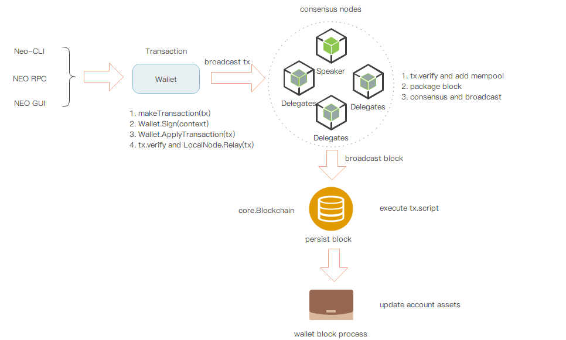

# 交易流程

交易，是区块链网络交互操作的唯一方式，包括发布资产，转账，部署智能合约，合约调用等等，都是基于交易的方式进行操作处理。

NEO中的交易，也是采用类似比特币交易的设计，每一笔交易都包含三个重要部分：input, output, scripts。 input代表资金来源，output代表资金流出，scripts是对input所引用UTXO（Unspent Transaction Output）的解锁，通过这种input-output组合方式，将资产的每一笔流动都形成了一条链条结构。

## 一般流程

[](../images/tx_execution/tx_flow_graph.jpg)

一笔交易，在NEO-CLI、NEO-GUI或通过RPC请求被创建，经钱包签名，构建出完整的交易数据，并通过节点进行验证和全网广播。

共识节点收到该笔交易后，校验并放入到内存池。在某次共识阶段，议长打包该交易到新块中。最后，伴随着新块的全网广播，该交易被全网节点执行处理。 整个流程可以简化成下图：

[](../images/tx_execution/tx_process_flow.jpg)

1. 交易构建： 用户发起一笔交易

2. 交易签名： 完成对交易签名，解锁交易输入

3. 交易广播： 广播交易

4. 交易打包： 共识议长打包交易到新块中

5. 交易处理： 经共识出块广播，交易被全网节点执行处理

### 创建交易

用户可通过NEO-CLI、NEO-GUI或通过RPC请求创建交易，最后经钱包，构建出完整的交易。

1. 通过NEO-CLI指令
  
  ```bash
   send <id|alias> <address> <value>|all [fee=0]
  ```
  
  其中
  - id|alias：资产ID或名称
  - address：对方地址
  - value: 转账金额，也可以用`all`表示所有资产
  - fee：手续费，缺省值为0

2. 通过NEO-RPC调用

  - sendfrom：从指定地址，向指定地址转账

  - sendtoaddress：向指定地址转账

  - sendmany：批量转账命令，并且可以指定找零地址

   具体用法请参考[API 参考](../../reference/rpc/latest-version/api.md)。
   
3. 通过NEO-GUI界面

  具体操作请参考 [交易](../../node/gui/transc.md)。

钱包构建完整交易接口定义：

```c#
public Transaction MakeTransaction(List<TransactionAttribute> attributes, IEnumerable<TransferOutput> outputs, UInt160 from, UInt160 change_address, Fixed8 fee);
```

其中
  - attributes：交易特性
  - outputs：处理的转账信息
  - from：转账的付款账户
  - change_address：找零地址
  - fee：系统费

**钱包生成完整交易步骤**：

1. 若包含非全局资产，涉及NEP-5资产转账时，转成`InvocationTransaction`调用合约`transfer`方法进行NEP-5资产的转账。

2. 计算总的GAS消耗，包括手续费 和 用户支付的网络费

3. 自动补全intput所需要的UTXO(Unspent Transaction Output)

    1. 对output按照<资产Id, 金额>进行统计分组

    2. 查找对应资产下，满足转账金额的最少可用的UTXO。若转账金额不满足时，转账失败。

        1. 若指定了转账账户，则查找该账户下满足转账金额的最少UTXO

        2. 否则，从钱包所有非Lock且非WatchOnly的账户下，查找满足转账金额的最少UTXO.

4. 若有零钱剩余时，设置找零的output

### 签名验证

在前面的章节提到，一个账户地址，实际上代表的就是一段`OpCode.CHECKSIG`或者`OpCode.CHECKMULTISIG`[合约代码](./wallets.md#3_address)，执行时需要提供签名参数。经典的UTXO交易转账时，实际上是对输入地址脚本执行解锁，执行成功则表示对交易的输入引用成功。在NEO交易验证时，也需要对涉及的脚本进行执行验证，故在执行前，需提供相应的脚本所需参数，如交易签名参数。这些参数与对应的脚本，最终被封装在交易的[见证人(Witness)](./blockchain/transaction.md#witness)列表中。

交易签名，实际上是添加地址脚本的签名参数，构建完整可执行的见证人(Witness)，其签名步骤如下：

**签名步骤**：

1. 封装交易为`ContractParametersContext`对象（`ContractParametersContext`是对要进行签名验证的对象包装，负责添加合约脚本参数，构建完整的见证人）。

2. 对于交易待验证脚本的ScriptHashes的每个对象，取得相应的账户，若对应帐户为空，或该账户没有密钥串，则跳过；

3. 用该密钥串对交易的未签名的序列化数据进行`ECDsa`方法签名；

4. 添加签名参数，存放到参数列表对应位置上，具体步骤如下：

    1. 若输入脚本是多重签名，则根据输入脚本合约Contract创建`ContextItem`（`ContextItem`是对一个脚本合约的参数封装）。
      
        1. 解析地址脚本字节码中包含的待签名地址公钥，若签名地址不在其中，则签名失败。

        2. 保存该签名

        3. 当最少签名数满足时，按照签名对应的公钥在脚本中的保序映射关系(order-preserving mapping, 若地址A在地址B前面，则A的签名参数在B的签名参数前面)，依次插入签名参数。（多重签名情况下，还需要别的账户地址进行签名，补充签名参数）
        
    2. 若输入脚本不是多重签名，判断contract.ParameterList中是否存在唯一的0x00（类型ContractParameterType.Signature）：

        1. 若不存在，返回false；

        2. 若存在多个抛异常；
        
        3. 将contract的Parameters的index位置赋值为signature

5. 若所有的脚本参数已齐全，则得到交易的见证人列表。（如，多重签名情况下，还需要别的账户地址进行签名，补充签名参数）

**交易验证**

1. **合法性验证**

   1. 交易输入是否存在重复引用

   2. 交易输入是否多重花费

   3. 检查资产是否存在，是否过期

   4. 检查转账金额是否正确，intputs金额与outputs金额关系
     
       1. 当交易有手续费时，input.GAS > output.GAS

       2. 当持有NEO提取GAS分红时， input.GAS < output.GAS

       3. 当发行资产时，input.Asset < output. Asset

   5. 资产类型与金额是否匹配，资产增发的只能是 MinerTransaction/ClaimTransaction + GAS，或 IssueTransaction + 非GAS资产。

   6. 交易手续费是否足够

   7. 交易属性是否匹配
   
      1. 若交易属性包含`TransactionAttributeUsage.ECDH02`或`TransactionAttributeUsage.ECDH03`时，校验失败

2. **交易脚本校验**

   1. 获取交易中待校验脚本的hash列表，包括如下脚本：
   
      1. input中的tx的output的scriptHash（收款人地址），即解锁UTXO。

      2. output中涉及到的特殊资产`AssetType.DutyFlag`的收款人地址。

      3. Attributes中涉及到的`TransactionAttributeUsage.Script`脚本。

   2. 获取交易的见证人列表。若对应脚本hash的见证人不存在，则hash指向的就是脚本地址，创建临时的`Opt.APPCALL hash`脚本。

   3. 分别加载校验脚本，执行脚本，通过NVM进行执行，若执行返回False，则校验失败。

需要对交易进行验证的地方：

1. 节点收到一笔交易时。

2. 节点产生/转发一笔交易时。

3. 节点持久化block后对剩余待验证交易的验证。

4. 共识过程中，对于尚未校验的待打包交易，进行校验。

> [!NOTE]
>
> - 对需要验证的脚本，提供好参数，最后通过NVM进行执行，若都返回True, 则脚本通过验证。
> - 每一个地址，都是一段`OptCode.CHECKSIG`代码段，执行的时候，都需要签名参数。类似的多签合约地址，调用的是`OptCode.CHECKMULTISIG`方法，需要指定数量的签名参数。
> - 每一笔交易的待验证脚本，都包括input所指向的tx.output.scriptHash脚本（即，输入交易的收款人的地址脚本)，这样确保了，只有对应的钱包才能使用该笔UTXO。
> - 当遇到自定义的地址脚本时，需要按照对方的脚本形参，提前准备好参数（不一定是签名参数）进行验证。

### 广播推送

钱包所在节点，将进行P2P广播该交易。

[](../images/tx_execution/tx_p2p_flow.jpg)

**广播步骤**：

1. 若本地节点启动了共识模块，则触发[共识模块的新交易事件](../concept/consensus/consensus_protocol.md#6_tx_handler)。

2. 本地节点在广播交易前，会先对交易进行校验，并添加到内存池中：

    1. 若交易为`MinerTransaction`，则校验失败。

    2. 若交易已经在内存池或区块链中，则校验失败。

    3. 进行交易自身的检查，包括合法性检查和校验脚本执行。

    4. 加载[插件](https://github.com/neo-project/neo-plugins/blob/master/SimplePolicy/SimplePolicyPlugin.cs#L18)进行过滤。

    5. 若上述校验通过，则添加到内存池。

3. 本地节点发送`inv`消息，并附带上交易的hash数据。

4. 若远程节点已收到过该hash对应的数据，或在短时间内，已经重复获取该inv消息时，则不处理；否则，进入步骤五。

5. 远程节点向外广播`getdata`消息，附带上`inv`消息中的hash数据。

6. 本地节点收到`getdata`消息后，则发送`tx`消息并携带上交易数据给对方。

7. 远程节点收到交易数据后, 回到步骤1执行，进行转发广播。

### 交易打包

共识过程中，议长将打包该交易进行提案投票，最后将新块广播到网络上。

1. 议长将内存池交易全部取出，并进行插件过滤和排序。

2. 将过滤后的交易，打包到新的提案块中，进行共识投票。

3. 若有超过 `N-f` 个节点投票赞同，则新块完成出块，进行广播新块。

### 交易处理

节点接收到新块后，验证块，最后进行持久化块操作。其中，对不同的交易进行不同的处理，比如投票，执行合约交易，发布资产等等。

**Core.Blockchain对block的处理**

随着对block的persist操作，每种交易的最终处理，也在该过程进行处理:

1. 若涉及到资产转账，则更新相应账户的资产变动。

2. 若账户有参与验证人投票时，更新 validators , validators_count的对应投票数。

3. 更新UTXO，和已花费尚未Claim的Output记录

4. 若是 `RegisterTransaction`, 则登记发布的新资产

5. 若是 `IssueTransaction`, 则更新资产的已发行量记录

6. 若是 `ClaimTransaction`, 则更新已花费尚未Claim的Output记录

7. 若是`EnrollmentTransaction`, 则更新验证人信息

8. 若是 `StateTransaction`， 则根据类别，进行投票或申请验证人，更新 validators , validators_count的投票数

9. 若是 `PublishTransaction`, 则创建新的智能合约

10. 若是 `InvocationTransaction`， 则执行脚本或调用智能合约

11. 删除非冻结用户且资产为零，非验证人的账户信息

12. 持久化各数据

**Wallet对Block中的交易处理**

钱包将启动一个线程，监听新来的block，更新相关资产变动账户，交易状态，以及未确认交易队列。处理如下：

1. 处理outputs, 更新钱包涉及到的交易状态和账户变动；

2. 处理intputs, 移除跟踪的地址与交易；

3. 移除Claim交易，跟踪地址与交易；

4. 触发资产变动事件。

5. 从未确认队列中，移除确认的新交易

## 特殊交易的处理

### 共同特征

所有的交易类型均派生自`Neo.Core.Transaction`类型。在该类型里，提供了一些共有的功能和特征，如：

- 交易属性

  交易的属性列表和最大属性数量16，交易类型（如前文所示），版本（默认为1），等等

- 交易的功能性

   输入/输出列表，验证该交易的脚本列表，网络/系统费用，每一个交易输入所引用的交易输出，获取需要校验的脚本散列值，获取交易后各资产的变化量，交易验证，等等

- 交易的读写操作

  ReflectionCache，Size，序列化/反序列化，等等

- TransactionAttribute

  TransactionAttribute是Transaction类别的一个变量，表示该交易所具备的额外特性。数据结构如下：

| 尺寸 | 字段 | 类型 | 描述 |
|---|-------|------|------|
| 1 | Usage | TransactionAttributeUsage | 属性类型 |
| 0\|1 | length | uint8 | 	数据长度（特定情况下会省略） |
| ? | Data | byte[length] | 特定于用途的外部数据 |

TransactionAttributeUsage，表示交易属性用途，数据结构如下：

| 字段 | 值 | 描述 |
|-------|-----|----|
| ContractHash | 0x00 | 外部合同的散列值 |
| ECDH02 | 0x02 | 用于ECDH密钥交换的公钥，该公钥的第一个字节为0x02 |
| ECDH03 | 0x03 | 用于ECDH密钥交换的公钥，该公钥的第一个字节为0x03 |
| Script | 0x20 | 用于对交易进行额外的验证, 如股权类转账，存放收款人的脚本hash |
| Vote | 0x30 | 投票 |
| DescriptionUrl | 0x81 | 外部介绍信息地址 |
| Description | 0x90 | 简短的介绍信息 |
| Hash1 - Hash15 | 0xa1-0xaf | 用于存放自定义的散列值 |
| Remark-Remark15 | 0xf0-0xff | 备注 |

目前实际使用到的TransactionAttributeUsage有两个，TransactionAttributeUsage.Script（脚本）和TransactionAttributeUsage.Remark（备注），均用于InvocationTransaction。因InvocationTransaction肩负资产注册，发布合约，以及部份转账的功能，需要TransactionAttribute作为补充信息。

### MinerTransaction

| 尺寸 | 字段 | 名称  | 类型 | 描述 |
|----|-----|-------|------|------|
|  -  | - | - | -  | 	交易的公共字段  |
| 4 | Nonce | 交易nonce | uint | 创世区块的Nonce的值与比特币的创世区块相同，<br/>为2083236893，其他情况下为随机数值。 |
|  -  | - | - | -  | 	交易的公共字段  |

分配字节费的特殊交易, 非用户创建类型的交易。系统在创世块创建了第一个MinerTransaction，此后在创建新块的时候，由议长创建相应的MinerTransaction，将所有交易的网络费作为出块奖励。

**交易创建**

1. 共识阶段时，议长将内存池交易，进行第三方插件过滤和排序。

2. 计算待打包交易的总网络费，作为MinerTransaction的output金额。

3. 装填MinerTransaction的output的收款地址为当前议长地址，其他字段：inputs, attrs, witnesses均设置为空。注意，MinerTransaction属于资产发行操作，input与output之间金额不一致。

4. 将上面交易打包到共识提案的block中，并进行广播。

其他处理流程，与一般流程一致。

### RegisterTransaction (已弃用)

| 尺寸 | 字段 | 名称  | 类型 | 描述 |
|----|-----|-------|------|------|
|  -  | - | - | -  | 	交易的公共字段  |
| 1 | AssetType | 资产类型 | byte |  |
| ? | Name | 资产名字 | string |  |
| 8 | Amount | 资产总量 | Fixed8 |  |
| 1 | Precision | 精度 | byte |  |
| ? | Owner | 所有者公钥 | ECPoint |  |
| 20 | Admin | 管理员地址脚本hash | UInt160 |  |
|  -  | - | - | -  | 	交易的公共字段  |

资产登记交易。系统在创世区块调用RegisterTransaction发行了两种资产：NEO Coin（旧称小蚁股，AntShare，简称NEO）和NEO Gas（旧称小蚁币，AntCoin，简称GAS）。注意，用户在GUI创建资产种类时，实际调用的是InvocationTransaction。

Amount为发行总量，共有2种模式：

   - **限量模式**：当Amount为正数时，表示当前资产的最大总量为Amount，且不可修改（股权在未来可能会支持扩股或增发，会考虑需要公司签名或一定比例的股东签名认可）。

   - **不限量模式**：当Amount等于-1时，表示当前资产可以由创建者无限量发行。这种模式的自由度最大，但是公信力最低。

其他处理流程与一般流程一致。

### IssueTransaction

分发资产的特殊交易。完成资产注册后，可在资产创设所设定的总量上限范围内，发行人分发该资产。分发后的资产可以用于转账和交易。分发资产需要消耗一定数量的 GAS 作为附加服务费。

> [!NOTE]
> 
> - 当版本大于等于1时，手续费为0。
> - 当输出列表中的资产种类为NEO或GAS时，手续费为0；否则手续费为500GAS。

**交易验证**

1. **合法性验证**

   1. 先进行一般交易的合法性验证

   2. 计算资产输入，输出差值变化情况

   3. 若交易引用的input不存在时，则校验失败

   4. 若发行的资产不存在，则校验失败

   5. 若该交易的发行量加上内存池该资产的其他发行量，超过了发行总量，则校验失败

2. **脚本验证**

    在进行一般交易的脚本验证时，会包含发行人的脚本验证

其他处理流程，与一般流程一致。

### ClaimTransaction

| 尺寸 | 字段 | 名称  | 类型 | 描述 |
|----|-----|-------|------|------|
|  -  | - | - | -  | 	交易的公共字段  |
| 34\*? | Claims | Claim已花费的交易 | CoinReference[] | 已经花费的含有NEO的交易输出，获取能够分红的Gas |
|  -  | - | - | -  | 	交易的公共字段  |

GAS是由持有NEO用户进行Claim操作，进行增发GAS（并非每出一个块就立马奖励Gas到账户上）。用户能够Claim到的GAS是与NEO资产的起始高度，截止高度，紧密相关。GAS总量上限是1亿，当区块高度到达4600W后，每个区块不再有奖励。

每一个笔NEO的交易都有两种状态：unspent和spent。每一个未提取的GAS也有两种状态，available和unavailable。一个NEO的生命周期以转入地址起始，转出地址截止，转入时状态变为unspent，转出时状态变为spent。当NEO处于unspent状态时，所产生的GAS为unavailable状态，即不可提取。当NEO处于spent状态时，期间所产生的GAS变为available，用户可以提取。用户可通过转账的方式，将unspent的NEO变成spent状态的NEO，再进行Claim提取GAS。

用户进行Claim时，实际上是

1. 找到已花费尚未Claim的NEO交易（系统维护了一份spentcoins集合——已花费尚未claim的交易）

2. 对其进行计算可以增发的Gas

3. 并将Gas转账到用户钱包地址

**交易创建**

1. 从spentcoins（已花费尚未claim的交易）中，选择要进行claim的output，并作为ClaimTransaction的claims值。

2. 计算出能提取到的Gas量，并作为ClaimTransaction的output金额

3. 设置ClaimTransaction的output收款人为当前账户，并设置inputs, attrs为空，构建出完整的交易。

4. 对交易进行签名并P2P广播

其中，**一笔有NEO的tx.output产生的GAS计算**如下图计算所示：

[](../images/tx_execution/tx_claim_gas.jpg)

[](../images/tx_execution/formula_gas.jpg)

- Gas： 一笔持有NEO的tx.output能提取到的Gas数量
- M: 交易的块高度， 起始高度
- N: 交易被花费的块高度，引用这笔tx.output的交易的所在块高度, 即截止高度
- `BlockBonus(h)`: 高度为h的区块所能得到的Gas奖励, 参考下表。
- `SystemFee(h)`: 高度为h的区块的系统手续费，等于该块下所有交易的系统手续费之和。`amount_sysfee = block.Transactions.Sum(p => p.SystemFee)`
- `tx.output.NEO`: 该交易的NEO数量
- 10^8: NEO的总量一亿

| 周期 |  区块高度范围 |   区块奖励GAS |
|------|-------------|---------------|
|  1   |  0 - (200W -1) |    8 |
|  2   |  200W ~~ (400W -1) |    7 |
|  3   |  400W ~~ (600W -1) |    6 |
|  4   |  600W ~~ (800W -1) |    5 |
|  5   |  800W ~~ (1000W -1) |    4 |
|  6   |  1000W ~~ (1200W -1) |    3 |
|  7   |  1200W ~~ (1400W -1) |    2 |
|  8~22   |  1400W ~~ (4600W -1) |    1 |
|  23~    |  4600W ~ |    0 |

> [!NOTE]
>
> 一笔交易产生的Gas，等于该交易从未花费到花费的区块高度差内，每个区块的奖励 + 区块系统手续费的之和 乘以该交易NEO的总量占比。

**交易验证**

1. **合法性验证**
  
   1. 先进行一般交易的合法性验证；

   2. 若Claims包含重复交易时，验证失败；

   3. 若Claims与内存池交易存在重复时，验证失败； 
   
   4. 若交易引用了一个不存在的交易输出；

   5. 若ClaimTransaction的GAS的资产减少或者没有变化时，验证失败；

   6. 若根据Claims指向的交易，计算出可以提取的Gas不等于ClaimTransaction GAS的增发量时，验证失败；

2. **脚本验证**

    在进行一般交易的脚本验证时，会包含Claims交易的收款人地址脚本

其他处理流程，与一般流程一致。

### EnrollmentTransaction (已弃用)

| 尺寸 | 字段 | 名称  | 类型 | 描述 |
|----|-----|-------|------|------|
|  -  | - | - | -  | 	交易的公共字段  |
| ? | PublicKey | 记账人的公钥 | ECPoint | 用于分配的NEO |
|  -  | - | - | -  | 	交易的公共字段  |

报名成为验证人的特殊交易，具体操作请参阅[选举与投票](../concept/consensus/vote_validator.md)。

### StateTransaction

| 尺寸 | 字段 | 名称  | 类型 | 描述 |
|----|-----|-------|------|------|
|  -  | - | - | -  | 	交易的公共字段  |
| ?\*? | Descriptors | 投票信息 | StateDescriptor[] |  |
|  -  | - | - | -  | 	交易的公共字段  |

其中，Descriptor类型如下：

| 尺寸 | 字段 | 名称  | 类型 | 描述 |
|----|-----|-------|------|------|
| 1 | Type | 类型 | Byte  | `0x40` 代表 投票， `0x48` 代表申请或注销验证人 |
| ? | Key | 操作人 | byte[] | Field = `Votes` 时，存放投票人地址脚本的hash <br>Feild = `Registered` 时，存放申请人的公钥 |
| ? | Field | 验证人表中的字段 | string | Type = `0x40`时， Field = `Votes`<br>Type = `0x48`时，Field = `Registered` |
| ? | Value | 验证人表中Key所代表的<br>字段存放值 | byte[] | Type = `0x40`时，Value存放投票地址列表 <br> Type = `0x48`时，存放是否申请验证人的布尔值 |

申请验证人或共识节点投票的交易。用户可以在NEO GUI报名成为验证人，成为验证人后就可以根据投票数竞选成为共识节点。报名成为验证人需要花费手续费 1000 GAS。具体操作请参阅[选举与投票](../concept/consensus/vote_validator.md)。

### ContractTransaction

合约交易，最常用的一种交易，用于转账交易（NEO CLI, API 的send指令，以及GUI的send操作），处理流程与一般流程一致。

### PublishTransaction (已弃用)

| 尺寸 | 字段 | 名称  | 类型 | 描述 |
|----|-----|-------|------|------|
|  -  | - | - | -  | 	交易的公共字段  |
| ? | Script | 合约的脚本 | byte[] |  |
| ? | ParameterList | 参数类型列表 | ContractParameterType |  |
| 1 | ReturnType | 返回类型 | ContractParameterType |  |
| 1 | NeedStorage | 是否需要存储空间 | bool |  |
| ? | Name | 合约名称 | string |  |
| ? | CodeVersion | 合约版本编号 | string |  |
| ? | Author | 合约作者姓名 | string |  |
| ? | Email | 电子邮箱 | string |  |
| ? | Description | 合约描述 | string |  |
|  -  | - | - | -  | 	交易的公共字段  |

智能合约发布的特殊交易，处理流程与一般流程一致。注意, 用户在GUI发布智能合约时，实际调用的是InvocationTransaction。

### InvocationTransaction

| 尺寸 | 字段 | 名称  | 类型 | 描述 |
|----|-----|-------|------|------|
|  -  | - | - | -  | 	交易的公共字段  |
| ? | Script | 合约的脚本 | byte[] |  |
| 8 | Gas | 消耗的Gas | Fixed8 |  |
|  -  | - | - | -  | 	交易的公共字段  |

调用智能合约的特殊交易。用户可以通过NEO API的`invoke/invokefunction/invokescript`指令，或者NEO GUI，根据输入的智能合约信息创建InvocationTransaction对象并调用。注意，用户在GUI创建资产和发布智能合约时，实际调用的是InvocationTransaction。

| InvokeTX用途 | 调用脚本 | Attributes | 包含属性 |
|--------------|------------|--------------|--------------|
| 执行智能合约 | 调用合约的脚本  |  空 |   |
| 发布合约 | Neo.Contract.Create  |   空  |   |
| 资产注册 | Neo.Asset.Create |  非空 | TransactionAttributeUsage.Script,资产所有者的地址脚本hash，数目 1 |
| GUI 转账 | NEP-5资产时，调用合约transfer方法；<br/>全局资产时，为空  |  非空 | TransactionAttributeUsage.Script，转账账户地址，数目若干 <br/> TransactionAttributeUsage.Remark，备注数据，数目 1 |

**交易创建**

1. 根据用途，构建相应的执行脚本，并赋值 InvocationTransaction的Script字段

2. 在本地NVM试运行（测试环境）上面脚本，计算需要消耗的GAS

3. 将 `Math.max(0, GasConsumed - 10).Ceiling()` 赋值给 InvocationTransaction的GAS字段，并作为交易的系统手续费。（注，系统减免了10GAS的消耗, 并取上整数的GAS）

4. 设置交易的其他字段，并进行签名和P2P广播

**交易验证**

1. **合法性校验**

    1. 若消耗的GAS不能整除10^8, 则返回false（GAS必须是整数单位形式的Fixed8，不能包含有小数的GAS）

    2. 交易的一般性校验

其他处理流程，与一般流程一致。
