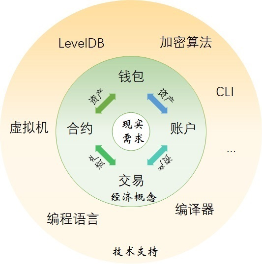

<h2>Neo区块链模型</h2>

&emsp;&emsp;资产是 Neo 系统中的核心。交易、合约、账户和钱包服务于资产的生成、流动和管理。而之前单独介绍过的Neo CLI、编译器、虚拟机等都是实现功能的技术手段。关系如下图描述：

&emsp;&emsp;Neo区块链网络中，一切的事物操作都是通过交易完成。资产可以在不同账户之间通过交易(`ContractTransaction`)进行转账；用户也可以通过交易（`ClaimTransaction`）来提取应得的分红GAS；合约也是通过交易（`InvocationTransaction`）才实现其调用。

&emsp;&emsp;在比特币中，Script脚本承担了交易中签名验证的任务。在Neo系统中，由合约承担了此项任务。合约可以简单理解成比特币的 Script 脚本的升级。比特币的 Script 脚本不是图灵完备的，虽然能够完成交易的签名验证，但是能做到的功能有限。因此比特币只有UTXO模型，关注的就是交易本身。编写 Neo 智能合约的语言，比如 C# 和 Python 等，都是图灵完备的，可以满足现实世界中的丰富多彩的需要。而现实世界广泛采用的是账户余额(account balance)模型。以太坊就采用了账户余额模型。在 Neo系统中，UTXO 模型和账户余额模型同时存在：UTXO 模型主要用于NEO和GAS等原生代币，账户余额模型主要用于用户发行的NEP-5资产（如股权、代币等）。

&emsp;&emsp;在Neo系统中，资产都是以代币的形式存在。资产有很多种，可以是NEO、GAS和NEP-5等全局资产，也可以是股权等权益类资产。而存在钱包中的是并不是这些资产，而是存放这些资产的地址的私钥。在Neo Tracker（https://neotracker.io/）中打开一个钱包再选择其中的一个`地址`，就会列出这个地址上的包括NEP-5资产在内的所有资产和相关交易信息。地址也被称为“账户”。一个地址可以是由一个私钥通过一系列加密算法和代码转换算得，直接在交易结账中使用。也可以是智能合约的地址，在调用智能合约时使用。计算地址的方法请见`钱包`中的`地址`部分。

> [!NOTE]
> 如果发现有死链接，请联系 <feedback@neo.org>

