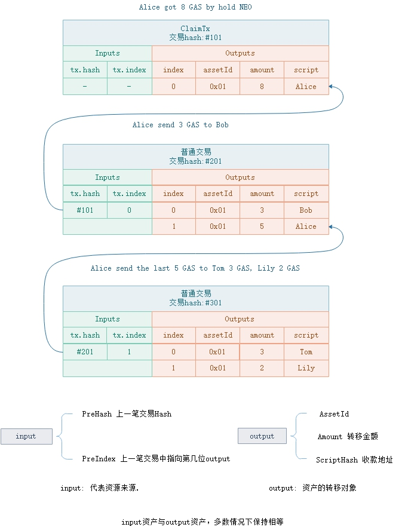

# UTXO模型

与账户余额模型不同的是，UTXO（Unspent Transaction Output）模型并不直接记录账户资产，而是通过未花费的`output`计算用户资产。每一笔 UTXO 类型的资产（如全局资产)，都是`input-output`关联模型，`input`指明了资金来源，`output`指明了所有资产的去向。如下图中，Alice 持有 NEO 分红得到 8 个 GAS，记录在交易 #101 的第一位output上。当 Alice 转账给 Bob 时，新交易的`input`指向资金来源是交易 #101 的 0 号位置上的 output 所代表的资产—— 8 个 GAS，并在交易 #201 中一笔 output 指向给 Bob 的3个GAS，另外一笔 output 指向 Alice 的5个GAS(找零)。

> [!WARNING]
>
> - 当交易有手续费时，input.GAS > output.GAS
> - 当持有NEO提取GAS分红时 input.GAS < output.GAS
> - 当发行资产时，input.Asset < output. Asset

UTXO转账其实是对能解锁`Output.scriptHash`的output进行消费，并在新交易的见证人上填充其签名参数。账户地址，实际上就是脚本hash的base58check处理，代表的是一段签名认证脚本，如下图。 

[`Op.CheckSig`](../neo_vm.md#checksig) 执行时需要公钥和签名两个参数，在地址脚本中，已经包含公钥参数，故在交易中只需要补充签名参数。

