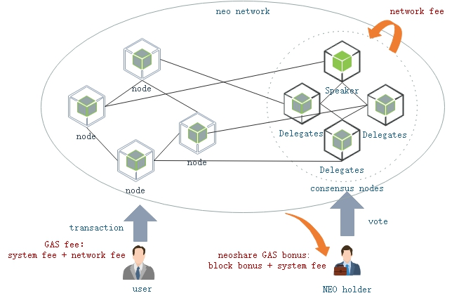

# 收费模型

用户在使用 NEO 网络时，需要支付一定的费用，总手续费包含系统费(System Fee)和网络费(Network Fee)，费用单位为 GAS。费用分配如下图所示。

### 网络费

网络费是用户向 NEO 网络提交交易时支付的费用，用户可自行设定网络费。理论上，每单位字节的网络费越高，越容易被打包确认。在当前主网上，一个块最多支持500笔交易，其中提供最多20笔免费交易。网络费将作为共识节点的出块奖励。

默认收费规则如下：

<table class='table table-hover'>
    <thead>
        <tr>
            <th>交易类型</th>
            <th>交易大小 (byte）</th>
            <th>手续费 (GAS)</th>
        </tr>
    </thead>
    <tbody>
        <tr>
            <td rowspan="2">除 ClaimTransaction 以外的所有交易</td>
            <td>&lt;= 1024</td>
            <td>0</td>
        </tr>
        <tr>
            <td>&gt; 1024</td>
            <td>交易大小&times;0.00001 + 0.001 </td>
        </tr>
        <tr>
            <td rowspan="3">ClaimTransaction</td>
            <td>所有</td>
            <td>0</td>
        </tr>
    </tbody>
</table>

> [!Note]
>
> - 如果用户发送交易时自定义了手续费，则只收取两项手续费中价格较高者。
> - NEO-CLI 2.10.2 及之后版本的 RpcWallet 插件新增了 config.json 配置文件，对于使用 RPC 命令发送的交易，可以在该文件中自定义手续费上限。如果交易需要花费的手续费没有超过设定的上限，则正常上链，否则交易会失败。

### 系统费
系统费是交易在虚拟机中执行消耗的资源费用，费用总额受合约脚本的指令数量和指令类型影响。系统费将作为持有 NEO 的用户权益分红。

在 NEO 中定义的特殊交易的系统费如下表所示： 

| 交易 | 系统手续费 (GAS) | 描述 |
| --------   | :-----:   | :----: |
| MinerTransaction | 0 | 分配字节费  |
| RegisterTransaction | 10000 | (已弃用) 资产登记   |
| IssueTransaction | 500 | 分发资产   |
| ClaimTransaction | 0 | 提取 GAS |
| EnrollmentTransaction | 1000 | (已弃用) 报名成为共识候选人   |
| StateTransaction | 1000 | 申请见证人或共识节点投票   |
| ContractTransaction | 0 | 合约交易，这是最常用的一种交易   |
| PublishTransaction | 500 | (已弃用) 发布智能合约 |
| InvocationTransaction | 具体的指令GAS消耗 | 调用智能合约   |

此外，运行智能合约时，产生的系统调用或虚拟机对指令的执行，也会产生系统费用。具体收费信息请参见 [手续费](../../sc/fees.md)。

