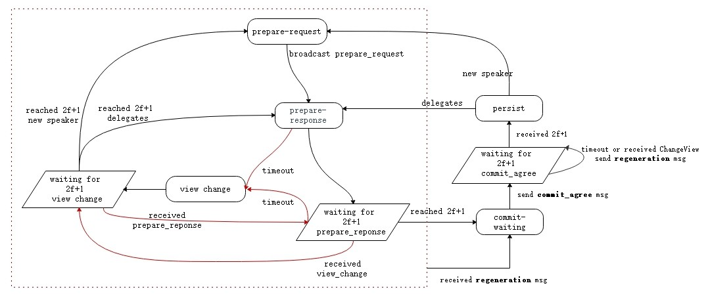

# dBFT算法介绍

PBFT(Practical Byzantine Fault Tolerance)[1]算法能够有效解决分布式可信共识问题，但是当投票节点越来越多时，性能下降越厉害，其算法时间复杂度为 O(n2), n是节点个数。 NEO在PBFT算法的基础上改良，提出结合POS模式特点的DBFT(Delegated Byzantine Fault Tolerant)[3]算法，利用区块链实时投票，决定下一轮共识节点，即授权少数节点出块，其他节点作为普通节点验证和接收区块信息。

## 基本概念

* 共识节点： 具有发起新块提案，提案投票权限的节点。
* 普通节点： 具有转账，交易权限和全网账本，但不能发起区块提案与投票。
* 议长：负责向其他节点，广播新块提案。
* 议员：参与共识出块的节点，负责对新块提案进行投票，当票数不少于 N-𝑓 时，则提案通过。
* 验证人： 被投票选举参与共识的节点，共识候选节点。
* 视图： 一轮共识从开始到结束所使用的数据集。视图编号 v，从 0 开始，本轮共识失败时 v 逐渐递增，直到新的提案通过后清零。

## 算法流程

### 符号定义

- N: 本轮共识节点总个数。
- f：最大容错节点个数， 为 ⌊(N-1)/3⌋。
- v: 视图编号，从0开始。
- ℎ：当前共识的区块高度。
- p: 议长编号，`p = (h - v) mod N`。
- i：议员节点编号，等于本轮共识列表中的序号。
- t: 出块时间。配置在文件`protocol.json`中的`SecondsPerBlock`值，默认15秒钟。
- 𝑏𝑙𝑜𝑐𝑘： 提案的新块。
- 〈𝑏𝑙𝑜𝑐𝑘〉𝜎𝑖: 第i个共识节点对𝑏𝑙𝑜𝑐𝑘的签名。

### 一般流程

假设当前共识节点总数N, 最多 f 个容错节点。 刚开始时，至少具有 N-𝑓 个节点处于相同的视图编号v, 区块高度 ℎ = 当前区块高度。（若没有处在同一高度，可通过P2P之间区块同步，最终达成一致； 若视图编号不一致时，可通过更换视图最终达成一致）。共识算法的流程如下：

1. 用户通过钱包发起一笔交易，如转账，发布智能合约，智能合约调用等。

2. 钱包对交易进行签名，并发给节点P2P广播；

3. 共识节点收到该笔交易，存放到内存池；

4. 在某一轮共识中，某议长经过时间 t 后，将内存池交易，打包到新𝑏𝑙𝑜𝑐𝑘中，并广播 〈𝑃𝑟𝑒𝑝𝑎𝑟𝑒𝑅𝑒𝑞𝑢𝑒𝑠𝑡,ℎ,𝑣,𝑝,𝑏𝑙𝑜𝑐𝑘,
〈𝑏𝑙𝑜𝑐𝑘〉𝜎𝑝〉  新块提案；

   1. 加载内存池交易

   2. 加载[`IPolicyPlugin`插件](https://github.com/neo-project/neo-plugins)，对交易进行排序和过滤。(其中，每个区块500笔交易，免费20笔交易，在插件中完成过滤)
  
   3. 计算总交易的网络手续费（`= input.GAS - output.GAS - 交易系统费 `)，将其作为当前议长的`MinerTransaction`奖励。
  
   4. 结合上面的交易和以前的验证人投票情况，计算出下一个区块的共识节点，并将多方签名脚本hash赋值给`block.NextConsensus`，锁定下一区块的共识节点。
  
   5. 设置block的时间戳为当前时间，并计算议长对block的签名
  
   6. 广播`PrepareRequset`共识消息

   7. 广播`inv`消息，附带上除`MinerTransaction`外的交易hash。（通知其他节点，同步要打包的交易数据）

5. 议员，在收到该提案与验证后，广播 〈𝑃𝑟𝑒𝑝𝑎𝑟𝑒𝑅𝑒𝑠𝑝𝑜𝑛𝑠𝑒,ℎ,𝑣,𝑖,〈𝑏𝑙𝑜𝑐𝑘〉𝜎𝑖〉 投票消息

6. 当任意一个议员（包括议长），在收到 𝑃𝑟𝑒𝑝𝑎𝑟𝑒𝑅𝑒𝑞𝑢𝑒𝑠𝑡 和 𝑃𝑟𝑒𝑝𝑎𝑟𝑒𝑅𝑒𝑠𝑝𝑜𝑛𝑠𝑒 至少 N-𝑓 个〈𝑏𝑙𝑜𝑐𝑘〉𝜎𝑖签名（包括自己的签名）后，即达成共识，开始发布新块，并广播；

7. 任意一个节点收到该新块后，将上面交易从内存池中删除，并记录该区块内容。 若是共识节点收到新区块后，则进入下一轮共识。

算法可以划分为三阶段。 

1. `PRE-PREPARE`预准备阶段，本轮的议长负责向其他议员广播`Prepare-Request`消息， 发起提案。 
2. `PREPARE`准备阶段，议员向外广播`Prepare-Response`消息，发起投票，当一个共识节点收到不少于`N-f`个〈𝑏𝑙𝑜𝑐𝑘〉𝜎𝑖签名, 则进入第三阶段。 
3. `PERSIST`出块阶段， 负责向外广播新块，并进入下一轮共识。 

> [!Note]
>
> 1. 刚启动区块链网络时，默认读取配置文件`protocol.json`的备用共识节点列表`StandbyValidators`.
> 2. 与普通块不一样，创世块并非共识节点出块，而是默认为区块链第一个区块。创世块中的`NextConsensus`指定了下一个块的共识节点为`StandbyValidators`的多方签名脚本hash。

### 视图更换

在开放的P2P网络环境共识过程中，可能会遇到网络延迟超时，恶意节点发送假数据等，议员可以发起更换视图消息，若收到不少于N-f个更换视图消息时，则进入新的视图和新的议长，重新进行区块共识。

当节点 𝑖 在经过 2𝑣+1 ⋅ 𝑡 的时间间隔后仍未达成共识，或接收到包含非法交易的提案后，开始进入视图更换流程： 

1. 令 𝑘 = 1，𝑣𝑘 = 𝑣 + 𝑘； 

2. 节点 𝑖 发出视图更换请求 〈𝐶ℎ𝑎𝑛𝑔𝑒𝑉𝑖𝑒𝑤,ℎ,𝑣,𝑖,𝑣𝑘〉； 

3. 任意节点收到至少 2𝑓+1 个来自不同 𝑖 的相同 𝑣𝑘 后，视图更换达成，令 𝑣 = 𝑣𝑘 并开始共识；

4. 若经过 2𝑣𝑘 +1 ⋅ 𝑡 的时间间隔后，视图更换仍未达成，则 𝑘 递增并回到第 2 步； 

随着 𝑘 的增加，超时的等待时间也会呈指数级增加，可以避免频繁的视图更换操作，并使各节点尽快对 𝑣 达成一致。 而在视图更换达成之前，原来的 𝑣 依然有效，避免因偶然性的网络延迟超时而导致不必要的视图更换。 

[1] [Practical Byzantine Fault Tolerance](http://pmg.csail.mit.edu/papers/osdi99.pdf) 
[2] [共识机制图解](http://docs.neo.org/zh-cn/basic/consensus/consensus.html) 
[3] [一种用于区块链的拜占庭容错算法](http://docs.neo.org/zh-cn/basic/consensus/whitepaper.html) 
[4] [The Byzantine Generals Problem](https://www.microsoft.com/en-us/research/wp-content/uploads/2016/12/The-Byzantine-Generals-Problem.pdf) 
[5] [Consensus Plugin](https://github.com/neo-project/neo-plugins)

