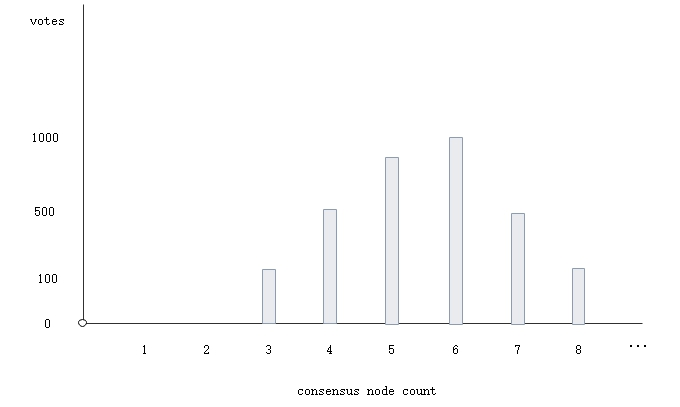
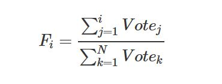

# 投票，验证人，议员，议长

NEO的POS模式，体现在 (1) 任何人都可以发起交易申请成为验证人（只要愿意支付系统费）；(2) 任何人都可以通过持有NEO对申请验证人进行投票，决定共识节点和个数。根据投票情况，按照本章介绍的算法，计算出共识节点。同时，投票是一个动态持续过程，若投票的账户发生NEO资产变动，之前被投票地址的投票数也会发生变动，共识节点也相应产生变动。

同时，NEO的每一个区块，都带了指向参与下一轮出块的共识节点的多方签名脚本hash的`NextConsensus`字段，即当前交易，决定下一轮共识节点。

## 投票

在NEO中，投票或申请成为验证人是通过一种特殊类型的交易`StateTransaction`进行的。当用户选择了被投票人进行投票时，实际上包括两部分投票：一是对共识节点个数的投票，二是对共识节点名单的投票。
 其实还有另一种交易类型可以实现同样的功能但是已经被弃用：`EnrollmentTransaction`。历史数据已经上链，但是系统不再接受新的交易数据。 

### EnrollmentTransaction

##### **交易结构**

| 尺寸 | 字段 | 类型 | 说明 |
|-----|------|------|------|
| 1 | Type | uint8 | 交易类型， `0x20` |
| 1 | Version | uint8 | 	交易版本，目前为 0 |
| ? | PublicKey | ECPoint | 申请验证人地址 |
| ?\*? | Attributes | tx_attr[]| 该交易所具备的额外特性 |
| 34\*? | Inputs |  tx_in[] | 输入 |
| 60\*? | Outputs | tx_out[] | 输出 |
| ?\*? | Scripts | script[] | 用于验证该交易的脚本列表 |

##### **交易校验**

1. 交易验证返回恒定的`false`, 即交易不再被创建接受。

2. 验证脚本附带了申请验证人的地址，即需要申请人地址签名该交易。

##### **交易处理**

1. 登记该申请验证人信息

> [!Warning]
>
> 已弃用， 已被`StateTransaction`所替代。 目前交易处理保留，为了兼容以前的交易，但是交易验证被设置为恒定`false`, 即不再接受新的`EnrollmentTransaction`交易。

### StateTransaction

##### **交易结构**

| 尺寸 | 字段 | 类型 | 说明 |
|-----|------|------|------|
| 1 | Type | uint8 | 交易类型，`0x90` |
| 1 | Version | uint8 | 	交易版本，目前为 0 |
| ?\*?   | Descriptors | StateDescriptor[] | 投票信息  |
| ?\*? | Attributes | tx_attr[]| 该交易所具备的额外特性 |
| 34\*? | Inputs |  tx_in[] | 输入 |
| 60\*? | Outputs | tx_out[] | 输出 |
| ?\*? | Scripts | script[] | 用于验证该交易的脚本列表 |

**StateDescriptor结构**

| 尺寸  |   字段  | 类型 |  说明 |
|-------|---------|------|-------|
| 1  | Type |  StateType | `0x40`--投票， `0x48`--申请验证人 |
| 20/30 |  Key | byte[] |  当`Field = "Votes"`时，存放投票人地址的脚本hash，`Key`代表投票人; 当`Field = "Registered"`时，存放公钥， `Key`代表申请人  |
| ? | Field | string |  当`Type = 0x40`时，`Field = "Votes"`;  当`Type = 0x48`时，`Field = "Registered"`; |
| ? | Value | byte[] | 当`Type = 0x40`时，代表投票地址列表；   当`Type = 0x48`时，代表验证人是否已注册的布尔值  |

#####  **交易校验**

1. 对交易的`StateDescriptor`进行验证，包括如下：

   1. 检验`StateDescriptor.Type` 与 `StateDescriptor.Field`是否匹配。
   
   2. 若`StateDescriptor.Type = 0x40`，即进行投票：
   
       1. 检查投票账户`StateDescriptor.Key` 是否是非冻结账户，且持有NEO个数大于0。
       
       2. 检查被投票验证人地址是否在备用共识节点地址列表里，且被投票验证人是否申请注册。

2. 交易的基本验证：合法性验证，和验证脚本的验证。其中验证脚本包括`StateDescriptor.Key`（注意，当`StateDescriptor.Field = "Votes"`时，需要对`StateDescriptor.Key`从公钥到地址脚本hash转化）， 即交易需要投票地址的账户签名。

#####  **交易处理**

1. 若`StateDescriptor.Type = 0x48`时， 根据`StateDescriptor.Value`布尔值，注销或者申请验证人。

2. 若`StateDescriptor.Type = 0x40`时，进行如下处理：

    1. 若投票人之前投过票，则将原先被投票人的票数，减少投票人持有NEO的个数。

    2. 新的被投票人，累加上投票人所持有NEO的个数，作为票数。

    3. 若投票人之前投过的投票人数与当前投票人数不一致时，则共识节点个数的票数，也做类似处理，旧的减少票数，新的增加票数。

> [!WARNING]
>
> 当一个投票用户的NEO资产发生变动时，相应的其投票数也做同样变动。

## 验证人到议员

从选举投票到共识节点，需经2个步骤计算：

1. 根据被投票列表个数的票数，计算出共识节点个数；

2. 根据被选举人的票数，计算出具体的共识节点。

### 共识节点个数

根据用户的投票情况，共识节点个数的投票得到类似如下图形式：

按照如下公式，转化成概率分布函数 F（离散函数），其中投票数的占比即为共识个数 i 的概率。

在概率分布函数上，截取F ∈ [0.25, 0.75]覆盖到的共识节点个数，再对这些点求取期望值，最后与备用共识节点个数比较取最大值，得到最终的共识节点个数。公式如下：

- 其中，⌈A⌉ 代表第一个 Fi >= 0.25 的点

- ⌈B⌉ 代表第一个  Fi >= 0.75 的点

- min(0.75, Fi) - max( Fi - 1, 0.25 )  表示只取阴影部分的概率

- StandbyValidators 代表备用共识节点列表

> [!Note]
>
> 过滤掉共识节点个数中，过大和过小的点，避免对均值造成的过大或过小的影响，故我们只考虑中间部分的投票情况。

### 共识节点

在上面的步骤中，根据投票情况确定了共识节点个数`Count`，再根据申请验证人的投票进行降序排序，取前`Count`个。若申请的验证人不足时，则从备用共识节点进行补充，最后得到当前参与共识的验证人，即议员。

> [!Note]
>
> 创世块作为第一个块，其`NextConsensus`被设定为备用共识节点的2/3多方签名脚本hash值。

## 议员到议长

按照上面的方法，得到了参与本轮共识节点的议员列表，以及议员编号（即列表序号）。根据共识算法，议长由公式`p = (h - v) mod N`决定，其中`h`是当前需要达成共识的块高度；`v`是视图编号，刚开始从0开始；N是议员总数。 

议长在共识阶段，将发送`PrepareRequest`消息，并附带上决定下一个区块共识节点的`NextConsensus`。议长结合打包Block中的交易（存在对投票数有影响交易：一是可能存在StateTransaction；二是，投票人的NEO资产可能发生转账变动），与之前的投票情况，计算出下一轮共识节点，再创建三分之二多方签名脚本的hash值作为`block.NextConsensus`，完成本轮交易对下一轮共识节点的锁定。
