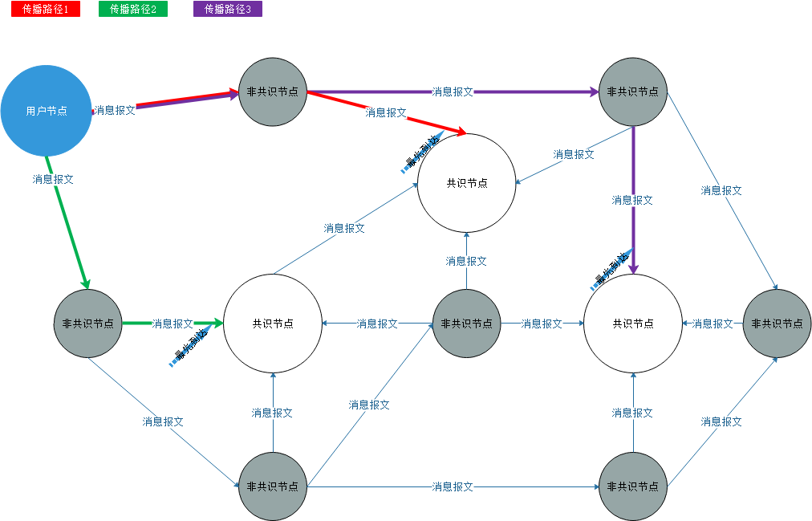

# Neo-CLI 结构

NEO是一个基于点对点网络的区块链系统。它提供基于UTXO模型的数字资产记账功能，以及一个基于NEO虚拟机的智能合约的执行环境。本文将描述网络中节点程序Neo-CLI的整体结构和基本行为。

## 整个网络

[](../images/neo_cli_structure/neo-p2p-network.png)

网络中的每个节点运行一个 Neo-CLI 程序或者协议兼容程序。其中参与共识的是共识节点。不参与共识的是非共识节点。

## Neo-CLI

Neo-CLI的结构如下图。（由于版本升级，部分结构可能会有变化 ）

[](../images/neo_cli_structure/NEO-CLI.png)

### Neo-CLI 命令行

Neo-CLI 是一个命令行程序。通过命令行控制台提供与区块链交互的基本功能。更多信息，请参考[Neo-CLI 命令行](../node/cli/cli.md)。

### 账本 API

账本API定义了UTXO模型的基本数据类型，包括交易，区块，记账人等基础数据结构。细节将在后续章节中介绍。

### 钱包

NEO官方提供两种格式的钱包，一种是sqlite数据库格式的钱包，另一种是NEP-6钱包。sqlite格式钱包的优点是性能相对较好，缺点是适用的平台不如NEP-6钱包更广泛。

### LevelDBStore / Blockchain

基于leveldb实现的区块链数据管理模块。向其它部分提供区块链数据的存储和查询服务。

### LocalNode

节点的网络通信的模块。负责与网络中的其它节点交换信息。细节将在后续章节中介绍。

### RpcServer

一个向外提供RPC调用接口的模块。关于RPC接口的细节，请参考[RPC API](../reference/rpc/latest-version/api.md)。

### ConsensusService

在NEO网络中，只有共识节点需要启动共识服务。共识节点通过点对点网络与其它共识节点交换信息，完成区块链中生成新的区块的过程。细节将在后续章节中介绍。

### Plugin

通过插件的形式实现区块链中一些特定模块的逻辑，方便特定功能的定制和调试。包括下述四个种类：

 - **ILogPlugin** : 智能合约的执行结果存储插件。
 - **IPolicyPlugin** : 生成新区块时交易的排序策略插件。
 - **IRpcPlugin** : 执行RPC调用的插件。
 - **IPersistencePlugin** : 节点收到新的区块，将其保存到本地数据库时的自定义行为插件。

### NeoVM

NEO实现的虚拟机。用来执行验证脚本和智能合约。细节将在后续章节中介绍。

ApplicationEngine是对NeoVM的一层封装。NeoVM被设计成一个独立的模块。可以在区块链之外部署。而ApplicationEngine与区块链本身的联系更加紧密。

## 配置文件

Neo-CLI的节点程序在执行过程中会访问下述配置文件。

 - **config.json** : 基础配置文件
 - **protocol.json** : 协议配置文件

### config.json

定义数据库路径、网络配置、启动设置等基础配置。

```json
{
  "ApplicationConfiguration": {
    "Paths": {
      "Chain": "Chain_{0}",
      "Index": "Index_{0}"
    },
    "P2P": {
      "Port": 10333,
      "WsPort": 10334
    },
    "RPC": {
      "BindAddress": "127.0.0.1",
      "Port": 10332,
      "SslCert": "",
      "SslCertPassword": ""
    },
    "UnlockWallet": {
      "Path": "",
      "Password": "",
      "StartConsensus": false,
      "IsActive": false
    }
  }
}
```

属性说明：

 - Paths/Chain : 区块链数据库的存储目录前缀。存储目录的后缀是Magic数的8位16进制表示。Magic数将在后续提及。
 - Paths/Index : 钱包索引的存储目录前缀。
 - P2P/Port : 网络节点之间 TCP/IP 协议连接的监听端口号。
 - P2P/WsPort : 网络节点之间 WebSocket 协议连接的监听端口号。
 - RPC/BindAddress : JSON-RPC 服务的监听 IP 地址。
 - RPC/Port : JSON-RPC 服务的监听端口号。
 - RPC/SslCert : JSON-RPC 服务的安全连接的认证。默认为空时，不使用安全连接。
 - RPC/SslCertPassword : JSON-RPC 服务的安全连接的密码。默认为空时，不使用安全连接。
 - UnlockWallet/IsActive : 启动网络节点时是否自动解锁钱包。
 - UnlockWallet/Path : 启动网络节点时解锁钱包的钱包文件地址。
 - UnlockWallet/Password : 启动网络节点时解锁钱包的密码。
 - UnlockWallet/StartConsensus : 启动网络节点时是否自动开始共识。自动开始共识依赖于自动解锁钱包。

`config.mainnet.json`和`config.testnet.json`是两个备份文件，分别存放主网和测试网的配置文件。

### protocol.json

定义协议级的变量、备用共识节点公钥列表、种子节点列表、系统手续费价格。

```json
{
  "ProtocolConfiguration": {
    "Magic": 7630401,
    "AddressVersion": 23,
    "SecondsPerBlock": 15, 
    "StandbyValidators": [
      "03b209fd4f53a7170ea4444e0cb0a6bb6a53c2bd016926989cf85f9b0fba17a70c",
      "02df48f60e8f3e01c48ff40b9b7f1310d7a8b2a193188befe1c2e3df740e895093",
      "03b8d9d5771d8f513aa0869b9cc8d50986403b78c6da36890638c3d46a5adce04a",
      "02ca0e27697b9c248f6f16e085fd0061e26f44da85b58ee835c110caa5ec3ba554",
      "024c7b7fb6c310fccf1ba33b082519d82964ea93868d676662d4a59ad548df0e7d",
      "02aaec38470f6aad0042c6e877cfd8087d2676b0f516fddd362801b9bd3936399e",
      "02486fd15702c4490a26703112a5cc1d0923fd697a33406bd5a1c00e0013b09a70"
    ],
    "SeedList": [
      "seed1.ngd.network:10333",
      "seed2.ngd.network:10333",
      "seed3.ngd.network:10333",
      "seed4.ngd.network:10333",
      "seed5.ngd.network:10333",
      "seed6.ngd.network:10333",
      "seed7.ngd.network:10333",
      "seed8.ngd.network:10333",
      "seed9.ngd.network:10333",
      "seed10.ngd.network:10333",
      "seed1.neo.org:10333",
      "seed2.neo.org:10333",
      "seed3.neo.org:10333",
      "seed4.neo.org:10333",
      "seed5.neo.org:10333"
    ],
    "SystemFee": {
      "EnrollmentTransaction": 1000,
      "IssueTransaction": 500,
      "PublishTransaction": 500,
      "RegisterTransaction": 10000
    }
  }
}
```

属性说明：

 - Magic : 魔法数字。主网：7630401(0x00746E41) 测试网：1953787457(0x74746E41)。搭建私有链网络时，魔法数字可以改为任意整数，但是同一网络中的节点的魔法数字必须相同。
 - AddressVersion : 地址版本。固定值23
 - SecondsPerBlock : 出块时间间隔。同一网络中共识节点必须相同。
 - StandbyValidators : 备用共识节点的公钥列表。
 - SeedList : 种子节点列表。种子节点不是共识节点。种子节点向网络中的新节点提供其它节点的地址查询服务。
 - SystemFee : 系统手续费定义。

protocol.mainnet.json 和 protocol.testnet.json 是两个备份文件，分别存放主网和测试网的配置文件。

> [!NOTE]
> 
> - Neo-CLI 2.7.6曾经使用过临时文件 peers.dat 保存已知的其它节点 IP 地址，2.9.0开始不再使用了。
> - Neo-CLI运行过程中如果异常终止，那么会将错误内容写入文件error.log，方便查看错误原因。

## 启动的基本过程

### Neo-CLI 的启动过程

1. 初始化LevelDBStore，创建或者打开leveldb数据库。

2. 启动LocalNode，异步开始点对点网络通信。

3. 根据文件配置决定是否打开钱包，是否启动共识服务。

4. 根据命令行参数(rpc)决定是否启动JSON-RPC服务。

5. 开始命令行循环，执行命令行输入的命令。

6. 系统结束时，停止RPC服务，停止LocalNode点对点网络通信。关闭leveldb数据库。

### LevelDBStore 的初始化过程

1. 打开leveldb数据库，初次访问就创建数据库。

2. 读取数据格式版本号，如果版本号小于2.9.1 就清空数据库，然后写入最新的版本号。

### Blockchain 的初始化过程

1. 从数据库读取区块链的区块头的列表，保存在内存中实现快速索引访问(header_index)。

2. 如果数据库中没有任何区块信息，那么将创世区块写入数据库。

### LocalNode 的初始化过程

1. 扫描本地的所有网卡的IP地址并保存。

2. 启动一个后台循环，每5秒钟检查一次网络节点连接数，如果小于最大连接数(10)，就主动尝试去连接其它节点。如果不知道其它节点地址，就首先连接种子节点，然后向种子节点询问其它节点的地址和端口号。

3. 如果设备在局域网且没有公网的IP地址，那么尝试寻找设备的UPnp外网IP，然后在外网启动TCP/IP的监听端口以及WebSocket的监听端口。

4. 在本地启动监听端口，接受其他网络节点的主动TCP/IP连接。

5. 在本地启动 WebSocket 服务，接受其他网络节点的主动WebSocket连接。

### 共识服务的初始化过程

 1. 初始化共识上下文

 2. 监听共识消息并处理

### JSON-RPC 服务的初始化过程

在指定的网卡地址和端口监听。如果有设置则启用安全链接(https)

### 其他的初始化过程

初始化所有的插件。关于插件的种类，请参考[安装插件](../node/cli/setup.md)。
