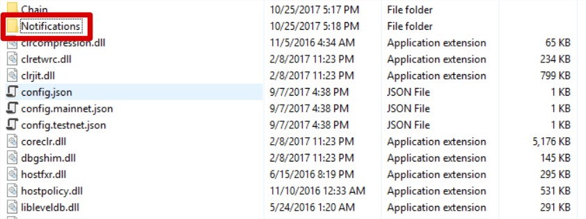

# Document for Exchange Developers

This document is intended to guide exchange developers to set up NEO nodes on the exchange server and complete related program development for NEO assets transactions. Before reading, maker sure you have read [NEO White Paper](index.html) and understand the NEO background knowledge and technologies. 

In general, an exchange needs to do the following：

- [Deploying a NEO Node on Server](#deploying-a-neo-node-on-server)
- [Creating a Wallet and Deposit Addresses](#creating-a-wallet-and-deposit-addresses)
- [Dealing with Global Assets Transactions](#dealing-with-global-assets-transactions)
- [Dealing with NEP-5 Assets Transactions](#dealing-with-nep-5-assets-transactions)
- [(Optional) Distributing GAS to Users](#optional-distributing-gas-to-users)


## Deploying a NEO Node on Server

To deploy a NEO node on the exchange server, do the following:

1.  Install [.NET Core Runtime](https://www.microsoft.com/net/download/core#/runtime) on the server, 2.0 and the later version.
2.  From Github, download the [Neo-CLI](https://github.com/neo-project/neo-cli/releases) program and enable the NEO node.

For more information, refer to [Installation and deployment of NEO node](node/setup.html).

## Creating a Wallet and Deposit Addresses

### About NEO-CLI

NEO-CLI is a command-line client (wallet) for developers. Developers have two ways to interact with it： 

- Using the CLI (command-line interface) commands. For example, you can create a wallet, generate an address, etc.
- Using the Remote Procedure Call (RPC). For example, you can transfer to the designated address, acquire the block information of the designated height, acquire the information of the designated trade, etc.

NEO-CLI provides the following features： 

- As a wallet, manages assets through the command-line.

  To enable the wallet，enter the following command under the NEO-CLI directory：

  ```
  dotnet neo-cli.dll
  ```

  To check all the available commands, enter the following command：

  ```
  help
  ```

  For more information, refer to [CLI Command Reference](node/cli.html).

- Provides APIs to retrieve blockchain data from nodes. The interfaces are provided through  [JSON-RPC](http://www.jsonrpc.org/specification)，and the underlying communications use HTTP/HTTPS protocols.

  To start a node which provides RPC service, enter the following command under the NEO-CLI directory：

  ```
  dotnet neo-cli.dll /rpc
  ```

  For more API information, refer to [API Reference](node/api.html).


### Creating a Wallet

The exchange needs to create an online wallet to manage the deposit addresses of users. A wallet is used to store the information of the accounts (both public keys and private keys) and the contracts. It is the most important proof that the user holds. Users must keep the wallet files and the wallet passwords secure. They must not lose or disclose these data.

> [!Note]
>
> Exchanges do not have to create a wallet for every address. An online wallet usually keeps all deposit addresses of users. A cold wallet (offline wallet) is another storage option which provides better security.

To create a wallet, do the following：

1. enter  `create wallet <path>`.

   <path> is the wallet path and wallet file name. The file extension can be any type, for example,  create wallet mywallet.db3.

2. Set a password for the wallet. 

> [!Note]
>
> The wallet must be kept open all the time to respond to the withdrawal requests of users. For security reasons, the wallets should be run in an independent server on which the firewall is configured properly, as shown below. 

|                    | Mainnet | Testnet |
| ------------------ | ------- | ------- |
| JSON-RPC via HTTPS | 10331   | 20331   |
| JSON-RPC via HTTP  | 10332   | 20332   |
| P2P                | 10333   | 20333   |
| websocket          | 10334   | 20334   |

### Generating Deposit Addresses

A wallet can store multiple addresses. The exchange needs to generate a deposit address for each user. 

There are two methods to generate deposit addresses: 

- When the user deposit (NEO/NEO GAS) for the first time, the program dynamically generates a NEO address. The advantage is that there is no need to generate addresses at fixed time intervals, while the disadvantage is you can not backup the wallet.

  To develop the program to dynamically generate addresses, use the NEO-CLI API  [getnewaddress Method](node/api/getnewaddress.html). The created address is returned.

- The exchange creates a batch of NEO addresses in advance. When the user charges (NEO/NEO GAS) for the first time, the exchange assigns a NEO address to him or her. The advantage is the convenience to backup the wallet, while the disadvantage is the need to generate NEO addresses manually.
  To generate addresses in batch, run the NEO- CLI command `create address [n]`. The  addresses are exported automatically to the address.txt file.
  [n] is optional. Its default value is 1. For example, to generate 100 addresses at a time, enter `create address 100`.


> [!Note]
>
> Either way, the exchange must import the addresses into the database and distribute them to users.

## Dealing with Global Assets Transactions

### Developing Programs for User Deposits and Withdrawals

For global assets, the exchange needs to develop programs to fulfil the following functions:

1. Monitor new blocks through NEO-CLI  API ([getblock Method](node/api/getblock2.html)).
2. Deal with user deposits according to the transaction information. 
3. Store the transaction records related to the exchange.

#### User Deposits 

Regarding user deposits, the exchange needs to note the following: 

- NEO blockchain has only one main chain without side chains, will not fork, and will not have isolated blocks.
- A transaction recorded in NEO blockchain cannot be tampered with, which means a confirmation represents a deposit success.
- In general, the balance of a deposit address in the exchange is not equal to the balance the user has in the exchange. It may because：
  - When transferring or withdrawing, the NEO wallet looks through one or more addresses in the wallet, finds the minimal loose change that meets the requirement and adds up to the total sum of the transaction and then serves that as the input, instead of withdrawing from the specified address (unless the exchange rewrites some functions of NEO wallet to meet their own needs).
  - Other operations that may lead to balance inequality, for example, the exchange transfers part of the assets to its cold wallets.
- There are more than two assets (NEO and NEO GAS) in a NEO address. More assets issued by users (such as stock or token) can be stored. The exchange should determine the assets type when the user deposits. Neither regard other assets as NEO shares or NEO nor confuse the withdrawal of NEO with NEO GAS. 
- NEO wallet is a full node, which needs to stay online to synchronize blocks. You can view the block synchronization status through the show state in the CLI, where the left side is the local block height, and the right side is the node block height.
- In the exchange, the transfer between users should not be recorded through the blockchain. In general, the user's balance are modified in the database directly. Only deposits and withdrawals should be recorded on the blockchain.

#### Deposit Records

The exchange needs to write code to monitor every transaction in a block and record all the transactions related to the exchange addresses in the database. If a deposit occurs, the user's balance should be updated. 

Developers can use the  `getblock <index> [verbose]` method of NEO-CLI API to retrieve the block information. `<index>` is the block index. `[verbose]` is 0 by default. When `[verbose]` is 0, the method returns the serialized block information in Hexadecimal. You should deserialize the hex string to get the detailed information of the block. When `[verbose]` is 1, the method returns the detailed information of the corresponding block in JSON format. For more information, refer to [getblock Method](node/api/getblock2.html).

The block information includes the transactions input and output. The exchange needs to record all its related transactions. The transactions output is in fact the transaction records of the withdrawals of a user. When the exchange sees any of its addresses in the output of the transactions, it updates the NEO/NEO GAS balance of the corresponding user who owns this deposit address. Some exchanges may also do as follows: if it finds an address within the exchange as the output of the transaction, then it records the deposit in its database and modifies the user’s balance after several confirmations (Unless it needs to comply with the operation of other blockchains, this way is not recommended) . 

> [!Note]
>
> - Method getblockcount returns the count of the blocks in the main chain. The first parameter of Method getblock is `<index>` which is the block index. Block index = Block height = The count of the blocks – 1. If getblockcount returns 1234, you should use getblock 1233 to get the information of the latest block. 
> - The deposit and withdrawal transactions (NEO/NEO GAS) are all in a type named ContractTransaction. The exchanges only need to care about the ones of ContractTransaction type when they check through the transactions in a block. 
> - As the first transaction of every block must be MinerTransaction, you can neglect or jump over it when traversing the blockchain. 
> - NEO system takes the transaction as a record unit.
>

### Dealing with User Withdrawals 

To deal with the user withdrawals for global assets, the exchange needs to do the following:

1. In NEO-CLI, run `open wallet <path>` to open the wallet.

2. Record the user withdrawal transaction and modify the user balance.

3. (Optional) Customer service deals with withdrawal application.

4. Send transaction to the user's withdrawal address using the NEO-CLI  API method, `sendtoaddress <asset_id> <address> <value>`. For more information, refer to  [sendtoaddress Method](node/api/sendtoaddress.html).

   - `<asset_id>` ：Asset ID
   - `<address>` ：Withdrawal address
   - `<value>` ：Withdrawal amount

   You can also send the transaction to a batch of addresses using API [sendmany Method](node/api/sendmany.html).

5. Extract the transaction ID from the returned transaction details in the JSON format,  and then record in the database.

6. Once confirmed by the blockchain, mark the withdrawal transaction as success. 

   Similar to deposit monitoring, withdrawals also need to be monitored. If the withdrawal transaction ID  is found in the blockchain, it means this transaction has already been confirmed and is a successful withdrawal.

> [!Note]
>
> -  The <value> here refers to the actual amount, instead of the amount multiplied by 10^8.
> -  NEO transfer amount must be an integer; otherwise, the blockchain will not confirm it since the loose change in the wallet will be inaccurate. It will be needed to rebuild wallet index, which is to recalculate the transactions and change of the wallet.

## Dealing with NEP-5 Assets Transactions

### Receiving User Deposits Notifications

For NEP-5 assets, the exchange needs to get the notification of users' deposits. The notification for each block is recorded in a JSON file, which includes all information of every NEP-5 transaction.

To get notification files, run the following command:

```
dotnet neo-cli.dll --rpc --record-notifications
```

A folder "Notifications" is generated under the root path, as shown below:



#### 

#### Notifications JSON File

The following shows an example of the notification file content.

```json
[
{
    "txid": "0x65d62a736a73c4d15dc4e4d0bfc1e4bbc4ef220e163625d770eb05577b1afdee",
    "contract": "0xecc6b20d3ccac1ee9ef109af5a7cdb85706b1df9",
    "state":
    {
        "type": "Array",
        "value": [
        {
            "type": "ByteArray",
            "value": "7472616e73666572"
        },
        {
            "type": "ByteArray",
            "value": "d336d7eb9975a29b2404fdb28185e277a4b299bc"
        },
        {
            "type": "ByteArray",
            "value": "eab336cac807707295afa7e7da2f4683237f612a"
        },
        {
            "type": "ByteArray",
            "value": "006ad42d100100"
        }]
    }
}]
```

In this file, there is an array of notifications with only one object, which means only one NEP-5 event is triggered in the block. The parameters related to a transaction in the file are the following:

-  **contract**: the script hash of smart contract, by which the exchange can identify assets type. For example, "0xecc6b20d3ccac1ee9ef109af5a7cdb85706b1df9" is the script hash and the unique identification of the RPX asset.

-  The four objects included in the "state" array:

   [event, from account, to account, amount]

   -  The first object with the type "bytearray" and the value "7472616e73666572", as shown in the example, can be converted to the string "transfer". "transfer" is a method in NEP5 that represents an asset transfer.
   -  The second object in the array is the account address where the asset is transferred from. Its type "bytearray" and the value "d336d7eb9975a29b2404fdb28185e277a4b299bc“ can be converted to "Ab2fvZdmnM4HwDgVbdBrbTLz1wK5TcEyhU". Note that for the hexadecimal string with "0x" prefix, it is processed as big endian; otherwise, it is processed as small endian.
   -  The third object in the array is the account address where the asset is transferred to. If the address is an exchange account address, it is a deposit transaction.
   -  The fourth object in the array is the transfer amount. There are two types of amount,  integer and bytearray. When dealing with this value, the exchange should pay special attention for transactions of the integer type.

### Querying User Balance

To query the user's balance, the exchange needs to do the following:

1. Construct JSON files to invoke three methods (`balanceOf`, `decimals`, and `symbol`) through the PRC API invokefunction. 
2. Send the JSON files to NEO RPC server.
3. Calculate the user balance according to the returned values.

#### invokefunction

In JSON, a general invokefunction request body is in the following form: 

```
{
  "jsonrpc": "2.0",
  "method": "invokefunction",
  "params": [
    "script hash",
    "method name",
    [
      {
        "optional arguments"
      }
    ]
  ],
  "id": 1
}
```

You need to replace these strings when querying the user's balance:

- script hash

  The script hash of the NEP-5 token you are querying. For example, you can find the script hash of RPX is : *0xecc6b20d3ccac1ee9ef109af5a7cdb85706b1df9*.


- method name

  The name of the method you are invoking. To query the user's balance, you need to invoke these three methods:

  **balanceOf**

  - Syntax: `public static BigInteger balanceOf(byte[] account)`
  - Remarks: "balanceOf" returns the token balance of the '''account'''.

  **decimals**

  - Syntax: `public static byte decimals()`
  - Remarks: "decimals" returns the number of decimals used by the token.

  **symbol**

  - Syntax: `public static string symbol()`
  - Remarks: "symbol" returns the token symbol.


- optional arguments

  Optional. If the method you are invoking requires arguments, you can pass them by constructing these parameters into an array. For example, "balanceOf" in NEP-5 returns the token balance of the "account":

  `public static BigInteger balanceOf(byte[] account)`

  So you need to pass the account as an argument in the "balanceOf" method.

#### Example

##### **Invoking balanceOf**

Suppose the account address is AJShjraX4iMJjwVt8WYYzZyGvDMxw6Xfbe, you need to convert it into Hash160 type and construct this parameter as a JSON object:

```json
{
    "type": "Hash160",
    "value": "bfc469dd56932409677278f6b7422f3e1f34481d"
}
```

Then you can construct the JSON message as the following:

Request Body：

```json
{
  "jsonrpc": "2.0",
  "method": "invokefunction",
  "params": [
    "ecc6b20d3ccac1ee9ef109af5a7cdb85706b1df9",
    "balanceOf",
    [
      {
        "type": "Hash160",
        "value": "bfc469dd56932409677278f6b7422f3e1f34481d"
      }
    ]
  ],
  "id": 3
}
```

After sending the request, you will get the following response：

```json
{
    "jsonrpc": "2.0",
    "id": 3,
    "result": {
        "state": "HALT, BREAK",
        "gas_consumed": "0.338",
        "stack": [
            {
                "type": "ByteArray",
                "value": "00e1f505"
            }
        ]
    }
}
```

It returns "00e1f505" which can be converted to interger 100000000.

##### **Invoking decimals**

Request Body：

```json
{
  "jsonrpc": "2.0",
  "method": "invokefunction",
  "params": [
    "0xecc6b20d3ccac1ee9ef109af5a7cdb85706b1df9",
    "decimals", 
    []
    ],
  "id": 2
}
```

After sending the request, you will get the following response：

```json
{
    "jsonrpc": "2.0",
    "id": 2,
    "result": {
        "state": "HALT, BREAK",
        "gas_consumed": "0.156",
        "stack": [
            {
                "type": "Integer",
                "value": "8"
            }
        ]
    }
}
```

It returns integer 8.

##### **Invoking symbol**

Request Body：

```json
{
  "jsonrpc": "2.0",
  "method": "invokefunction",
  "params": [
    "0xecc6b20d3ccac1ee9ef109af5a7cdb85706b1df9",
    "symbol", 
    []
    ],
  "id": 1
}
```

After sending the request, you will get the following response：

```json
{
    "jsonrpc": "2.0",
    "id": 1,
    "result": {
        "state": "HALT, BREAK",
        "gas_consumed": "0.141",
        "stack": [
            {
                "type": "ByteArray",
                "value": "525058"
            }
        ]
    }
}
```

It returns "525058" which can be converted to string "RPX".

##### **Calculating the User Balance**

According to all the returned values,  we can calculate the user balance as follows:
The balance = 100000000/10<sup>8</sup> RPX = 1 RPX

### Dealing with User Withdrawals

The exchange can choose one of the following way to send NEP-5 assets to users: 

- NEO-CLI command: `send`

- RPC method: `sendtoaddress`
- PRC method: `sendmany`

#### NEO-CLI Command: send

##### Syntax

`send <txid|script hash> <address> <value> [fee = 0]`

##### Parameters

- txid|script hash: the asset ID.

- address: the payment address.

- value: the transfer amount.

- fee: This parameter can be left empty. The default value is 0.


This command verifies the wallet password. 

##### Example

To transfer 100 RPX to the address *AeSHyuirtXbfZbFik6SiBW2BEj7GK3N62b*, enter the following:

```
send 0xecc6b20d3ccac1ee9ef109af5a7cdb85706b1df9 AeSHyuirtXbfZbFik6SiBW2BEj7GK3N62b 100
```

If you need to send global asset, just change the first parameter to txid. For example, 
The txid of NEO: 0Xc56f33fc6ecfcd0c225c4ab356fee59390af8560be0e930faebe74a6daff7c9b
The txid of GAS: 0x602c79718b16e442de58778e148d0b1084e3b2dffd5de6b7b16cee7969282de7

#### RPC Method: sendtoaddress

The key "params" includes an array of at least three parameters. 

`"params":[script hash, address, amount, fee(optional), change address(optional)]`

For example, to send 1 RPX to *AbP3FU3YcqBrWh72nc9deyQB99eazG9XUg* , construct a JSON file as follows and send it to RPC server.

Request Body：

```json
{
    "jsonrpc":"2.0",
    "method":"sendtoaddress",
    "params":[
        "0xecc6b20d3ccac1ee9ef109af5a7cdb85706b1df9",
        "AbP3FU3YcqBrWh72nc9deyQB99eazG9XUg",
        "1",
        "0",
        "ARkJ8QcVdYL68WRvN3wj3TSvXX8CgmC73Z"
    ],
    "id":1
}
```

After sending the request, you will get the following response：

```json
{
    "jsonrpc":"2.0",
    "id":1,
    "result":{
        "txid":"0xc6d4bf7c62fb47e0b2a6e838c3a1ca297622a1b1df7ceb2d30fa4ef8b7870700",
        "size":219,
        "type":"InvocationTransaction",
        "version":1,
        "attributes":[
            {
                "usage":"Script",
                "data":"5305fbbd4bd5a5e3e859b452b7897157eb20144f"
            }
        ],
        "vin":[

        ],
        "vout":[

        ],
        "sys_fee":"0",
        "net_fee":"0",
        "scripts":[
            {
                "invocation":"4054fbfca678737ae164ebf0e476da0c8215782bc42b67ae08cf4d8a716eeef81fcc17641e7f63893c3e685fb7eb1fb8516161c5257af41630f4508dde3afa3a8c",
                "verification":"210331d1feacd79b53aeeeeb9de56018eadcd07948675a50258f9e64a1204b5d58d1ac"
            }
        ],
        "script":"0400e1f50514d710f6f3f0bad2996a09a56d454cfc116a881bfd145305fbbd4bd5a5e3e859b452b7897157eb20144f53c1087472616e7366657267f91d6b7085db7c5aaf09f19eeec1ca3c0db2c6ecf166187b7883718089c8",
        "gas":"0"
    }
}
```

#### RPC Method: sendmany

The key "params" includes an array of at least one parameter:

`"params":[[], fee(optional), change address(optional)]`

For example, to send 15.5 RPX and 0.0001 GAS to *AbP3FU3YcqBrWh72nc9deyQB99eazG9XUg* and the `change address` is also *AbP3FU3YcqBrWh72nc9deyQB99eazG9XUg*, you can construct a JSON file as follows and send it to RPC server.

Request Body：

```json
{
    "jsonrpc":"2.0",
    "method":"sendmany",
    "params":[
        [
            {
                "asset":"0xecc6b20d3ccac1ee9ef109af5a7cdb85706b1df9",
                "value":"15.5",
                "address":"AbP3FU3YcqBrWh72nc9deyQB99eazG9XUg"
            },
            {
                "asset":"0x602c79718b16e442de58778e148d0b1084e3b2dffd5de6b7b16cee7969282de7",
                "value":"0.0001",
                "address":"AbP3FU3YcqBrWh72nc9deyQB99eazG9XUg"
            }
        ],"0.00001","AbP3FU3YcqBrWh72nc9deyQB99eazG9XUg"
    ],
    "id":1
}
```

After sending the request, you will get the following response：

```json
{
    "jsonrpc": "2.0",
    "id": 1,
    "result": {
        "txid": "0xe1351c9c9f2205a801d1b04f0df2d65fb4b1692d7d3b06cf41e0712fd1b12c9c",
        "size": 373,
        "type": "InvocationTransaction",
        "version": 1,
        "attributes": [
            {
                "usage": "Script",
                "data": "6d64dc9e50af8e911247436b264c8f7d791ad58c"
            }
        ],
        "vin": [
            {
                "txid": "0x9f0a28a912527604ab4b7d5e8b8d1a9b57631fcbab460132811ae7b6ed1ccaff",
                "vout": 1
            }
        ],
        "vout": [
            {
                "n": 0,
                "asset": "0x602c79718b16e442de58778e148d0b1084e3b2dffd5de6b7b16cee7969282de7",
                "value": "0.0001",
                "address": "AbP3FU3YcqBrWh72nc9deyQB99eazG9XUg"
            },
            {
                "n": 1,
                "asset": "0x602c79718b16e442de58778e148d0b1084e3b2dffd5de6b7b16cee7969282de7",
                "value": "0.01359",
                "address": "AbP3FU3YcqBrWh72nc9deyQB99eazG9XUg"
            }
        ],
        "sys_fee": "0",
        "net_fee": "0.00001",
        "scripts": [
            {
                "invocation": "40644ab915419dbf855a52d5c75596e80b78c8e928cc0ce91ae6afc3b75a0c31ee54efe1836f9ec232f6c42dcb3ace0bfdc688e626944fa20970a76064975eade9",
                "verification": "2103d4b6fc2d116855f86a483d151182f68e88e6ddd13f3f1f3631e36300aac122bfac"
            }
        ],
        "script": "04801f635c14d710f6f3f0bad2996a09a56d454cfc116a881bfd146d64dc9e50af8e911247436b264c8f7d791ad58c53c1087472616e7366657267f91d6b7085db7c5aaf09f19eeec1ca3c0db2c6ecf166f871fb30fc859b77",
        "gas": "0"
    }
}
```

### See Also

[NEP-5 Token Standard](https://github.com/neo-project/proposals/blob/master/nep-5.mediawiki "NEP5")

[Data Transformation Examples](https://github.com/PeterLinX/NeoDataTransformation)

## (Optional) Distributing GAS to Users

The exchange can determine whether to distribute GAS to users. GAS is used to pay to the NEO blockchain for recording and additional services. 

### What is GAS ?

NeoGas (abbreviated as GAS) represents the right to use the Neo Blockchain. There will be 100 million GAS in total. GASs are generated along with every new block. The issuance will slow down according to a set slowly-decreasing pace, while GAS will go through a generating process to grow from zero to 100 million. Once NEO is acquired, GAS will be generated in the system following the algorithms.

### Calculating the Available GAS Amount

- Available *GAS = f(neo_amount, Δt_const)*

  -  Δt_const = t_end - t_start
    -  t_end = the moment that Neo goes into the state of spent
    -  t_start = the moment that Neo goes into the state of unspent

  Δt_const is fixed, thus the available Gas is of a fixed amount too. And this amount is a function of the amount of Neo held by the user and the duration between the moments that he or she transferred this amount of Neo into and out of his or her address. 


- Unavailable *GAS = f(neo_amount, Δt_var)*

  - Δt_var = t - t_start
    - t is the current time
    - t_start = the moment that Neo goes into the state of unspent

  The current time is a variable, so the amount of the unavailable GAS also grows through time, which means it is a variable.

### Distributing GAS to Users

Suppose all the exchange addresses are stored in one wallet, the following chart demonstrates the procedure and computational formula how the exchange distributes GAS to the user A.


The shorter the snapshot interval, the more precise the calculation is. If the snapshot interval is not uniform, use the weighted average calculation method.

### Claiming GAS

GAS becomes claimable after the user transfer his or her NEO. For example, **someone has NEO in address A and GAS are not claimable, he transfer his NEO to himself (address A) then the NEO GAS are claimable.**

The following table lists the GAS claiming steps and corresponding commands.

| #    | Steps                                    | Command                                  |
| ---- | :--------------------------------------- | ---------------------------------------- |
| 1    | Run NEO-CLI                              | `./neo-cli.dll /rpc`                     |
| 2    | Check the client version                 | `version`                                |
| 3    | Check the synchronized height of the client ( Height: height/header height, Nodes: amount of connected nodes). | `show state`                             |
| 4    | Create a wallet                          | `create wallet /home/NeoNode/test.db3`   |
| 5    | Open the wallet created in the last step | `open wallet /home/NeoNode/test.db3`     |
| 6    | Check the address list in the wallet     | `list address`                           |
| 7    | Check the assets in the wallet           | `list asset`                             |
| 8    | Check the GAS balances details in the wallet | `show gas`                               |
| 9    | Transfer NEO to your address（e.g. AaAHt6Xi51iMCaDaYoDFTFLnGbBN1m75SM 1） to change the status of Gas to be claimable. | `send NEO AaAHt6Xi51iMCaDaYoDFTFLnGbBN1m75SM 1` |
| 10   | Get the details of the balances of GAS in the wallet again. Now the status of all the GAS should be available to claim. | `show gas`                               |
| 11   | Claim GAS.                               | `claim gas`                              |
| 12   | Check balance again.                     | `list asset`                             |

